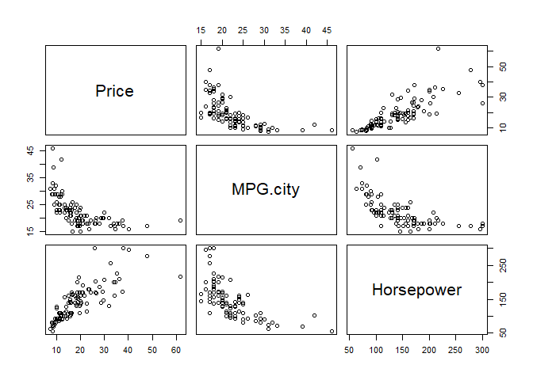

Estatística Descritiva
======================

------------------------------------------------------------------------


<br> <br> <br> <br> <br>

Aqui você vai compreender os conceitos de população e amostra, e o que é
a estatística descritiva. Aprendará o que são e omo empregar medidas de
centralidade (média, mediana) e medidas de dispersão (variância, desvios
padrão, quartis) para caracterização de conjuntos de dados. Vai aprender
também como identificar outliers dos dados e a explorar como duas
variáveis podem estar relacionadas linearmente (covariância,
correlação). E você aprender tudo isso aplicando esses conceitos a
conjuntos de dados com R.

Introdução
----------

A estatística descritiva busca fornecer uma descrição útil de um grande
número de dados a partir de medidas de centralidade e dispersão dos
dados como média, mediana, variância, desvio padrão e quartis,
frequencia de valores e moda, correlação e covariância.

Você, então, pode aplicar agora os seus conhecimentos de R para fazer
essas estatísticas e entender melhor um conjunto de dados de interesse.

Tipos de dados
--------------

Uma distinção importante que você precisa ter em mente ao explorar os
dados é identificar que tipo de dado, ou a natureza do dado, que você
está tratando. Podemos identificar dois grandes grupos de dados, os
qualitativos e quantitativos, ou mais simplesmente dados numéricos e
dados categóricos.

| Dados quantitativos ou numéricos         | Exemplos                        |
|:-----------------------------------------|:--------------------------------|
| discretos (contagens ou número inteiros) | ex. número de casos de infecção |
| contínuos (medidas numa escala contínua) | ex. volume, área, peso, preços  |

| Dados qualitativos ou categóricos | Exemplos                           |
|:----------------------------------|:-----------------------------------|
| nominais (categorias de dados)    | ex. sexo: masculino, feminino      |
| ordinais (categorias ordenadas)   | ex. salinidade: baixa, média, alta |

Identificar claramente essa natureza dos dados é muito importante pois,
dependedo de sua natureza, o dado pode ter um tratamento diferente. Por
exemplo, pense no atributo `sexo` em uma base de dados de clientes. Esse
atributo pode aparecer codificado como 0=masculino e 1=feminino.
Entretanto, mesmo apresentando os valores numéricos 0 e 1, trata-se de
uma categoria, um valor nominal e, portanto, faz pouco sentido falarmos
em média do atributo `sexo` ou ainda valores como min e max, por que
também não há uma relação de ordem (do menor para o maior) entre esses
valores. Assim, essa natureza do dado é determinante para você saber que
estatísticas são aplicáveis àquele dado.

Amostra X População
-------------------

Outra característica importante que você deve ter em mente sobre a
natureza dos dados é se os dados que você irá analisar são *amostras* de
um conjunto de dados ou são a totalidade dos dados. Por exemplo, você
pode ter todos os salários dos funcionários de uma empresa e obter média
salarial, maior e menor salários etc. Mas você não poderá obter o
salário de *todos* dos brasileiros e, certamente, trabalhará com
amostras desses dados. Existem uma série de técnicas para tornar essas
amostras confiáveis e para que possamos, a partir de uma amostra,
inferir, por exemplo, a média de salário dos brasileiros. Assim, você
deve ter em mente ao obter medidas como média ou desvio padrão se elas
se referem a dados de uma amostra ou dados de toda a população de dados.
Em alguns havendo inclusive uma diferença na forma de cálculo.

Exploração inicial dos dados
----------------------------

Vamos empregar nesses exemplos o dataset `Cars93`, um dataset built-in
do pacote `MASS`. Significado ds dados, quantidade e linhas e colunas,
tipos de dados.

``` r
library(MASS)
head(Cars93)
```

    ##   Manufacturer   Model    Type Min.Price Price Max.Price MPG.city MPG.highway
    ## 1        Acura Integra   Small      12.9  15.9      18.8       25          31
    ## 2        Acura  Legend Midsize      29.2  33.9      38.7       18          25
    ## 3         Audi      90 Compact      25.9  29.1      32.3       20          26
    ## 4         Audi     100 Midsize      30.8  37.7      44.6       19          26
    ## 5          BMW    535i Midsize      23.7  30.0      36.2       22          30
    ## 6        Buick Century Midsize      14.2  15.7      17.3       22          31
    ##              AirBags DriveTrain Cylinders EngineSize Horsepower  RPM
    ## 1               None      Front         4        1.8        140 6300
    ## 2 Driver & Passenger      Front         6        3.2        200 5500
    ## 3        Driver only      Front         6        2.8        172 5500
    ## 4 Driver & Passenger      Front         6        2.8        172 5500
    ## 5        Driver only       Rear         4        3.5        208 5700
    ## 6        Driver only      Front         4        2.2        110 5200
    ##   Rev.per.mile Man.trans.avail Fuel.tank.capacity Passengers Length Wheelbase
    ## 1         2890             Yes               13.2          5    177       102
    ## 2         2335             Yes               18.0          5    195       115
    ## 3         2280             Yes               16.9          5    180       102
    ## 4         2535             Yes               21.1          6    193       106
    ## 5         2545             Yes               21.1          4    186       109
    ## 6         2565              No               16.4          6    189       105
    ##   Width Turn.circle Rear.seat.room Luggage.room Weight  Origin          Make
    ## 1    68          37           26.5           11   2705 non-USA Acura Integra
    ## 2    71          38           30.0           15   3560 non-USA  Acura Legend
    ## 3    67          37           28.0           14   3375 non-USA       Audi 90
    ## 4    70          37           31.0           17   3405 non-USA      Audi 100
    ## 5    69          39           27.0           13   3640 non-USA      BMW 535i
    ## 6    69          41           28.0           16   2880     USA Buick Century

``` r
help(Cars93)
```

    ## starting httpd help server ... done

Os comandos abaixo exploram características da estrutura dos dados como
número de linhas, atributos e os tipos de dados.

``` r
# execute cada um dos comandos isoladamente 

nrow(Cars93) # nr de linhas
```

    ## [1] 93

``` r
ncol(Cars93) # nr de atributos ou colunas
```

    ## [1] 27

Examinando estrutura e tipos de dados.

``` r
str(Cars93) # estrutura dos dados como exibido na área 'Environment' do RStudio
```

    ## 'data.frame':    93 obs. of  27 variables:
    ##  $ Manufacturer      : Factor w/ 32 levels "Acura","Audi",..: 1 1 2 2 3 4 4 4 4 5 ...
    ##  $ Model             : Factor w/ 93 levels "100","190E","240",..: 49 56 9 1 6 24 54 74 73 35 ...
    ##  $ Type              : Factor w/ 6 levels "Compact","Large",..: 4 3 1 3 3 3 2 2 3 2 ...
    ##  $ Min.Price         : num  12.9 29.2 25.9 30.8 23.7 14.2 19.9 22.6 26.3 33 ...
    ##  $ Price             : num  15.9 33.9 29.1 37.7 30 15.7 20.8 23.7 26.3 34.7 ...
    ##  $ Max.Price         : num  18.8 38.7 32.3 44.6 36.2 17.3 21.7 24.9 26.3 36.3 ...
    ##  $ MPG.city          : int  25 18 20 19 22 22 19 16 19 16 ...
    ##  $ MPG.highway       : int  31 25 26 26 30 31 28 25 27 25 ...
    ##  $ AirBags           : Factor w/ 3 levels "Driver & Passenger",..: 3 1 2 1 2 2 2 2 2 2 ...
    ##  $ DriveTrain        : Factor w/ 3 levels "4WD","Front",..: 2 2 2 2 3 2 2 3 2 2 ...
    ##  $ Cylinders         : Factor w/ 6 levels "3","4","5","6",..: 2 4 4 4 2 2 4 4 4 5 ...
    ##  $ EngineSize        : num  1.8 3.2 2.8 2.8 3.5 2.2 3.8 5.7 3.8 4.9 ...
    ##  $ Horsepower        : int  140 200 172 172 208 110 170 180 170 200 ...
    ##  $ RPM               : int  6300 5500 5500 5500 5700 5200 4800 4000 4800 4100 ...
    ##  $ Rev.per.mile      : int  2890 2335 2280 2535 2545 2565 1570 1320 1690 1510 ...
    ##  $ Man.trans.avail   : Factor w/ 2 levels "No","Yes": 2 2 2 2 2 1 1 1 1 1 ...
    ##  $ Fuel.tank.capacity: num  13.2 18 16.9 21.1 21.1 16.4 18 23 18.8 18 ...
    ##  $ Passengers        : int  5 5 5 6 4 6 6 6 5 6 ...
    ##  $ Length            : int  177 195 180 193 186 189 200 216 198 206 ...
    ##  $ Wheelbase         : int  102 115 102 106 109 105 111 116 108 114 ...
    ##  $ Width             : int  68 71 67 70 69 69 74 78 73 73 ...
    ##  $ Turn.circle       : int  37 38 37 37 39 41 42 45 41 43 ...
    ##  $ Rear.seat.room    : num  26.5 30 28 31 27 28 30.5 30.5 26.5 35 ...
    ##  $ Luggage.room      : int  11 15 14 17 13 16 17 21 14 18 ...
    ##  $ Weight            : int  2705 3560 3375 3405 3640 2880 3470 4105 3495 3620 ...
    ##  $ Origin            : Factor w/ 2 levels "USA","non-USA": 2 2 2 2 2 1 1 1 1 1 ...
    ##  $ Make              : Factor w/ 93 levels "Acura Integra",..: 1 2 4 3 5 6 7 9 8 10 ...

``` r
class(Cars93$Model) # tipo dos dados
```

    ## [1] "factor"

``` r
class(Cars93$Price)
```

    ## [1] "numeric"

``` r
names(Cars93) # nome dos atributos
```

    ##  [1] "Manufacturer"       "Model"              "Type"              
    ##  [4] "Min.Price"          "Price"              "Max.Price"         
    ##  [7] "MPG.city"           "MPG.highway"        "AirBags"           
    ## [10] "DriveTrain"         "Cylinders"          "EngineSize"        
    ## [13] "Horsepower"         "RPM"                "Rev.per.mile"      
    ## [16] "Man.trans.avail"    "Fuel.tank.capacity" "Passengers"        
    ## [19] "Length"             "Wheelbase"          "Width"             
    ## [22] "Turn.circle"        "Rear.seat.room"     "Luggage.room"      
    ## [25] "Weight"             "Origin"             "Make"

### Selecionando linhas e colunas

Em geral a seleção de dados de interesse ocorre depois que você já tem
uma ideia das variáveis e seus valores para efetuar a seleção. Os
exemplos abaixo são, portanto, apenas para que você tenha mais exemplos
de seleção de dados e se familiarize com a seleção de dados com
dataframes em R. Lembre-se aqui da sintaxe dos dataframes:

    dataframe [ linhas , colunas ]

#### Selecionando linhas de `Cars93`

``` r
head(Cars93[Cars93$Price < 20,])
```

    ##    Manufacturer    Model    Type Min.Price Price Max.Price MPG.city MPG.highway
    ## 1         Acura  Integra   Small      12.9  15.9      18.8       25          31
    ## 6         Buick  Century Midsize      14.2  15.7      17.3       22          31
    ## 12    Chevrolet Cavalier Compact       8.5  13.4      18.3       25          36
    ## 13    Chevrolet  Corsica Compact      11.4  11.4      11.4       25          34
    ## 14    Chevrolet   Camaro  Sporty      13.4  15.1      16.8       19          28
    ## 15    Chevrolet   Lumina Midsize      13.4  15.9      18.4       21          29
    ##               AirBags DriveTrain Cylinders EngineSize Horsepower  RPM
    ## 1                None      Front         4        1.8        140 6300
    ## 6         Driver only      Front         4        2.2        110 5200
    ## 12               None      Front         4        2.2        110 5200
    ## 13        Driver only      Front         4        2.2        110 5200
    ## 14 Driver & Passenger       Rear         6        3.4        160 4600
    ## 15               None      Front         4        2.2        110 5200
    ##    Rev.per.mile Man.trans.avail Fuel.tank.capacity Passengers Length Wheelbase
    ## 1          2890             Yes               13.2          5    177       102
    ## 6          2565              No               16.4          6    189       105
    ## 12         2380             Yes               15.2          5    182       101
    ## 13         2665             Yes               15.6          5    184       103
    ## 14         1805             Yes               15.5          4    193       101
    ## 15         2595              No               16.5          6    198       108
    ##    Width Turn.circle Rear.seat.room Luggage.room Weight  Origin
    ## 1     68          37           26.5           11   2705 non-USA
    ## 6     69          41           28.0           16   2880     USA
    ## 12    66          38           25.0           13   2490     USA
    ## 13    68          39           26.0           14   2785     USA
    ## 14    74          43           25.0           13   3240     USA
    ## 15    71          40           28.5           16   3195     USA
    ##                  Make
    ## 1       Acura Integra
    ## 6       Buick Century
    ## 12 Chevrolet Cavalier
    ## 13  Chevrolet Corsica
    ## 14   Chevrolet Camaro
    ## 15   Chevrolet Lumina

``` r
head(Cars93[Cars93$Price < 20 & Cars93$Type == 'Small',])
```

    ##    Manufacturer   Model  Type Min.Price Price Max.Price MPG.city MPG.highway
    ## 1         Acura Integra Small      12.9  15.9      18.8       25          31
    ## 23        Dodge    Colt Small       7.9   9.2      10.6       29          33
    ## 24        Dodge  Shadow Small       8.4  11.3      14.2       23          29
    ## 29        Eagle  Summit Small       7.9  12.2      16.5       29          33
    ## 31         Ford Festiva Small       6.9   7.4       7.9       31          33
    ## 32         Ford  Escort Small       8.4  10.1      11.9       23          30
    ##        AirBags DriveTrain Cylinders EngineSize Horsepower  RPM Rev.per.mile
    ## 1         None      Front         4        1.8        140 6300         2890
    ## 23        None      Front         4        1.5         92 6000         3285
    ## 24 Driver only      Front         4        2.2         93 4800         2595
    ## 29        None      Front         4        1.5         92 6000         2505
    ## 31        None      Front         4        1.3         63 5000         3150
    ## 32        None      Front         4        1.8        127 6500         2410
    ##    Man.trans.avail Fuel.tank.capacity Passengers Length Wheelbase Width
    ## 1              Yes               13.2          5    177       102    68
    ## 23             Yes               13.2          5    174        98    66
    ## 24             Yes               14.0          5    172        97    67
    ## 29             Yes               13.2          5    174        98    66
    ## 31             Yes               10.0          4    141        90    63
    ## 32             Yes               13.2          5    171        98    67
    ##    Turn.circle Rear.seat.room Luggage.room Weight  Origin          Make
    ## 1           37           26.5           11   2705 non-USA Acura Integra
    ## 23          32           26.5           11   2270     USA    Dodge Colt
    ## 24          38           26.5           13   2670     USA  Dodge Shadow
    ## 29          36           26.5           11   2295     USA  Eagle Summit
    ## 31          33           26.0           12   1845     USA  Ford Festiva
    ## 32          36           28.0           12   2530     USA   Ford Escort

``` r
myCars = Cars93[Cars93$Price < 20 & Cars93$Type == 'Small',]
head(myCars)
```

    ##    Manufacturer   Model  Type Min.Price Price Max.Price MPG.city MPG.highway
    ## 1         Acura Integra Small      12.9  15.9      18.8       25          31
    ## 23        Dodge    Colt Small       7.9   9.2      10.6       29          33
    ## 24        Dodge  Shadow Small       8.4  11.3      14.2       23          29
    ## 29        Eagle  Summit Small       7.9  12.2      16.5       29          33
    ## 31         Ford Festiva Small       6.9   7.4       7.9       31          33
    ## 32         Ford  Escort Small       8.4  10.1      11.9       23          30
    ##        AirBags DriveTrain Cylinders EngineSize Horsepower  RPM Rev.per.mile
    ## 1         None      Front         4        1.8        140 6300         2890
    ## 23        None      Front         4        1.5         92 6000         3285
    ## 24 Driver only      Front         4        2.2         93 4800         2595
    ## 29        None      Front         4        1.5         92 6000         2505
    ## 31        None      Front         4        1.3         63 5000         3150
    ## 32        None      Front         4        1.8        127 6500         2410
    ##    Man.trans.avail Fuel.tank.capacity Passengers Length Wheelbase Width
    ## 1              Yes               13.2          5    177       102    68
    ## 23             Yes               13.2          5    174        98    66
    ## 24             Yes               14.0          5    172        97    67
    ## 29             Yes               13.2          5    174        98    66
    ## 31             Yes               10.0          4    141        90    63
    ## 32             Yes               13.2          5    171        98    67
    ##    Turn.circle Rear.seat.room Luggage.room Weight  Origin          Make
    ## 1           37           26.5           11   2705 non-USA Acura Integra
    ## 23          32           26.5           11   2270     USA    Dodge Colt
    ## 24          38           26.5           13   2670     USA  Dodge Shadow
    ## 29          36           26.5           11   2295     USA  Eagle Summit
    ## 31          33           26.0           12   1845     USA  Ford Festiva
    ## 32          36           28.0           12   2530     USA   Ford Escort

#### Selecionando colunas de `Cars93`

``` r
head(Cars93$Price)
```

    ## [1] 15.9 33.9 29.1 37.7 30.0 15.7

``` r
head(Cars93[,c('Price','Type')])
```

    ##   Price    Type
    ## 1  15.9   Small
    ## 2  33.9 Midsize
    ## 3  29.1 Compact
    ## 4  37.7 Midsize
    ## 5  30.0 Midsize
    ## 6  15.7 Midsize

``` r
head(Cars93[,c(3,5)])
```

    ##      Type Price
    ## 1   Small  15.9
    ## 2 Midsize  33.9
    ## 3 Compact  29.1
    ## 4 Midsize  37.7
    ## 5 Midsize  30.0
    ## 6 Midsize  15.7

``` r
myCars = Cars93[,c('Price','Type')]
head(myCars)
```

    ##   Price    Type
    ## 1  15.9   Small
    ## 2  33.9 Midsize
    ## 3  29.1 Compact
    ## 4  37.7 Midsize
    ## 5  30.0 Midsize
    ## 6  15.7 Midsize

#### Selecionando conjuntos de dados de `Cars93`

``` r
myCars = Cars93[ Cars93$Price < 20 & Cars93$Type == 'Small', c('Price','Type','MPG.city')]
head(myCars)
```

    ##    Price  Type MPG.city
    ## 1   15.9 Small       25
    ## 23   9.2 Small       29
    ## 24  11.3 Small       23
    ## 29  12.2 Small       29
    ## 31   7.4 Small       31
    ## 32  10.1 Small       23

``` r
nrow(myCars)
```

    ## [1] 21

Estatísticas dos Valores
------------------------

O quadro a seguir sumariza alguns comandos básicos de R empregados para
se obter estatísticas dos dados.

| Univariada    | Descrição                                 |
|---------------|-------------------------------------------|
| min(x)        | Mínimo elemento em x                      |
| max(x)        | Máximo elemento em x                      |
| range(x)      | Range (min to max) elementos em x         |
| length(x)     | número de elementos em x                  |
| mean(x)       | Média dos valores em x                    |
| median(x)     | Mediana dos valores em x                  |
| var(x)        | Variância dos elementos em x              |
| sd(x)         | Desvio padrão dos elementos em x          |
| quantile(x,p) | O percentual p quartil dos elementos de x |
| table(x)      | Frequ\~encias de valores de x             |

| Multivariada | Descrição                           |
|--------------|-------------------------------------|
| cor(x,y)     | Correlação entre os elementos x e y |
| cov(x,y)     | cov(x,y) Covariance between x and y |

A análise univariada refere-se a estatísticas que explicam uma única
variável enquanto a análise multivariada são estatísticas que buscam
explorar a relação entre duas ou mais variáveis.

Frequência de valores `table()`
-------------------------------

Para dados categóricos uma característica importante é quantidade de
instâncias (linhas ou registros) que aparecem de cada valor. Em
estatística chamamos isso de **frequencia dos dados** e mais adiante
vamos ampliar esse conceito para variáveis contínuas e estudar
distribuições dos dados.

O comando `table()` em R pode ser empregado para exibir a frequência de
valores de uma variável discreta (categórica ou numérica). No momento,
você não precisa se preocupar com os comandos para exibir o gráfico
aqui. Simplesmente estamos apresentando a informação da frequência dos
valores de forma gráfica.

``` r
table(Cars93$Type)
```

    ## 
    ## Compact   Large Midsize   Small  Sporty     Van 
    ##      16      11      22      21      14       9

``` r
table(Cars93$Origin)
```

    ## 
    ##     USA non-USA 
    ##      48      45

``` r
par(mfrow = c(1, 2))
barplot(table(Cars93$Type), main='Qde de Veículos por Tipo',col='orange')
barplot(table(Cars93$Origin), main='Qde de Veículos por Origem',col=c('green','blue'))
```


Medidas de Centralidade
-----------------------

Média, Mediana e Moda são as principais medidas de Centralidade ou
medida de tendência central dos dados.

A **média** é calculada somando-se todos os valores de um conjunto de
dados e dividindo-se pelo número de elementos deste conjunto,
resumidamente:

$$ \\bar{x} = \\frac{\\sum\_{i}^{n} x\_i}{n} $$
A **Moda** é o valor mais frequente de um conjunto de dados, sendo
assim, para defini-la basta observar a frequência com que os valores
aparecem, e um conjunto de dados é chamado de bimodal quando apresenta
dois valores igualmente mais frequentes. Não há um comando específico em
R para a moda. Então, empregamos abaixo uma função para retornar a moda.
Vários pacotes estatísticos, entretanto, implementam essa função e você
pode, se quiser, empregar a função de algum pacote estatístico como o
`DescTools`.

``` r
x = c(rep(1,2),rep(2,3),rep('a',5))
cat('x: ', x)
```

    ## x:  1 1 2 2 2 a a a a a

``` r
moda = names(table(x))[table(x)==max(table(x))]

cat('\nModa de x: ', moda)
```

    ## 
    ## Moda de x:  a

``` r
# install.packages("DescTools")
library(DescTools)

cat('\nModa de x: ', Mode(x))
```

    ## 
    ## Moda de x:  a

**Mediana** é definido como o valor central de um conjunto de dados.
Para encontrar o valor da mediana os dados são colocados em ordem ordem
crescente buscando-se assim o dados central (ou na posição de 50% dos
dados, e isso será útil para você entender os quartis mais adiante).
Quando o número elementos é par, a mediana é obtida pela média dos dois
valores centrais. Note abaixo como se diferenciam os valores de média e
mediana.

``` r
a = c(1,2,3,4,10)
b = c(1,2,3,10)
c = c(1,1,1,3,10)
cat('\nMediana de a: ', median(a), '\nMediana de b: ', median(b),  '\nMediana de c: ', median(c))
```

    ## 
    ## Mediana de a:  3 
    ## Mediana de b:  2.5 
    ## Mediana de c:  1

``` r
cat('\nMédia de a: ', mean(a), '\nMédia de b: ', mean(b),  '\nMédia de c: ', mean(c))
```

    ## 
    ## Média de a:  4 
    ## Média de b:  4 
    ## Média de c:  3.2

Existem outro tipos de média, como médias geométricas e médias
harmônicas, mas que não trataremos aqui. Você deve notar ainda que as
medidas de centralidade não se aplicam para valores categóricos pois sua
natureza não inclui uma ideia de valor e ou necessariamente de ordem. O
mesmo ocorre com as medidas de dispersão a seguir.

### Sensibilidade de Médias e Medianas

Em geral a média é uma boa medida para caracterizar dados mais
uniformemente distribuídos sendo mais sensível que a mediana para dados
na presença de *outliers*. *Outliers* são valores que se diferenciam
muito da maior parte dos dados. Por exemplo, imagine a média de renda
dos alunos do nosso curso e imagine agora que Jeff Bezos venha a ser seu
colega de turma. A média de renda dos alunos será bastante modificada, o
valor da mediana, entretanto, tende a ficar pouco alterado.

``` r
a = c(rep(2000,5),rep(2500,4),rep(5000,2))
b = c(rep(2000,5),rep(2500,4),rep(5000,2),1000000000) # incluindo o outlier 'Jeff Bezos'

cat('\nMediana de a: ', median(a), '\nMediana de b: ', median(b))
```

    ## 
    ## Mediana de a:  2500 
    ## Mediana de b:  2500

``` r
cat('\nMédia de a: ', mean(a), '\nMédia de b: ', mean(b))
```

    ## 
    ## Média de a:  2727.273 
    ## Média de b:  83335833

Medidas de Dispersão
--------------------

Medidas de dispersão são usadas para determinar o grau de variabilidade
dos dados de um conjunto de valores. As estatísticas de tendência
central (média, mediana, moda) não permite avaliar a homogeneidade ou
uniformidade dos dados. O intervalo de valores (range), variância,
desvio padrão e os quartis são as medidas de dispersão mais
frequentemente usadas.

Inspecionar os valores min, max e o intervalo de valores é importante
para quaisquer conjuntos de dados (mas lembre-se que essas medidas não
se aplicam a dados categóricos).

``` r
min(myCars$Price)
```

    ## [1] 7.4

``` r
max(myCars$Price)
```

    ## [1] 15.9

``` r
range(myCars$Price)
```

    ## [1]  7.4 15.9

``` r
max(myCars$Price) - min(myCars$Price) # chamamos essa diferença de amplitude total
```

    ## [1] 8.5

### Variância e Desvio Padrão

A variação é uma medida numérica de como os valores dos dados estão
dispersos em torno da média . Em particular, a variação da amostra é
definida como:

$$  s^2(x) = \\sum\_i^n \\frac{( x\_i -  \\bar{x})^2 }{n - 1} $$

Da mesma forma, a variância de uma população é definida em termos da
média da população *μ* e tamanho da população N :

$$  \\sigma^2(x) = \\sum\_i^n  \\frac{( x\_i -  \\mu)^2 }{N} $$
Em R, a variação da amostra é calculada com a função `var()`. Observe
que, quando o tamanho da amostra é grande, a variância da amostra
converge para a variância da população. Desse modo não faremos na maior
parte dos casos distinção entre os cálculos de amostras e população,
empregando diretamente as funções do R. Note ainda que, independente de
uma ou outra forma de cálculo, a ordem do valor obtido é mantida e um
valor maior de variância de amostra corresponde também a um maior valor
de variância da população o que permite empregarmos quaisquer desses
valores para identificar dados mais e menos dispersos. Mas se você
precisar de uma variação da população poderá empregar o cálculo direto.

``` r
x = c(1,2,3,4)
var(x)
```

    ## [1] 1.666667

``` r
sum((x - mean(x))^2) / length(x)
```

    ## [1] 1.25

``` r
sum((x - mean(x))^2) / (length(x) - 1) # este é o cálculo que corresponde a função var()
```

    ## [1] 1.666667

O desvio padrão, de uma amostra ou população, pode ser obtido pela raiz
quadrada da correspondente variância. Assim,

$$  s(x) =  \\sqrt{ \\sum\_i^n \\frac{( x\_i -  \\bar{x})^2 }{n - 1}} $$
Ou simplesmente

$$  s(x) = \\sqrt{ s^2(x) } $$
e, igualmente

$$  \\sigma(x) =   \\sqrt{  \\sum\_i^n  \\frac{( x\_i -  \\mu)^2 }{N} } $$
ou

$$  \\sigma(x) =   \\sqrt{  \\sigma^2(x)  } $$
Um valor alto para a variância (ou desvio padrão) indicará que os
valores encontram-se mais distantes da média – ou seja, a distribuição é
mais dispersa.

Você pode notar ainda que a variância emprega o quadrado da diferença
dos valores com relação à média. Já o desvio padrão, como a raiz
quadrada da variação, fornece um valor que está nas mesmas unidades que
os valores o que será útil em uma série de situações que empream os
dados originais. Em princípio, ambas medidas fornecem uma medida de
dispersão, usando-se uma ou outra dependendo da necessidade.

``` r
suppressMessages(attach(Cars93)) 

mean(Price)
```

    ## [1] 19.50968

``` r
var(Price)
```

    ## [1] 93.30458

``` r
sd(Price)
```

    ## [1] 9.65943

``` r
cat(mean(Price) - sd(Price), mean(Price) + sd(Price))
```

    ## 9.850248 29.16911

``` r
detach(Cars93)
```

O comando `attach` permite aqui omitir o nome do dataframe simplificando
a codificação e o `sd()`, estando na mesma unidade da variável original,
permite fazer operações como cálculo do intervalo acima.

### Escore padrão e *Outliers*

Outra medida de dispersão importante é o escore padronizado. Ele fornece
uma medida de quanto um valor se desvia da média e é dado por:

$$  Z(x\_i) =   \\frac{ x\_i -  \\bar{x} }{s(x)} $$
Valores negativos indicam que o valor de *x*<sub>*i*</sub> encontra-se à
esquerda da média e valores positivos indicam que o valor de
*x*<sub>*i*</sub> encontra-se à direita da média.

Essa medida é útil para vários propósitos e aqui você pode empregá-la
para detectar *outliers* dos dados, isto é, dados que se diferenciam
demais da amostra. O escore padronizado pode ser obtido para os valores
todos os valores dos dados aplicando-se a função `scale()`.

Neste exemplo calculamos o valor do escore padronizado para o preço do
5o veículo de nosso conjunto de dados Cars93.

``` r
suppressMessages(attach(Cars93)) 

cat('\nPreço do 5o veículo: ', Price[5])
```

    ## 
    ## Preço do 5o veículo:  30

``` r
cat('\nCálculo do escore padronizado (empregando a definição):', ( Price[5] - mean(Price) ) / sd(Price))
```

    ## 
    ## Cálculo do escore padronizado (empregando a definição): 1.086019

``` r
cat('\nCálculo do escore padronizado (empregando a função scale):', scale(Price)[5])
```

    ## 
    ## Cálculo do escore padronizado (empregando a função scale): 1.086019

``` r
detach(Cars93)
```

Outliers podem surgir por erros de medida, ‘sujeira’ nos dados ou serem
medidas de fato que apenas desviam do padrão dos demais dados, e é
importante você entender a natureza desses dados para tomar a decisão do
que fazer com esses dados (por exemplo, excluir da amostra). Existem
algumas técnicas para a detecção de outliers e uma delas é empregar
escore padronizado. Valores com escore padrão superior a 3 são, então,
considerados outliers. Note que muitas vezes você pode pensar que um
determinado valor está *fora da curva*, mas o que define
estatisticamente um valor fora do padrão dos dados é um cálculo bem
definido, como por exemplo do escore padrão \> 3. Assim, você deve notar
que o preço do veículo acima, 30, com escore padrão de 1.08 é um preço
dentro do padrão de dados.

Você pode, então, empregar a função `scale()` para determinar outliers
nos dados.

``` r
suppressMessages(attach(Cars93))  

scale(Price, center=FALSE)[1:6] # uma amostra dos escores padrão
```

    ## [1] 0.7271963 1.5504374 1.3309065 1.7242328 1.3720685 0.7180492

``` r
L = scale(Price) > 3 # selecionando escores maiores que 3

print(Cars93[L,])
```

    ##     Manufacturer Model    Type Min.Price Price Max.Price MPG.city MPG.highway
    ## 59 Mercedes-Benz  300E Midsize      43.8  61.9        80       19          25
    ##               AirBags DriveTrain Cylinders EngineSize Horsepower  RPM
    ## 59 Driver & Passenger       Rear         6        3.2        217 5500
    ##    Rev.per.mile Man.trans.avail Fuel.tank.capacity Passengers Length Wheelbase
    ## 59         2220              No               18.5          5    187       110
    ##    Width Turn.circle Rear.seat.room Luggage.room Weight  Origin
    ## 59    69          37             27           15   3525 non-USA
    ##                  Make
    ## 59 Mercedes-Benz 300E

``` r
detach(Cars93)
```

Não é supresa que um Mercedes-Benz seja o veículo com preço outlier,
sendo 61.9 o único preço outlier desse conjunto de dados.

### Interpretando o Escore Padrão

Você aprenderá mais sobre isso e os comandos abaixo nas aulas seguintes.
Mas neste ponto, talvez seja importante você notar que em dados com uma
distribuição normal, aquela com uma curva em forma de sino e que inclui
um grande número de casos de interesse, é esperado que 68% dos dados
estejam dentro de 1 desvio padrão da média, 95% dos dados dentro de 2
desvios padrão da média e 99,7% dos dados dentro de 3 desvios padrão da
média.

\[*x̄* − 1*σ*(*x*), *x̄* + 1*σ*(*x*)\] → 68% *d**o**s* *d**a**d**o**s*
\[*x̄* − 2*σ*(*x*), *x̄* + 2*σ*(*x*)\] → 95% *d**o**s* *d**a**d**o**s*

\[*x̄* − 3*σ*(*x*), *x̄* + 3*σ*(*x*)\] → 99.7% *d**o**s* *d**a**d**o**s*
Os comandos `pnorm` e `qnorm` que você aprenderá quando estudarmos a
distribuição normal são empregados para obter respectivamente o
‘percentil’ dos dados a partir de um valor (`pnorm`) ou o valor para um
dado percentil (`qnorm`), e você pode notar que o preço do quinto
veículo corresponde a um percentil inferior a 99.7% (e portanto um valor
esperado), enquanto o preço do modelo Mercedez aparece encontra-se em
percentil 99.9%, e portanto fora do intervalo de 99.7%, caracterizando
um outlier.

``` r
suppressMessages(attach(Cars93))  

Price[5] # um preço normal
```

    ## [1] 30

``` r
pnorm(Price[5],mean=mean(Price),sd=sd(Price))
```

    ## [1] 0.8612647

``` r
qnorm(pnorm(Cars93$Price[5],mean=mean(Price),sd=sd(Price)),mean=mean(Price),sd=sd(Price))
```

    ## [1] 30

``` r
Price[59] # um outlier
```

    ## [1] 61.9

``` r
pnorm(Price[59],mean=mean(Price),sd=sd(Price))
```

    ## [1] 0.9999943

``` r
qnorm(pnorm(Cars93$Price[59],mean=mean(Price),sd=sd(Price)),mean=mean(Price),sd=sd(Price))
```

    ## [1] 61.9

``` r
detach(Cars93)
```

A figura a seguir mostra como estão relacionados esses intervalos às
quantidades de ocorrências da amostra para uma distribuição normal
introduzindo também o conceito de quartis e distância inter quartis que
você verá a seguir.

</a>

Quartis
-------

O percentil é o valor que corresponde a um certo percentual dos dados da
amostra quando encontram-se ordenados. Desse modo, os percentis 0%, 50%
e 100% correspondem, respectivamente, ao valor mímino, a mediana e o
valor máximo dos dados.

``` r
suppressMessages(attach(Cars93))  

cat('\n',min(Price), quantile(Price,prob=0))
```

    ## 
    ##  7.4 7.4

``` r
cat('\n',median(Price), quantile(Price,prob=0.5))
```

    ## 
    ##  17.7 17.7

``` r
cat('\n',max(Price), quantile(Price,prob=1))
```

    ## 
    ##  61.9 61.9

``` r
detach(Cars93)
```

E os quartis, os valores que correspondem a 0, 0.25, 0.5, 0.75 e 1 do
percentual ordenado das amostras, pela sua importância, acabam recebendo
denominação próprias. Os valores correspondentes a 25% e 75% dos dados
são chamados de 1º e 3º quartis, e os demais mínimo (0), mediana (0.5) e
máximo (1).

``` r
print(quantile(Cars93$Price))
```

    ##   0%  25%  50%  75% 100% 
    ##  7.4 12.2 17.7 23.3 61.9

Esses dados também podem ser obtidos com o comando `summary()` que
apresenta um conjunto de estatísticas resumidas dos dados.

``` r
summary(Cars93[ , c('Type','Make','Price','Cylinders','Horsepower')])
```

    ##       Type               Make        Price        Cylinders    Horsepower   
    ##  Compact:16   Acura Integra: 1   Min.   : 7.40   3     : 3   Min.   : 55.0  
    ##  Large  :11   Acura Legend : 1   1st Qu.:12.20   4     :49   1st Qu.:103.0  
    ##  Midsize:22   Audi 100     : 1   Median :17.70   5     : 2   Median :140.0  
    ##  Small  :21   Audi 90      : 1   Mean   :19.51   6     :31   Mean   :143.8  
    ##  Sporty :14   BMW 535i     : 1   3rd Qu.:23.30   8     : 7   3rd Qu.:170.0  
    ##  Van    : 9   Buick Century: 1   Max.   :61.90   rotary: 1   Max.   :300.0  
    ##               (Other)      :87

Um gráfico de caixa, ou `boxplot` é um gráfico que representa esses
valores. Você aprenderá na próxima aula como produzir esses gráficos e,
por hora, basta observar como esses valores são representados.

``` r
suppressMessages(attach(Cars93))  

boxplot(Price,data=Cars93,main="Preços por Tipo",col='Blue')
```


``` r
detach(Cars93)
```

### Distância interquartis e Outliers

Os quartis oferecem uma outra técnica para detecção de outliers e,
embora aqui apresentem outliers diferentes, em geral a técnica do escore
padrão e das distâncias interquartis tendem a convergir para uma grande
quantidade de dados. A técnica interquartis, entretanto, é mais comum e
é a que empregaremos aqui.

Nessa técnica (veja a figura anterior) são considerados outliers os
dados que ultrapassam a distância de 1.5 × *I**Q**R*, a distância entre
o 3o e o 1o quartil.

``` r
iqr = IQR(Cars93$Price)

# ou ainda...
#
# Q1 = quantile(Cars93$Price, probs=c(.25))
# Q3 = quantile(Cars93$Price, probs=c(.75))
# iqr = Q3 - Q1

print(Cars93[ (Cars93$Price > mean(Cars93$Price) + 1.5*iqr) | (Cars93$Price < mean(Cars93$Price) - 1.5*iqr), ])
```

    ##     Manufacturer    Model    Type Min.Price Price Max.Price MPG.city
    ## 4           Audi      100 Midsize      30.8  37.7      44.6       19
    ## 11      Cadillac  Seville Midsize      37.5  40.1      42.7       16
    ## 19     Chevrolet Corvette  Sporty      34.6  38.0      41.5       17
    ## 48      Infiniti      Q45 Midsize      45.4  47.9      50.4       17
    ## 59 Mercedes-Benz     300E Midsize      43.8  61.9      80.0       19
    ##    MPG.highway            AirBags DriveTrain Cylinders EngineSize Horsepower
    ## 4           26 Driver & Passenger      Front         6        2.8        172
    ## 11          25 Driver & Passenger      Front         8        4.6        295
    ## 19          25        Driver only       Rear         8        5.7        300
    ## 48          22        Driver only       Rear         8        4.5        278
    ## 59          25 Driver & Passenger       Rear         6        3.2        217
    ##     RPM Rev.per.mile Man.trans.avail Fuel.tank.capacity Passengers Length
    ## 4  5500         2535             Yes               21.1          6    193
    ## 11 6000         1985              No               20.0          5    204
    ## 19 5000         1450             Yes               20.0          2    179
    ## 48 6000         1955              No               22.5          5    200
    ## 59 5500         2220              No               18.5          5    187
    ##    Wheelbase Width Turn.circle Rear.seat.room Luggage.room Weight  Origin
    ## 4        106    70          37             31           17   3405 non-USA
    ## 11       111    74          44             31           14   3935     USA
    ## 19        96    74          43             NA           NA   3380     USA
    ## 48       113    72          42             29           15   4000 non-USA
    ## 59       110    69          37             27           15   3525 non-USA
    ##                  Make
    ## 4            Audi 100
    ## 11   Cadillac Seville
    ## 19 Chevrolet Corvette
    ## 48       Infiniti Q45
    ## 59 Mercedes-Benz 300E

Covariância e Correlação
------------------------

Entendidas as características de uma variável isolada do nosso conjunto
de dados (por exemplo o Preço dos veículos), estamos interessados agora
em compreender como se relacionam duas variáveis de interesse. Por
exemplo, você pode estar interessado em saber o preço de um veículo se
relaciona com o consumo de combustível.

A Covariância mede a relação linear entre duas variáveis. A covariância
é semelhante à correlação entre duas variáveis, no entanto, elas diferem
nas seguintes maneiras:

1.  Coeficientes de correlação são normalizados, sendo um valor no
    intervalo entre \[ − 1, 1\] onde, um relacionamento linear perfeito
    resulta em um coeficiente de correlação \|1\|. Ele mede tanto a
    força (valor absoluto) como a direção da relação linear entre duas
    variáveis (positivo para mesma direção).

2.  1.  Valores de covariância podem variar de menos infinito a mais
        infinito e, portanto, o valor para uma relação linear ideal
        dependerá dos dados. Assim, é difícil determinar a força da
        relação entre as variáveis. De qualquer modo, valores de
        covariância positivos indicam que valores acima da média de uma
        variável estão associados, também, a valores acima da média da
        segunda variável. E de modo equivalente, valores negativos de
        covariância indicam que valores acima da média de uma variável
        associam-se a valores abaixo da média para segunda variável.

Embora represente uma relação linear entre os dados a correlação é uma
relação bastante importante e, em geral, a primeira que buscamos. Mas
você deve saber que dados podem estar bastante relacionados sem que,
entretanto, exibam uma relação linear.

``` r
x = c(1:100)
y = sin(x)*x
cor(x,y)
```

    ## [1] -0.04414844

Nos dados acima *x* e *y* têm uma dependência direta e, entretanto,
exibem uma correlação próxima de zero.

Além disso você correlação não significa necessariamente uma relação de
causa efeito. Ela pode ser um indício dessa relação, mas em princípio,
ela apenas indica o quanto os valores esperados de uma variável estão
relacionados ao valor da outra. Duas variáveis, entretanto, podem
apresentar correlação sem uma relação de causa efeito entre elas, mas
por que ambas são o resultado de uma terceira variável.

O coeficiente de correlação é uma função direta da covariância e obtido
pela divisão da covariância pelo produto dos desvios padrão das
variáveis.

A covariância de uma amostra é definida como:

$$ s\_{xy} = COV(x,y) =\\frac{1}{n-1} \\sum\_{i}^{n}  (x\_i - \\bar{x})(y\_i - \\bar{y}) $$
e, da mesma forma, a covariância populacional é dada por:

$$ \\sigma\_{xy} = COV(x,y) = \\frac{1}{n} \\sum\_{i}^{n} (x\_i - \\mu\_{x})(y\_i - \\mu\_{y}) $$
e talvez você tenha notado a semelhança dos cálculos de covariância e
variância de uma única variável. A variância sendo idêntica a
covariância de uma variável com ela mesma.

O **coeficiente de determinação**, ou mais exatamente o **coeficiente de
determinação de Pearson** pode ser então calculado como:

$$ r\_{xy} = \\frac{COV(x,y)}{\\sigma(x) \\sigma(y)} $$
E empregamos as funções `cov()` e `cor()` para obter esses valores com
R.

``` r
cov(Cars93$Price, Cars93$Horsepower)
```

    ## [1] 398.7647

``` r
cor(Cars93$Price, Cars93$Horsepower)
```

    ## [1] 0.7882176

``` r
cov(Cars93$Price, Cars93$MPG.city)
```

    ## [1] -32.27532

``` r
cor(Cars93$Price, Cars93$MPG.city)
```

    ## [1] -0.5945622

E não ver ser surpresa para você que o preço dos veículos tenha uma
correlação positiva para potência dos motores (isto é, carros mais
potentes são mais caros) e uma correlação negativa para o maior consumo
de combustível (note que MPG, ou *Milhas por Galão* tem valores menores
para um maior consumo de combustível).

Você pode observar a relação de duas variáveis graficamente e
exploraremos mais isso na próxima aula.

``` r
myCars = Cars93[ , c('Price',"MPG.city", 'Horsepower')]
pairs(myCars)
```



Referências
-----------

Devore, Jay L. **Probabilidade e Estatística para Engenharia e
Ciências**. Trad. Solange Aparecida Visconte. Cengage, 2018.

Navarro, Danielle, **Learning Statistics with R**, disponível em:
<a href="https://learningstatisticswithr.com/" class="uri">https://learningstatisticswithr.com/</a>
( LSR version 0.6 (pdf) ). Acesso: 26/02/2021.

Wickham, H., Grolemund, G. **R for Data Science**. O’Reilly Media, Inc.,
2016.
