Visualização dos Dados
======================

------------------------------------------------------------------------


<br> <br> <br> <br> <br>

Aqui você aprenderá comandos básicos de R para diferentes visualizações
dos dados. Aprenderá a produzir gráficos como de tendência (linha), de
distribuição (histograma, boxplot e densidade), relações (dispersão) e
proporção (barras, pizza) dos dados. Você aprenderá também como
interpretar esses dados e, em conjunto com seleções de dados e a
estatística descritiva que viu anteriormente, elaborar explorações
importantes dos dados (EDA, Exploratory Data Analysis).

Introdução
----------

**Por que visualizar os dados?** O **Quarteto de Anscombe** (F.J.
Anscombe, 1973) talvez seja o exemplo mais conhecido que ilustra o valor
da visualização dos dados.

Os quatro conjuntos de dados exibidos abaixo, pares (*x*, *y*),
apresentam com até 3 casas decimais as mesmas médias e variâncias de *x*
e *y* e correlação de 0.816, levando todos a uma mesma regressão linear.
Você aprenderá sobre Regressão Linear na Aula 7, e por hora é suficiente
que você entenda que a regressão linear é uma aproximação de pontos por
uma reta.

*y* = 3 + 0.5*x*

    ##        x1             x2             x3             x4           y1        
    ##  Min.   : 4.0   Min.   : 4.0   Min.   : 4.0   Min.   : 8   Min.   : 4.260  
    ##  1st Qu.: 6.5   1st Qu.: 6.5   1st Qu.: 6.5   1st Qu.: 8   1st Qu.: 6.315  
    ##  Median : 9.0   Median : 9.0   Median : 9.0   Median : 8   Median : 7.580  
    ##  Mean   : 9.0   Mean   : 9.0   Mean   : 9.0   Mean   : 9   Mean   : 7.501  
    ##  3rd Qu.:11.5   3rd Qu.:11.5   3rd Qu.:11.5   3rd Qu.: 8   3rd Qu.: 8.570  
    ##  Max.   :14.0   Max.   :14.0   Max.   :14.0   Max.   :19   Max.   :10.840  
    ##        y2              y3              y4        
    ##  Min.   :3.100   Min.   : 5.39   Min.   : 5.250  
    ##  1st Qu.:6.695   1st Qu.: 6.25   1st Qu.: 6.170  
    ##  Median :8.140   Median : 7.11   Median : 7.040  
    ##  Mean   :7.501   Mean   : 7.50   Mean   : 7.501  
    ##  3rd Qu.:8.950   3rd Qu.: 7.98   3rd Qu.: 8.190  
    ##  Max.   :9.260   Max.   :12.74   Max.   :12.500

    ## Analysis of Variance Table
    ## 
    ## Response: y1
    ##           Df Sum Sq Mean Sq F value  Pr(>F)   
    ## x1         1 27.510 27.5100   17.99 0.00217 **
    ## Residuals  9 13.763  1.5292                   
    ## ---
    ## Signif. codes:  0 '***' 0.001 '**' 0.01 '*' 0.05 '.' 0.1 ' ' 1
    ## Analysis of Variance Table
    ## 
    ## Response: y2
    ##           Df Sum Sq Mean Sq F value   Pr(>F)   
    ## x2         1 27.500 27.5000  17.966 0.002179 **
    ## Residuals  9 13.776  1.5307                    
    ## ---
    ## Signif. codes:  0 '***' 0.001 '**' 0.01 '*' 0.05 '.' 0.1 ' ' 1
    ## Analysis of Variance Table
    ## 
    ## Response: y3
    ##           Df Sum Sq Mean Sq F value   Pr(>F)   
    ## x3         1 27.470 27.4700  17.972 0.002176 **
    ## Residuals  9 13.756  1.5285                    
    ## ---
    ## Signif. codes:  0 '***' 0.001 '**' 0.01 '*' 0.05 '.' 0.1 ' ' 1
    ## Analysis of Variance Table
    ## 
    ## Response: y4
    ##           Df Sum Sq Mean Sq F value   Pr(>F)   
    ## x4         1 27.490 27.4900  18.003 0.002165 **
    ## Residuals  9 13.742  1.5269                    
    ## ---
    ## Signif. codes:  0 '***' 0.001 '**' 0.01 '*' 0.05 '.' 0.1 ' ' 1

    ##                   lm1      lm2       lm3       lm4
    ## (Intercept) 3.0000909 3.000909 3.0024545 3.0017273
    ## x1          0.5000909 0.500000 0.4997273 0.4999091

    ## $lm1
    ##              Estimate Std. Error  t value    Pr(>|t|)
    ## (Intercept) 3.0000909  1.1247468 2.667348 0.025734051
    ## x1          0.5000909  0.1179055 4.241455 0.002169629
    ## 
    ## $lm2
    ##             Estimate Std. Error  t value    Pr(>|t|)
    ## (Intercept) 3.000909  1.1253024 2.666758 0.025758941
    ## x2          0.500000  0.1179637 4.238590 0.002178816
    ## 
    ## $lm3
    ##              Estimate Std. Error  t value    Pr(>|t|)
    ## (Intercept) 3.0024545  1.1244812 2.670080 0.025619109
    ## x3          0.4997273  0.1178777 4.239372 0.002176305
    ## 
    ## $lm4
    ##              Estimate Std. Error  t value    Pr(>|t|)
    ## (Intercept) 3.0017273  1.1239211 2.670763 0.025590425
    ## x4          0.4999091  0.1178189 4.243028 0.002164602

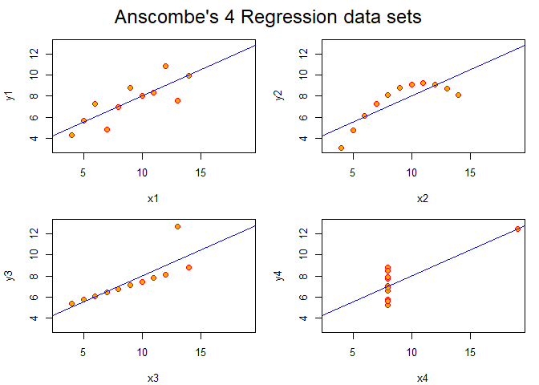

Você pode notar que, apesar dos quatro conjuntos de pontos poderem ser
aproximados por mesma reta eles estão muito diferentemente organizados.

Quê conclusão pode tirar disso? Embora as estatísticas descritivas dos
dados forneça uma ferramenta útil para descrever conjuntos de dados, ela
não é suficiente para observarmos todos os padrões dos dados. É aqui que
a visualização dos dados entra para colaborar no entendimento dos dados
e você poder observar padrões e características dos dados que não são
facilmente observáveis diretamente ou por estatísticas sobre os dados.

Gráficos de Apresentação e de Exploração
----------------------------------------

Existe uma série de questões sobre a visaulização de dados, mas em
primeiro lugar, há a questão de que fazemos *gráficos de apresentação* e
*gráficos de exploração*. Criamos gráficos de apresentação quando
queremos exibir os dados de uma forma limpa, atraente, e às vezes
impactante, para torna mais fácil a comunicação de uma ideia ou
resultado ao leitor, ou mesmo quando queremos convencê-lo de um
resultado que o gráfico representa. Você pode pensar, por exemplo, nos
inúmeros gráficos produzidos para ‘explicar’ a Pandemia de Covid-19 em
2020 ao público em geral, ou ainda nos gráficos produzidos para
apresentar os resultados de uma empresa aos acionistas.

Igualmente importante, mas para nós aqui ainda mais importante, é
produzir gráficos que irão ajudar você a entender melhor os dados.
Produzir gráficos exploratórios ajudam você a aprender sobre os dados à
medida que os analisa. Embora passamos dar bastante qualidade a esses
gráficos, não daremos ênfase aqui na forma de ‘apresentação’ dos
gráficos como cores, organização dos dados, combinação de múltiplos
gráficos em uma única página, inserção de textos como títulos e rótulos,
que são mais importantes quando produzimos gráficos de apresentação.
Nosso foco será mais na exploração dos dados, mas você pode consultar as
referências para a produção de gráficos mais elegantes se quiser.

Buscando gráficos corretos
--------------------------

Antes de entrarmos nos comandos de R e você aprender a fazer diferentes
tipos de gráficos, vamos entender o quê exatamente estamos buscando nos
dados. Essa é uma pergunta essencial pois, a partir dela, é que podemos
buscar o tipo de gráfico que queremos produzir e, então, buscar a melhor
forma de produzir esse gráfico , seja em R ou qualquer outra linguagem
(que comandos, parâmetros do gráfico etc.)

Quando você analisa um conjunto de dados você em geral vai estar
buscando responder algumas perguntas. Por exemplo, você estar buscando
entender a distribuição de renda ou de escolaridade entre os brasileiros
a partir dos dados do IBGE, ou buscar a tendência das ações de bitcoin
para os próximos anos. A visualização desses dados em gráficos permite,
então, dar uma primeira resposta a essas perguntas que você poderá em
seguida se aprofundar.

As perguntas que podemos fazer sobre os dados podem ser agrupadas em
algumas categorias, cada uma delas tendo gráficos que são *mais
frequentemente usados* para você obter e apresentar respostas à sua
questão:

> **Evolução** (ou *Tendência dos Dados*): gráficos de linha, área,
> séries múltiplas

> **Distribuição**: histogramas, gráficos de distribuição de densidade,
> *boxplot*

> **Composição**: gráficos de barras, *word cloud*, *spider*, *pie
> chart*

> **Relações**: gráficos de dispersão, *heat map*, *density 2D*

Havendo ainda gráficos mais especializados que envolvem para análises
geográficas (*maps*), fluxo de dados em redes sociais e outros. Mas para
estatística, vamos nos concentrar apenas nesse conjunto de gráficos que
já serão tremendamente úteis.

Note que falamos em gráficos *mais frequentemente usados*, o quê não
impede que empreguemos um gráfico de uma categoria para análise de outra
em alguns casos.

Vamos ver alguns exemplos que mostrarão para você a importância dessas
perguntas e da análise gráfica.

### Evolução

Em muitos dados nos interessam a evolução de uma variável com relação a
outra. Por exemplo, a evolução da renda de um indivíduo ao longo dos
anos, o descréscimo de fumantes (ou o aumento de veganos ;-)) ao longo
do tempo, ou ainda o aumento do preço com relação ao aumento da demanda
de um produto. Quando uma dessas variáveis é uma variável de tempo,
temos uma série temporal. Nesses casos, frequentemente, você quer saber
sobre a tendência dessa evolução, sobre a probabilidade de se alcançar
um valor, ou ainda comparar a forma de evolução de duas variáveis no
tempo.

Quando essas variáveis são numéricas, um gráfico de linhas é
frequentemente usado para visualizar a tendência dos dados e responder
essas perguntas.

O gráfico a seguir exibe o comportamento de um conjunto de índices da
bolsa de São Paulo nos primeiros meses de 2020 e você pode notar a
tendência de perda de valor das ações VALE3, PETR4 e IBOV ao longo do
tempo em virtude da pandemia de COVID 19 neste ano, e a consequente
valorização do Dólar no período.

Aproveite para examinar a sintaxe e o uso do comando plot:

`plot(df$x, df$y, main='titulo', xlim=c(min,max), xlabel='rotulo x' ylim=c(min,max), ylabel='rotulo x', type = 'l')`

O `plot()` produz um gráfico de linhas *x* × *y* e os parâmetros indicam
os limites de cada eixo, título do gráfico e rótulos. O parâmetro `type`
indicando o tipo de linha a empregado e você pode querer experimentar os
seus diferentes valores `c("p","l","o","b","c","s","S","h")`.

Considere a base.

``` r
df = read.csv('http://meusite.mackenzie.br/rogerio/TIC/mystocksn.csv')
head(df)
```

    ##         data   IBOV VALE3 PETR4  DOLAR
    ## 1 2020-01-02 118573 13.45 16.27 4.0163
    ## 2 2020-01-03 117707 13.29 15.99 4.0234
    ## 3 2020-01-06 116878 13.14 16.22 4.0570
    ## 4 2020-01-07 116662 13.23 16.06 4.0604
    ## 5 2020-01-08 116247 13.22 15.70 4.0662
    ## 6 2020-01-09 115947 12.99 15.75 4.0628

Antes de plotar os valores vamos converter os dados de data para formato
data.

``` r
df$data = as.Date(df$data)
```

plot dos valores (x,y)

``` r
par(mfrow = c(2, 2))     # este comando apenas permite exibir os 4 gráficos em uma única página

plot(df$data,df$IBOV,type='l',main='IBOV')
plot(df$data,df$VALE3,type='l',main='VALE3')
plot(df$data,df$PETR4,type='l',main='PETR4')
plot(df$data,df$DOLAR,type='l',main='DOLAR')
```

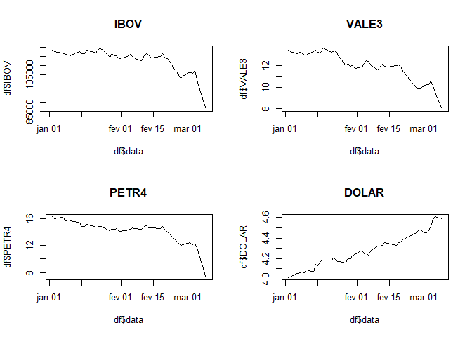

``` r
plot(df$data,df$DOLAR, main='Evolução do Dólar',xlab='Tempo',ylab='Dólar',type='l',col='red')
```

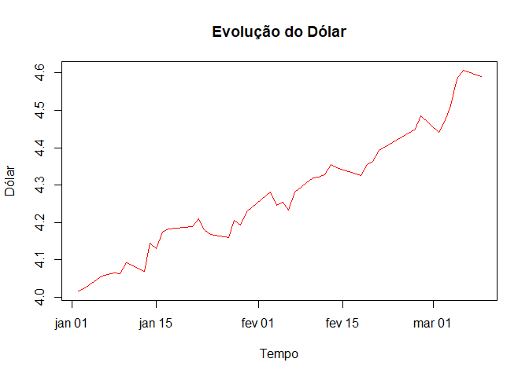

``` r
help(plot)
```

    ## starting httpd help server ... done

Você pode querer também exibir mais um gráfico de linha no mesmo gráfico
e comparar diferentes séries de dados. Para isso você pode empregar o
comando `lines`, que adiciona linhas a um comando `plot` anterior, mas
sem criar um novo gráfico. Veja também a adição de cores e legendas que
podem ser úteis em gráficos de apresentação mais elaborados.

``` r
plot(df$data,df$VALE3, type='l',col='blue',ylim=c(4,18),xlab='Tempo',ylab='Dólar')

lines(df$data,df$PETR4, type='l',col='green')
lines(df$data,df$DOLAR, type='l',col='red')

title("VALE3, PETR4 e DÓLAR")

legend(as.Date('2020-01-02'), 10,               # posição x, y da lengenda no gráfico
       legend=c('VALE3','PETR4','DOLAR'),       # lengendas
       col=c('blue','green','red'), 
       lty=1:3, 
       cex=0.8)
```

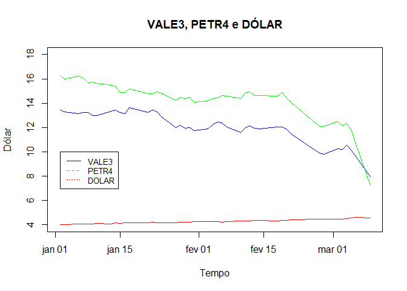

Como você pode ver gráficos de linha são úteis para observarmos a
evolução, ou tendência dos dados, de uma variável com relação a outra,
ou mesmo para compararmos a evolução de duas ou mais variáveis.

Distribuição
------------

Veremos mais sobre distribuições no próximo capítulo mas, basicamente, a
distribuição de uma variável refere-se a quantidade de vezes que uma dos
valores dessa variável aparece nos dados.

``` r
head(mtcars)
```

    ##                    mpg cyl disp  hp drat    wt  qsec vs am gear carb
    ## Mazda RX4         21.0   6  160 110 3.90 2.620 16.46  0  1    4    4
    ## Mazda RX4 Wag     21.0   6  160 110 3.90 2.875 17.02  0  1    4    4
    ## Datsun 710        22.8   4  108  93 3.85 2.320 18.61  1  1    4    1
    ## Hornet 4 Drive    21.4   6  258 110 3.08 3.215 19.44  1  0    3    1
    ## Hornet Sportabout 18.7   8  360 175 3.15 3.440 17.02  0  0    3    2
    ## Valiant           18.1   6  225 105 2.76 3.460 20.22  1  0    3    1

``` r
hist(mtcars$mpg, main='Histograma de mpg',col='lightblue')
```

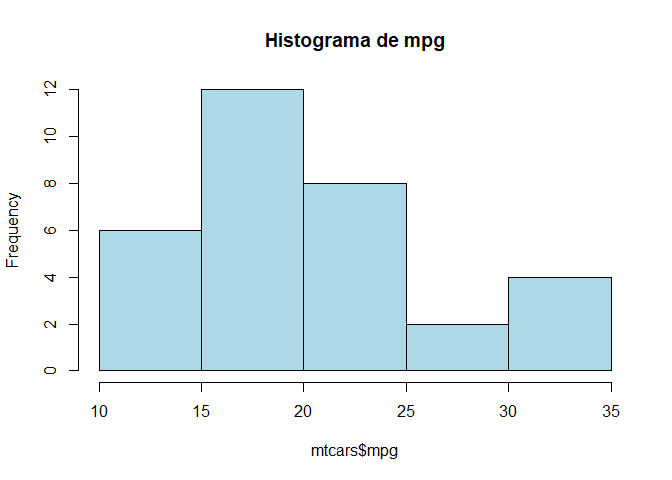

O gráfico acima mostra a distribuição dos valores de `mtcars$mpg` em
`mtcars`. Existem 6 veículos com valores de `mpg` entre \]10, 15\[, 12
veículos entre \[15, 20\[, 8 entre \[20, 2\[ etc. Esse gráfico é um
histograma e denominamos as quantidades de um valor, ou intervalo de
valores, de **frequência dos valores**.

Uma outra forma bastante comum de exibir essas distribuições é
empregarmos gráficos de *densidade de probabilidade*. `mtcars` tem 32
casos e você pode notar então que a probabilidade de veículos com
valores de `mpg` entre \]10, 15\[ é 6/32, veículos entre
\[15, 20\[12/32, veículos entre \[20, 2\[ 8/32 etc. e a probabilidade de
todos esse valores tem soma 1. Um gráfico de densidade de probabilidade
é um gráfico que, no lugar da frequencia dos valores, exibe essas
probabilidades e tem sua área sob o gráfico igual a 1 (a soma de todas
probabilidades).

``` r
# densityplot(mtcars$mpg, main='Densidade de Probabilidades de mpg',lwd=2)  # lwd é line witdh, a largura da linha
```

Você deve estar acostumado a gráficos de duas dimensões do tipo
*x* × *y*, como aparecem frequentemente na matemática. É exatamente o
que vimos no `plot()` em que empregamos duas variáveis, ou duas
dimensões, `plot(x,y)`. Note que nos histogramas, ou nos gráficos de
densidade, *uma única variável é informada*. De fato, histogramas e
gráficos de densidade são gráficos em que exibimos uma *única variável
em duas dimensões*: seus valores e sua frequencia ou probabilidade de
valores. Isso é particularmente importante para que você diferencie
principalmente histogramas de outros gráficos de barras (uma confusão
bastante comum).

Agora que você entendeu o que é a distribuição de uma variável podemos
partir para um exemplo mais interessante. O conjunto Os dados a seguir
foram obtidos da **WHO World Health Organization** - Life expectancy and
Healthy life expectancy. Eles apresentam indicadores de saúde de
diversos países como o índice de massa corpórea médio da população
(BMI), a expectativa de vida e índices de mortalidade. Uma pergunta
relevante sobre a saúde global que você poderia fazer é sobre a
distribuição desses índices entre os países.

Vamos considerar no conjunto de dados apenas os dados do ano mais
recente.

``` r
df = read.csv('https://meusite.mackenzie.br/rogerio/TIC/Life_Expectancy_Data.csv')
df = df[df$Year == max(df$Year),]
head(df)
```

    ##                Country Year     Status Life.expectancy Adult.Mortality
    ## 1          Afghanistan 2015 Developing            65.0             263
    ## 17             Albania 2015 Developing            77.8              74
    ## 33             Algeria 2015 Developing            75.6              19
    ## 49              Angola 2015 Developing            52.4             335
    ## 65 Antigua and Barbuda 2015 Developing            76.4              13
    ## 81           Argentina 2015 Developing            76.3             116
    ##    infant.deaths Alcohol percentage.expenditure Hepatitis.B Measles  BMI
    ## 1             62    0.01               71.27962          65    1154 19.1
    ## 17             0    4.60              364.97523          99       0 58.0
    ## 33            21      NA                0.00000          95      63 59.5
    ## 49            66      NA                0.00000          64     118 23.3
    ## 65             0      NA                0.00000          99       0 47.7
    ## 81             8      NA                0.00000          94       0 62.8
    ##    under.five.deaths Polio Total.expenditure Diphtheria HIV.AIDS        GDP
    ## 1                 83     6              8.16         65      0.1   584.2592
    ## 17                 0    99              6.00         99      0.1  3954.2278
    ## 33                24    95                NA         95      0.1  4132.7629
    ## 49                98     7                NA         64      1.9  3695.7937
    ## 65                 0    86                NA         99      0.2 13566.9541
    ## 81                 9    93                NA         94      0.1 13467.1236
    ##    Population thinness..1.19.years thinness.5.9.years
    ## 1    33736494                 17.2               17.3
    ## 17      28873                  1.2                1.3
    ## 33   39871528                  6.0                5.8
    ## 49    2785935                  8.3                8.2
    ## 65         NA                  3.3                3.3
    ## 81   43417765                  1.0                0.9
    ##    Income.composition.of.resources Schooling
    ## 1                            0.479      10.1
    ## 17                           0.762      14.2
    ## 33                           0.743      14.4
    ## 49                           0.531      11.4
    ## 65                           0.784      13.9
    ## 81                           0.826      17.3

Podemos notar então, por exemplo, que a expectativa de vida mais
frequente entre os países está entre 70 e 75 anos, ou ainda que a maior
parte dos países tem expectativa de vida acima de 70 anos.

``` r
library(lattice)
par(mfrow = c(2, 1))

hist(df$Life.expectancy, main='Expectativa de Vida dos Países' , 
     xlab='expectativa de vida em anos', col = "lightgreen",)
hist(df$Life.expectancy, main='Expectativa de Vida dos Países', 
     breaks = 100, col = "lightblue",                             # cria 100 faixas de dados no histograma
     xlab='expectativa de vida em anos')
```

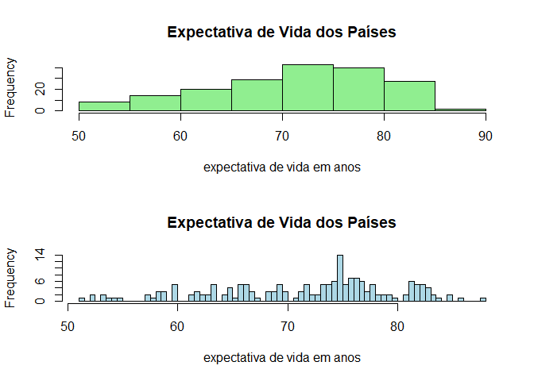

``` r
densityplot(df$Life.expectancy, main='Expectativa de Vida dos Países',
            xlab='expectativa de vida em anos')
```

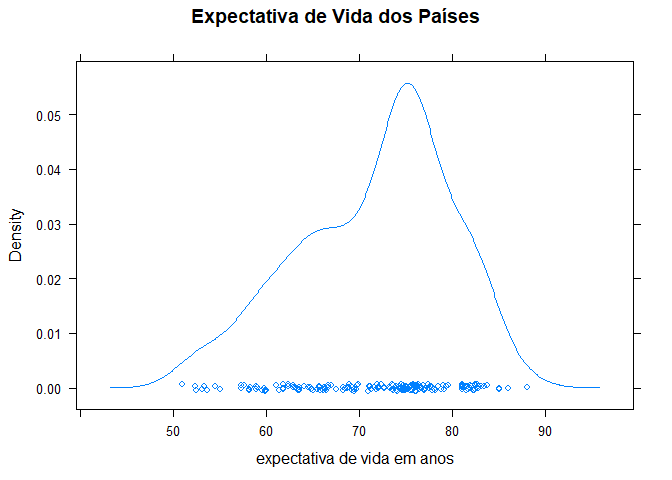

Uma forma comum de exibirmos gráficos de densidade é preenchendo a área
sob a curva e, dentre muitas outras formas, podemos fazer isso do
seguinte modo.

``` r
d = density(df$Life.expectancy,na.rm = TRUE)             # na.rm remove dados faltantes da base
plot(d, main='Expectativa de Vida dos Países')
polygon(d, col="lightblue", border="black")
```

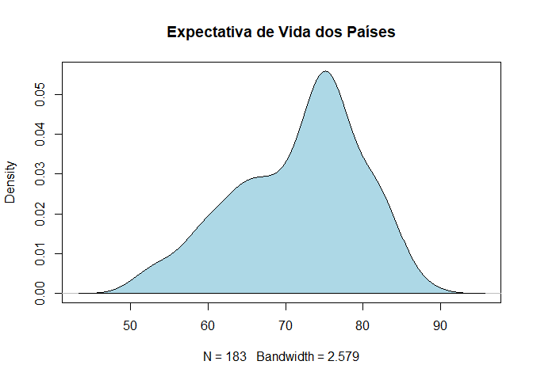

E podemos ainda comparar a distribuição de expectativa de vida entre os
países desenvolvidos e em desenvolvimento, e não será surpresa para você
observar que a expectativa de vida nos países desenvolvidos é cerca de
10 anos superior a dos países em desenvolvimento!

``` r
densityplot(df[df$Status == 'Developing',]$Life.expectancy, main='Expectativa de Vida dos Países',
            xlab='expectativa de vida em anos')
```

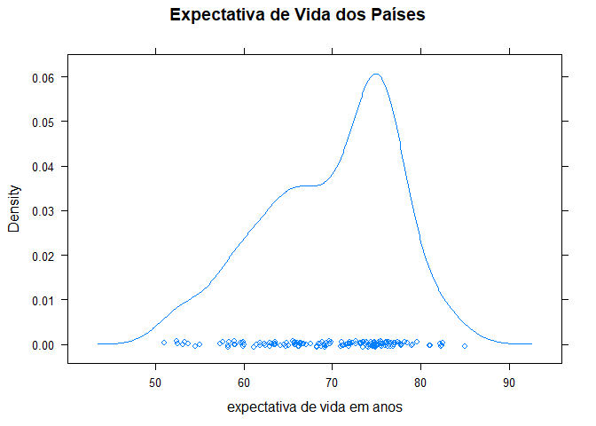

``` r
densityplot(df[df$Status != 'Developing',]$Life.expectancy, main='Expectativa de Vida dos Países',
            xlab='expectativa de vida em anos')
```

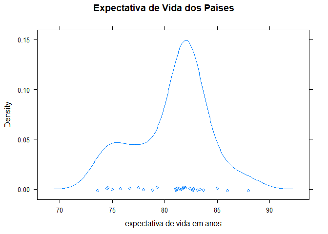

Uma forma sintética de exibir essas distribuições é a partir dos
gráficos de caixa ou *boxplot*. Os quartis, que você estudou no capítulo
anterior, são uma forma sintética de representar as distribuições dos
dados e é basicamente o que exibem os gráficos de caixa.

``` r
par(mfrow = c(1, 3))
boxplot(df$Life.expectancy,main='Expectativa de Vida')
boxplot(df$BMI,main='BMI')
boxplot(Life.expectancy ~ Status,data=df,main="Expectativa de Vida ")
```

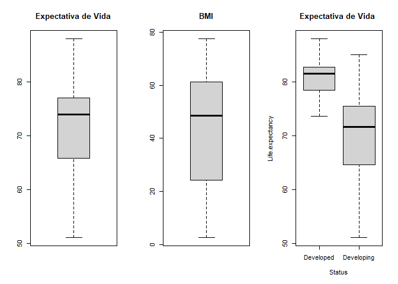

E para entender o gráfico acima podemos recorrer a figura que empregamos
no capítulo 2:

</a>

e gráficos de caixa também são úteis para detecção de outliers (eles
aparecem como pontos acima/abaixo das linhas dos valores máximo/mínimo
dos dados).

Como você pôde notar aqui a distribuição dos dados diz muito sobre uma
variável. Aqui você aprendeu somente a exibir e analisar graficamente
essas distribuições e você ira aprender muito mais no capítulo seguinte.

### Composição

Aqui estamos interessados em entender a ‘composição’ ou as partes de um
conjunto de dados. Entender as quantidades e proporções de cada parte,
as diferentes categorias de uma variável, os diferentes valores de
variáveis para diferentes categorias etc. Gráficos de barras e *pizza*
são particularmente úteis para isso.

Considere a base \`mtcars.

``` r
library(MASS)
help(Cars93)
head(Cars93)
```

    ##   Manufacturer   Model    Type Min.Price Price Max.Price MPG.city MPG.highway
    ## 1        Acura Integra   Small      12.9  15.9      18.8       25          31
    ## 2        Acura  Legend Midsize      29.2  33.9      38.7       18          25
    ## 3         Audi      90 Compact      25.9  29.1      32.3       20          26
    ## 4         Audi     100 Midsize      30.8  37.7      44.6       19          26
    ## 5          BMW    535i Midsize      23.7  30.0      36.2       22          30
    ## 6        Buick Century Midsize      14.2  15.7      17.3       22          31
    ##              AirBags DriveTrain Cylinders EngineSize Horsepower  RPM
    ## 1               None      Front         4        1.8        140 6300
    ## 2 Driver & Passenger      Front         6        3.2        200 5500
    ## 3        Driver only      Front         6        2.8        172 5500
    ## 4 Driver & Passenger      Front         6        2.8        172 5500
    ## 5        Driver only       Rear         4        3.5        208 5700
    ## 6        Driver only      Front         4        2.2        110 5200
    ##   Rev.per.mile Man.trans.avail Fuel.tank.capacity Passengers Length Wheelbase
    ## 1         2890             Yes               13.2          5    177       102
    ## 2         2335             Yes               18.0          5    195       115
    ## 3         2280             Yes               16.9          5    180       102
    ## 4         2535             Yes               21.1          6    193       106
    ## 5         2545             Yes               21.1          4    186       109
    ## 6         2565              No               16.4          6    189       105
    ##   Width Turn.circle Rear.seat.room Luggage.room Weight  Origin          Make
    ## 1    68          37           26.5           11   2705 non-USA Acura Integra
    ## 2    71          38           30.0           15   3560 non-USA  Acura Legend
    ## 3    67          37           28.0           14   3375 non-USA       Audi 90
    ## 4    70          37           31.0           17   3405 non-USA      Audi 100
    ## 5    69          39           27.0           13   3640 non-USA      BMW 535i
    ## 6    69          41           28.0           16   2880     USA Buick Century

O comando `table()` fornece a frequencia de valores (quantidades) para
cada um dos pares de valores informados. Podemos exibir, então, cada um
desses valores representados pela altura das barras no gráfico.

``` r
par(mfrow = c(1, 2))

counts1 = table( Cars93$Origin, Cars93$Cylinders)

print(counts1)
```

    ##          
    ##            3  4  5  6  8 rotary
    ##   USA      0 22  0 20  6      0
    ##   non-USA  3 27  2 11  1      1

``` r
barplot(counts1, main="Cyl X Origem",
  xlab="Número de Cyl", 
  legend = rownames(counts1), 
  beside=TRUE) # barras uma do lado da outra

counts2 = table(Cars93$Cylinders , Cars93$DriveTrain)

print(counts2)
```

    ##         
    ##          4WD Front Rear
    ##   3        1     2    0
    ##   4        4    41    4
    ##   5        0     2    0
    ##   6        5    20    6
    ##   8        0     2    5
    ##   rotary   0     0    1

``` r
barplot(counts2, main="Tipo de Tração X Cyl",
  xlab="Tipo de Tração", 
  legend = rownames(counts2), 
  beside=TRUE,
  col=rainbow(6)) # fornece 6 cores diferentes
```

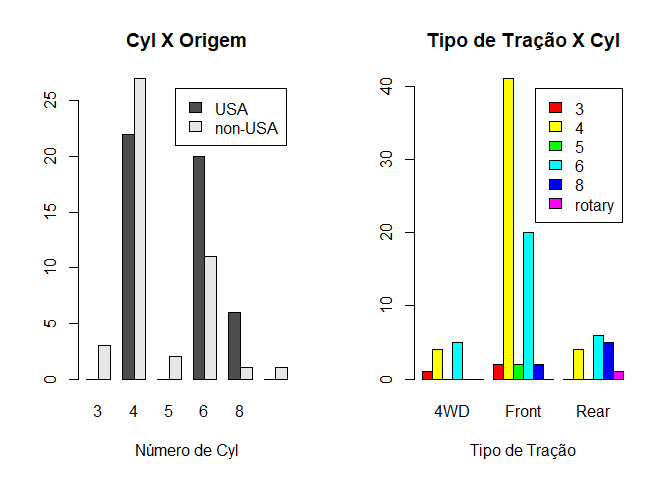

Você pode, então, explorar a ‘composição’ desse conjunto de veículos
notando, por exemplo, que somente encontramos veículos fabricados fora
dos Estados Unidos para com número de cilindros ímpares (ou ainda do
tipo *rotary*), ou que a maior predomiância nos dados é de veículos de 4
cilindros com tração dianteira.

E a mesma informação pode ser exibida com barras sobrepostas (*stacked
bar plot*) o que pode ser interessante e alguns casos. Para isso basta
você tirar o parâmetro `beside` dos comandos acima.

``` r
par(mfrow = c(1, 2))

counts1 = table( Cars93$Origin, Cars93$Cylinders)
barplot(counts1, main="Cyl X Origem",
  xlab="Número de Cyl", 
  legend = rownames(counts1))

counts2 = table(Cars93$Cylinders , Cars93$DriveTrain)
barplot(counts2, main="Tipo de Tração X Cyl",
  xlab="Tipo de Tração", 
  legend = rownames(counts2), 
  col=rainbow(6)) # fornece 6 cores diferentes
```

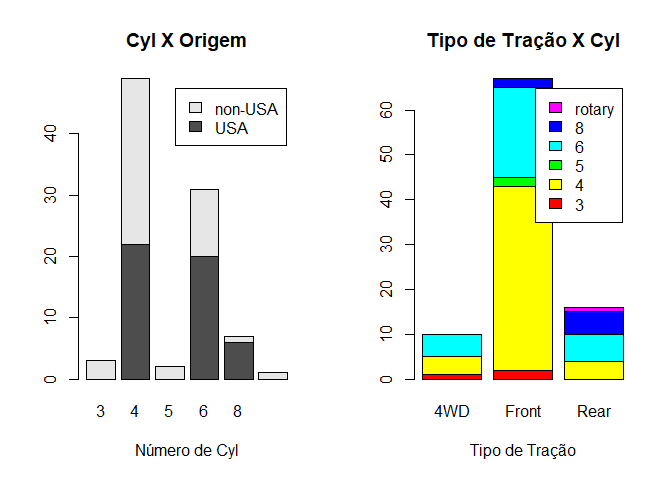

Gráficos de barras não exibem somente frequência de valores (que
obtevemos com o comando `table()`acima), eles podem ser empregados para
exibir quaiquer quantidades e são particularmente úteis na comparação de
valores. Abaixo produzimos os valores médios dos veículos por tipo de
tração e origem, e podemos então exibir e comparar esses valores.

``` r
par(mfrow = c(1, 2))

valoresUS = c(mean( Cars93[Cars93$Origin == 'USA',]$Price ),
            mean( Cars93[Cars93$Origin != 'USA',]$Price ))

barplot(valoresUS, main="Origem X Preço Médio",
  xlab="Origem", 
  names.arg = c('USA','non-USA'),
  col='lightblue')


valoresTracao = c(mean( Cars93[Cars93$DriveTrain == '4WD',]$Price ),
            mean( Cars93[Cars93$DriveTrain == 'Front',]$Price ),
            mean( Cars93[Cars93$DriveTrain == 'Rear',]$Price ))

barplot(valoresTracao, main="Tipo de Tração X Preço Médio",
  xlab="Tipo de Tração", 
  names.arg = c('4WD','Front','Rear'), 
  col=rainbow(3))
```

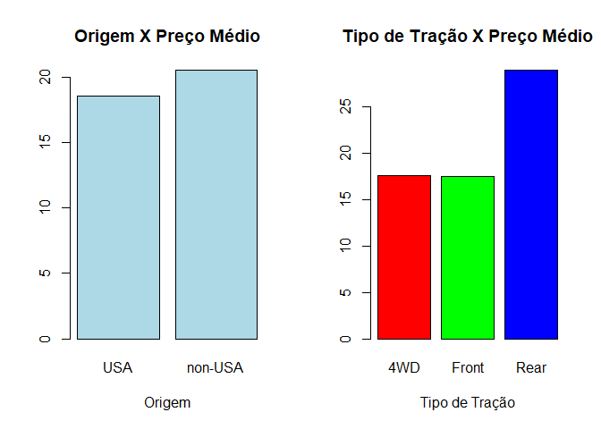

Existem formas mais simples em R de se obter os valores por grupos de
dados, mas aqui nos limitamos a empregar comandos que você já conhece.

Os gráficos de *pizza* também podem ser empregados mas, em geral,
gráficos de barra desempenham a mesma função e são mais fáceis de serem
interpretados.

``` r
par(mfrow = c(1, 3))

pie(table(Cars93$Cylinders), main='Cilindros')
pie(table(Cars93$Origin), main='Origem')
pie(table(Cars93$DriveTrain), main='Tipo de Tração')
```

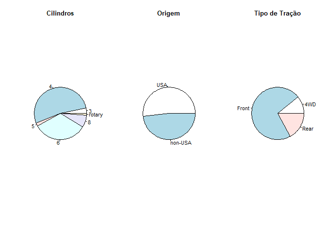

O `dotchart` é um gráfico bastante especializado mas que pode substituir
um gráfico de barras nos casos em que muitos valores são exibidos. Você
pode comparar os dois gráficos abaixo e notar que para um maior número
de casos o `dotchart` fornece uma visualização mais limpa.

``` r
par(mfrow = c(1, 2))

barplot(Cars93[Cars93$Manufacturer %in% c('Ford','Chevrolet'),]$Horsepower,
         names.arg = Cars93[Cars93$Manufacturer %in% c('Ford','Chevrolet'),]$Model,
         col='blue',
         horiz = T, las=1, # barras e seus labels na horizontal
         main="Potência dos Modelos",
         cex.names = 0.8)

dotchart(Cars93[Cars93$Manufacturer %in% c('Ford','Chevrolet'),]$Horsepower,
         labels=Cars93[Cars93$Manufacturer %in% c('Ford','Chevrolet'),]$Model,
         cex=0.8,col='blue',
   main="Potência dos Modelos",
   xlab="hp")
```

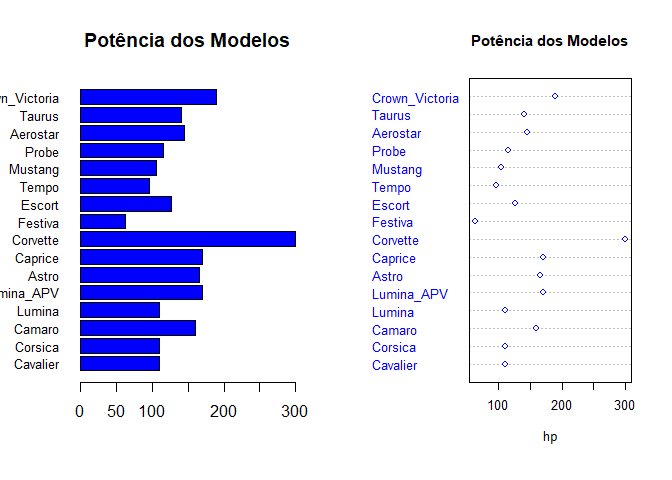

### Relações

Relações entre os dados são muitas vezes a parte mais importante dentre
as descobertas que buscamos nos dados. Essas relações são denominadas de
modo geral como correlações. Mas, como você viu no capítulo anterior, a
correlação estatística tem um significado muito mais específico e, em
geral, está associada a correlação linear. Essa é em geral a primeira
relação que buscamos entre variáveis numéricas pois permite, como
veremos no capítulo 7 mais adiante, aplicarmos métodos de regressão
linear para inferência de valores. Graficamente, entretanto, estamos
livres para buscar quaisquer relações entre os dados, sejam elas
lineares ou não.

O gráfico `pairs()` do R é útil por exibir um *gráfico de dispersão* de
todos os pares de variáveis de um dataframe. Um gráfico de dispersão, ou
*scatter plot*, é um gráfico *x* × *y* onde, diferentemente de uma
função podemos ter vários valores de *y* para um mesmo valor de *x*. Um
gráfico de dispersão é obtido com o mesmo comando `plot(x,y)`, mas sem
produzir uma *linha* entre os pontos (pois haveria vários pontos para um
mesmo *x*). Ele representa assim como se distribuem os valores de uma
variável com relação a outra, ou sua dispersão.

Vamos empregar o mesmo conjunto de dados anterior, da **WHO World Health
Organization** - Life expectancy and Healthy life expectancy e
selecionar somente os dados mais recentes.

``` r
df = read.csv('https://meusite.mackenzie.br/rogerio/TIC/Life_Expectancy_Data.csv')
df = df[df$Year == max(df$Year),]
head(df)
```

    ##                Country Year     Status Life.expectancy Adult.Mortality
    ## 1          Afghanistan 2015 Developing            65.0             263
    ## 17             Albania 2015 Developing            77.8              74
    ## 33             Algeria 2015 Developing            75.6              19
    ## 49              Angola 2015 Developing            52.4             335
    ## 65 Antigua and Barbuda 2015 Developing            76.4              13
    ## 81           Argentina 2015 Developing            76.3             116
    ##    infant.deaths Alcohol percentage.expenditure Hepatitis.B Measles  BMI
    ## 1             62    0.01               71.27962          65    1154 19.1
    ## 17             0    4.60              364.97523          99       0 58.0
    ## 33            21      NA                0.00000          95      63 59.5
    ## 49            66      NA                0.00000          64     118 23.3
    ## 65             0      NA                0.00000          99       0 47.7
    ## 81             8      NA                0.00000          94       0 62.8
    ##    under.five.deaths Polio Total.expenditure Diphtheria HIV.AIDS        GDP
    ## 1                 83     6              8.16         65      0.1   584.2592
    ## 17                 0    99              6.00         99      0.1  3954.2278
    ## 33                24    95                NA         95      0.1  4132.7629
    ## 49                98     7                NA         64      1.9  3695.7937
    ## 65                 0    86                NA         99      0.2 13566.9541
    ## 81                 9    93                NA         94      0.1 13467.1236
    ##    Population thinness..1.19.years thinness.5.9.years
    ## 1    33736494                 17.2               17.3
    ## 17      28873                  1.2                1.3
    ## 33   39871528                  6.0                5.8
    ## 49    2785935                  8.3                8.2
    ## 65         NA                  3.3                3.3
    ## 81   43417765                  1.0                0.9
    ##    Income.composition.of.resources Schooling
    ## 1                            0.479      10.1
    ## 17                           0.762      14.2
    ## 33                           0.743      14.4
    ## 49                           0.531      11.4
    ## 65                           0.784      13.9
    ## 81                           0.826      17.3

``` r
pairs(df[ ,c('BMI','Life.expectancy','Income.composition.of.resources','Schooling')])
```

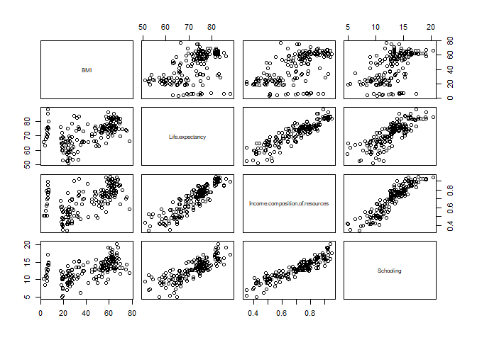

A rigor esse não é um gráfico, mas vários gráficos combinados, e você
pode notar, por exemplo, a proximidade de uma reta para a relação entre
Expectativa de Vida e Renda (por simplicidade chamaremos
income.composition.of.resource simplesmente de Renda), ou ainda Renda e
Escolaridade. O que não ocorre em nenhum caso para o BMI (índice de
massa corporal médio das populações).

Você pode notar, por exemplo, a proximidade de uma reta para a relação
entre Expectativa de Vida e Renda (por simplicidade chamaremos
income.composition.of.resource simplesmente de Renda), ou ainda Renda e
Escolaridade. O que não ocorre em nenhum caso para o BMI (índice de
massa corporal médio das populações).

Uma vez identificados um ou mais pares de interesse, podemos empregar o
comando `plot()` para exibir o gráfico de dispersão dessas variáveis.
Você pode ainda adicionar uma linha de regressão para enfatizar a
relação das variáveis, mas você não precisa se preocupar com isso agora.

``` r
par(mfrow = c(1, 2))

plot(df$Income.composition.of.resources, df$Life.expectancy, 
     main='Expectativa X Renda',xlab='Renda',ylab='Expectativa de Vida', col='red')

plot(df$Income.composition.of.resources, df$Life.expectancy, 
     main='Expectativa X Renda',xlab='Renda',ylab='Expectativa de Vida')

abline(lsfit(df$Income.composition.of.resources, df$Life.expectancy),col='red')
```

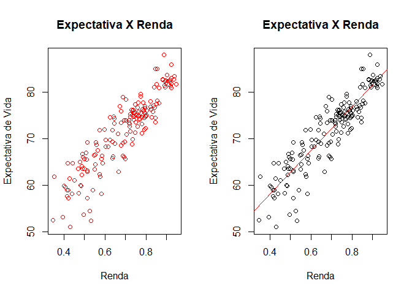

E como falamos, muitas vezes podemos empregar um gráfico mais
frequentemente empregado para uma categoria de perguntas em outra. Aqui
empregamos um `boxplot()` para examinar a relação entre Renda e
Escolaridade. A sintaxe *y* ← *x* no comando indica a variável preditora
*x* e variável dependente *y*.

``` r
boxplot(df$Income.composition.of.resources ~ df$Schooling,  
        xlab="Escolaridade", ylab="Renda",main='Escolaridade X Renda',
        col='blue') 
```

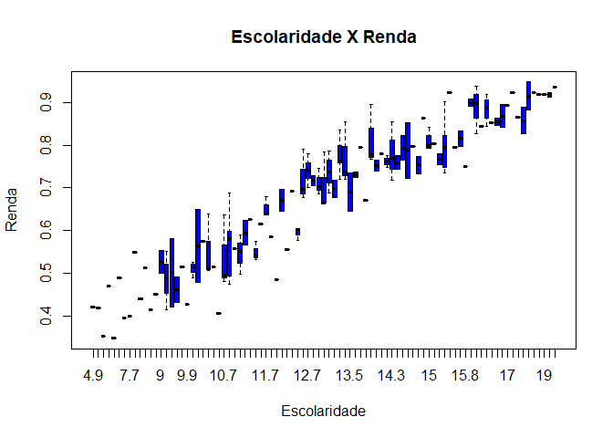

Uma outra forma útil e comum de buscarmos essas relações é o uso de um
mapa de calor (*heat map*) do valor da correlações entre as variáveis de
interesse. Antes de fazermo com os dados de WHO veja aqui um exemplo
simples.

``` r
data = signif(cor(mtcars),2)
heatmap(data)
```

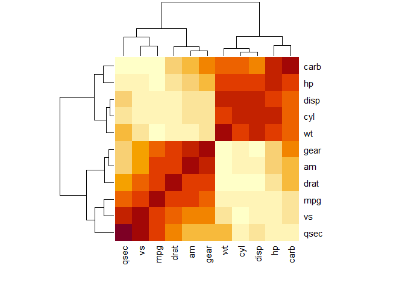

O comando `cor()`, como vimos no capítulo anterior, retorna a correlação
(coeficiente de Pearson) para todos os pares de valores. O `heat map()`
então, exibe em um gráfico, a intensidade dos valores de correlação para
cada par. Você pode notar, por exemplo, que hp, cyl e carb, todos
atributos associados a uma maior potência dos veículos apresentam uma
correlação bastante maior representado por cores mais escuras no
gráfico.

Do mesmo modo podemos exibir a correlação dos dados da base WHO e notar
a maior correlação de Renda e Escolaridade por exemplo.

``` r
data = signif(cor(na.omit( df[ ,c('BMI','Life.expectancy','Income.composition.of.resources','Schooling')]) ),2)

heatmap(data, cexRow=0.8, cexCol=0.5)
```

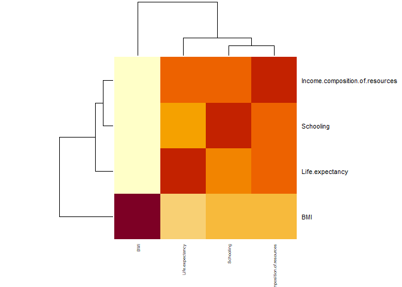

Agora você já sabe como buscar relações lineares e não lineares em um
conjunto de dados!

Melhores Gráficos
-----------------

Para os nossos propósitos os gráficos acima serão suficientes. Mas se
você se interessa por gráficos com uma apresentação mais profissional
pode empregar a biblioteca `ggplot2`.

``` r
# install.packages('ggplot2')
# Loading
# library(ggplot2)
```

Ela é uma das bibliotecas mais empregadas para produzir visualizações
profissionais dos dados, mas exige um pouco mais de conhecimento para o
uso de suas funções e você pode consultar alguma das referências abaixo
para empregar o `ggplot`.

Referências
-----------

Navarro, Danielle, **Learning Statistics with R**, disponível em:
<a href="https://learningstatisticswithr.com/" class="uri">https://learningstatisticswithr.com/</a>
( LSR version 0.6 (pdf) ). Acesso: 26/02/2021. Alternativamente em
formato bookdown:
<a href="https://learningstatisticswithr.com/book/" class="uri">https://learningstatisticswithr.com/book/</a>
Acesso: 07/03/2021.

Wickham, H., Grolemund, G. **R for Data Science**. O’Reilly Media, Inc.,
2016.

Chang, W. **R Graphics Cookbook**. O’Reilly Media, Inc. 2nd edition,
2021. Alternativamente em formato eletrônico:
<a href="https://r-graphics.org/index.html" class="uri">https://r-graphics.org/index.html</a>.
Acesso: 07/03/2021.
