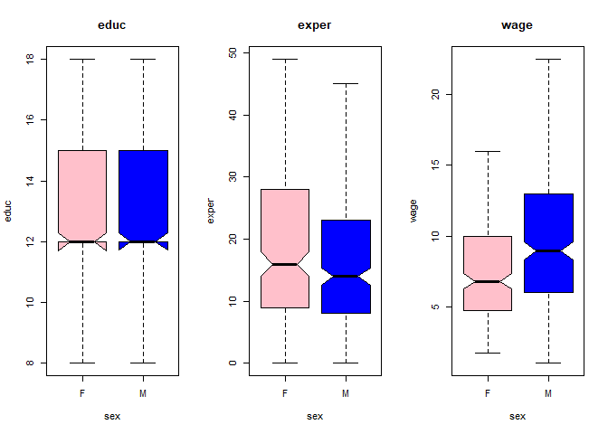

Probabilidade e Estatística - Exercícios 3
================
Rogério de Oliveira
2021-05-24

# Visualização dos Dados

-----


<br> <br> <br> <br> <br>

## Exercícios

### Exercício 1

Considere a base.

``` r
# install.packages("mosaicData")
data(CPS85 , package = "mosaicData")
head(CPS85)
```

1.  Faça um histograma e gráficos de caixa de `educ` e `expr`. Existem
    outliers para que valores?

**Solução**

2.Faça gráficos para exibir a distribuição (histograma) de valores de
`educ`, `exper` e `wage` separadamente para os sexos Masculino e
Feminino. Que distribuições concentram valores mais a esquerda (valores
menores)?

Esses são casos de distribuições chamadas distribuições assimétricas em
calda.

**Solução**

3.  Analise a distribuição dos mesmos dados do problema anterior, mas
    agora empregue um gráfico de caixa e a função `~` para exibir
    separadamente os sexos.

Dica: experimente `educ ~ sex`.

**Solução**

4.  Consulte o help do boxplot e busque uma opção que exiba com maior
    evidência a mediana e o quanto ela difere dos outros valores. Repita
    então o exercício anterior com essa opção. Se conseguir (rs)
    empregue uma opção para colorir diferentemente as caixas para o sexo
    Feminino e Masculino. Utilize também um parâmetro para não exibir os
    outliers.

Dica: não se incomode com a mensagem de warning se surgir.

**Solução**

``` r
par(mfrow = c(1, 3))

boxplot(educ ~ sex, data=CPS85, main='educ',col=c('pink','blue'),
        notch=TRUE,outline=FALSE)
boxplot(exper ~ sex, data=CPS85, main='exper',col=c('pink','blue'),
        notch=TRUE,outline=FALSE)
boxplot(wage ~ sex, data=CPS85, main='wage',col=c('pink','blue'),
        notch=TRUE,outline=FALSE)
```

<!-- -->

5.  Empregue um gráfico de barras e outro de pizza para exibir a
    proporção de do status de casados na base. Dica: para o `pie()`
    você precisa fornecer a frequencia dos valores. Empregue em conjunto
    o `table()`.

**SOlução**

6.  Faça um gráfico de densidade e um histogram com breaks=30 para os
    valores de rendimentos (`wage`). Compare os gráficos.

**Solução**

### Exercício 2

1.  Empregue a função `rnorm` para gerar valores randomicos. Acesse o
    `help(norm)`. Mas o seu formato geral é:

<!-- end list -->

``` 
                      rnorm( n, valor médio, desvio padrão)
```

gere 4 séries com 100 valores aleatórios com média 50 e desvio padrão
10, 50, 20 e 5 respectivamente. Em seguida plot os gráficos de densidade
e compare.

Dica: você pode querer empregar `plot(density(...),...)` no lugar do
`densityplot()`.

**Solução**

2.  Repita o exercício anterior somente para as séries de desvio padrão
    10 e 20, mas compare também os histogramas produzidos. Compare os
    resultados.

**Solução**

### Exercício 3

Considere a base.

```{r}
df = read.csv('http://meusite.mackenzie.br/rogerio/TIC/mystocksn.csv')
head(df)
```

1.  Produza o gráfico:

```{r}
    boxplot(DOLAR ~ data, data=df)
```

Por quê o gráfico aparentemente não exibe os quartis de cada data?

**Solução**
