Distribuições de Probabilidade
==============================

------------------------------------------------------------------------

         

Vamos introduzir aqui a noções de probabilidade e inferência
estatística. Você vai conhecer aqui as principais distribuições de
probabilidades. Aqui você aprenderá como caracterizar diferentes
distribuições de probabilidades e como empregar essas distribuições para
fazer inferências sobre os dados. Você vai ainda aplicar esse conceitos
em conjuntos de dados com R.

Introdução
----------

No capítulo anterior você aprendeu a visualizar distribuições dos dados
empregando histrogramas e gráficos de densidade. Deve ter notado também
a importância da distribuição para o entendimento dos dados e análise
gráfica permite distinguir entre distribuições simétricas, em calda à
direita (assimetria negativa, com a média é em geral menor que a
mediana) ou à direita etc. Algumas dessas distribuições são bastante
comuns e aparecem com frequencia em uma série de problemas práticos,
como a *distribuição normal* que você já deve ter ouvido falar em algum
momento, no dia-a-dia, na escola ou no trabalho, e entender sobre essas
distribuições permitirá você fazer *inferências* importantes sobre os
dados como estimar um valor mais provável.

Probabilidade
-------------

Imagine uma caixa com 10 bolas de bilhar, 5 vermelhas, 2 azuis e 3
amarelas. Abaixo você pode ver representada a frequencia, isto é
quantidade, de cada uma das cores na caixa.

    barplot(c(5,2,3),
            names.arg=c('vermelha','azul','amarela'), 
            col=c('red','blue','yellow'))
    title('Proporção das Bolas na Caixa pelas Quantidades (frequencia)')

Imagine agora que você vai tirar uma bola da caixa sem olhar para bola
que irá retirar. Qual cor você imagina será mais provável de você
retirar da caixa? Se você respondeu *vermelha* você certamente já tem a
intuição do que é a probabilidade de um evento. A probabilidade, em uma
perspectiva que podemos dizer *frequentista*, considera a frequencia (as
quantidades) que ocorrem de cada valor, sendo o caso mais provável a cor
que aparece em maior proporção. No caso do nosso exemplo, a
probabilidade de você tirar cada uma das cores é dada por:

$$ p(X=vermelha) = \\frac{\\text{bolas vermelhas}}{\\text{total de bolas}} = 5/10 = 0.5  $$

$$ p(X=azul) = \\frac{\\text{bolas azuis}}{\\text{total de bolas}} = 2/10 = 0.2  $$

$$ p(X=amarela) = \\frac{\\text{bolas amarelas}}{\\text{total de bolas}} = 3/10 = 0.3  $$

E podemos então dizer que a probabilidade de um evento, um valor
*x**i*, é dada por:

$$ p(X=x\_i) = \\frac{\\text{nr de casos de } x\_i}{\\text{nr de todos casos possíveis}} $$

Você pode notar também que a soma da probabilidade de todos os casos é
1.

*p*(*X* = *v**e**r**m**e**l**h**a*) + *p*(*X* = *a**z**u**l*) + *p*(*X* = *a**m**a**r**e**l**a*) = 0.5 + 0.3 + 0.2 = 1

Este é um resultado não ocorre só para o nosso exemplo. Em qualquer caso
a soma das probabilidades de todos eventos possíveis é 1, e podemos
escrever isso de modo geral como:

$$ \\sum\_i^n p(X=x\_i) = 1 $$

Podemos agora, de forma semelhante ao que fizemos com as quantidades,
representar a *proporção* ou a probabilidade de cada cor, dividindo a
frequencia de cada cor pelo total de bolas na caixa.

    barplot(c(5/10,2/10,3/10),
            names.arg=c('vermelha','azul','amarela'), 
            col=c('red','blue','yellow'))
    title('Proporção das Bolas na Caixa')

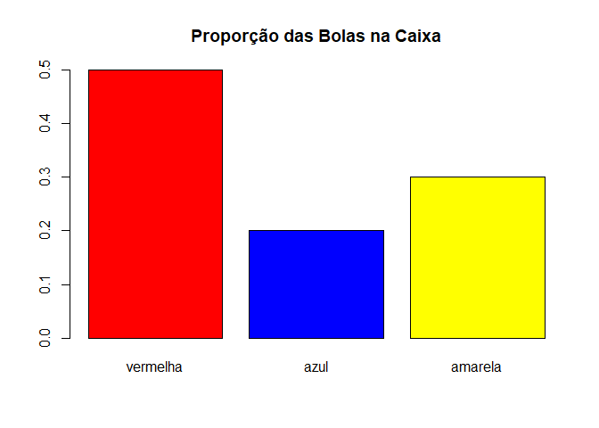

Você acaba de descobrir uma função de probabilidades e isso vai ajudar
você a entender as distribuições de probabilidade.

Distribuições de Probabilidade
------------------------------

As distribuições de probabilidade são um conceito fundamental em
estatística. Para dados univariados, funções de distribuição de
probabilidades fornecem um modelo de distribuição dos dados, e ela ainda
são a base para o cálculo de intervalos de confiança e os testes de
hipóteses, desempenhando um papel fundamental na inferência estatística,
simulações etc.

A definição matemática de uma **função de probabilidade discreta**,
*p*(*x*), é uma função com as seguintes propriedades:

1.  Fornece *p*(*x**i*) a probabilidade de que
    *x**i* possa assumir um determinado valor:

*P*\[*X* = *x**i*\] = *p*(*x**i*)

1.  *p*(*x*) é não negativo para todo valor *x*.

*p*(*x**i*) ≥ 0 , para ∀*i*

1.  A soma de *p*(*x*) para todos os valores possíveis de
    *x**i* é 1

∑*i**p*(*x**i*) = 1

E como consequência de 2. e 3. temos 0 ≤ *p*(*x**i*) ≤ 1 para
∀*i*.

Pelo nosso exemplos da caixa com bolas coloridas é exatamente o que você
esperava encontrar, não é mesmo?

Uma função de probabilidade discreta é um função que pode assumir um
número discreto de valores (não necessariamente finitos). No nosso
exemplo, existem somente 3 casos correspondente às 3 cores na caixa. Mas
de modo análogo podemos também **definir funções de probabilidades
contínuas**, e com suas correspondentes distribuições.

1.  
    *P*\[*a* ≤ *x* ≤ *b*\] = ∫*a**b**p*(*x*)

2.  
    *p*(*x*) ≥ 0 , para ∀*x*

3.  
    ∫ − ∞ + ∞*p*(*x*) = 1

Para essas funções *P*(*x*) podemos criar gráficos que são bastante
úteis para entendermos os dados envolvidos. Um gráfico que exibe a
probabilidade *P*(*X* = *x*) para cada valor de *x* é um **gráfico de
densidade de probabilidade** e ainda é comum empregarmos um **gráfico de
densidade de probabilidade acumulada** exibindo os valores de
*P*(*X* ≤ *x*) para todo *x*.

   

    Brown, R. J.[**Connecting the CDF and the
PDF**](http://demonstrations.wolfram.com/ConnectingTheCDFAndThePDF/)
*Wolfram Demonstrations Project*.    

Essas funções são normalmente conhecidas como **PDF** (do inglês,
Probability Density Function) e **CDF** (do inglês, Cumulative Density
Function). E talvez você queira explorar aqui em [Connecting the CDF and
the PDF](https://demonstrations.wolfram.com/ConnectingTheCDFAndThePDF/)
como essas funções se relacionam.

É importante você notar que, assim como no caso discreto, em que a
somatória de todos os valores de probabilidade possíveis é 1, para o
caso contínuo, $ \_{-}^{+} p(x) = 1$, isso significa que a área sob a
curva da PDF tem valor 1.

Função de Probabilidade Discreta: Distribuição Binomial
-------------------------------------------------------

Considere que você vai jogar uma moeda e deseja saber qual a
probabilidade de obter 7 caras ou mais em 20 lançamentos. Esses
lançamentos de moeda seguem uma distribuição conhecida como Binomial e
podemos empregar a fórmula:

$$P(k) = \\frac{{n!}}{{k!\\left( {n - k} \\right)!}}p^k (1 - p)^{n - k} = \\left( {\\begin{array}{\*{20}c} n \\\\ k \\\\ \\end{array}} \\right)p^k (1 - p)^{n - k}$$

para calcular a probabilidade *p*(7) de até 7 caras, onde *p* é a
probabilidade de se obter cara (0.5 se a moeda é não viciada) e *n* o
número de lançamentos.

Você não precisa se preocupar compreender completamente essa função
agora, mesmo por quê empregaremos o R para fazer esses cálculos para
você. O seu objetivo agora é entender *o quê* podemos fazer se
conhecemos essa função? Você pode, por hora, pensar nessa função como um
fórmula, havendo uma fórmula para cada tipo de distribuição diferente.
Entender o que podemos fazer essas funções vai então motivá-lo a
compreendê-las melhor.

Podemos então construir os gráficos PDF e CDF dessa distribuição e isso
ajudará você a compreender e explorar esse problema.

    n = 20
    p = 0.5

    prob = c(0)

    pmf <- function(k, n, p){
      return ( factorial(n) / ( ( factorial(k) * factorial(n - k) ) ) * p**k * (1-p)**(n-k) )
    }

    for (k in c(0:n)){
      prob[k+1] = pmf(k, n, p)
    }

    barplot(prob,
            names.arg = seq(0,n,1),
            xlab = 'Quantidade de Caras',
            ylab = 'Função Densidade de Probabilidade',
            col='lightblue',
            cex.names = 0.8)  
    title('PDF, Binom(n=20, p=0.5)')

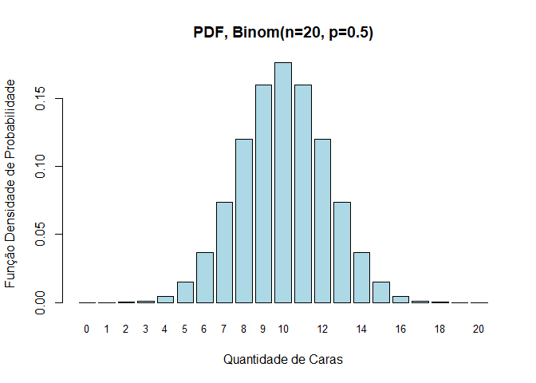

O gráfico acima exibe a função de densidade de probabilidade, isto é, a
probabilidade de obtermos **até** um determinado número de caras ao
longo dos 20 lançamentos.

Vamos explorar um pouco esse gráfico. Por exemplo, você pode notar que a
probabilidade de termos **até** uma única cara nos lançamentos é muito
baixa, afinal você precisaria que os 19 demais lançamentos retornassem
todos coroa. A probabilidade aumenta até 10, o quê também é esperado, já
que em média, sendo a uma moeda sem vício, a chance de se obter cara é
de 50% e 10 corresponderia à metade dos 20 lançamentos.

Mas para muitas distribuições, como esta, o R já fornece a função de
probabilidades.

    dbinom(x, size, prob, log = FALSE)

Veja `help('pbinom')`.

Assim, podemos reescrever o código acima como:

    n = 20
    p = 0.5

    prob = c(0)

    for (k in c(0:n)){
      prob[k+1] = dbinom(k, n, p)
    }

    barplot(prob,
            names.arg = seq(0,n,1),
            xlab = 'Quantidade de Caras',
            ylab = 'Função Densidade de Probabilidade',
            col='lightblue',
            cex.names = 0.8)  
    title('PDF, Binom(n=20, p=0.5)')

E você verá que outras distribuições a função de **d**istribuição de
probabilidades também será **d**<nome-da-distribuição>, por exemplo
`dnorm()` para a distribuição normal. Mas voltaremos nisso mais adiante.

Mas esse gráfico permite você entender muito mais. A probabilidade de
termos até 7 caras nos lançamentos é a soma das probabilidades de termos
até 1, 2,… e 7 lançamentos, o que é representado no gráficos pela área
ou ‘soma’ das barras até o valor 7. De fato, você verá mais adiante, que
nas distribuições contínuas podemos calcular essa área para obtermos as
probabilidades.

    n = 20
    p = 0.5

    prob = c(0)

    for (k in c(0:n)){
      prob[k+1] = dbinom(k, n, p)
    }

    barplot(prob,
            names.arg = seq(0,n,1),
            xlab = 'Quantidade de Caras',
            ylab = 'Função Densidade de Probabilidade',
            col=c( rep('green',8) , rep('lightblue',n-8) ),
            cex.names = 0.8)  
    title('PDF, Binom(n=20, p=0.5)')

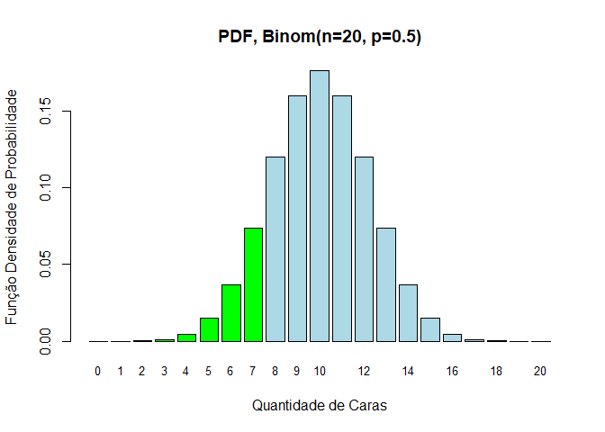

Assim, podemos calcular:

*P*(*k* ≤ 7) = *P*(*k* = 0) + *P*(*k* = 1) + ... + *P*(*k* = 7) = 0.131588

    n = 20
    p = 0.5

    p7 = 0 

    for (k in c(0:7)){
      p7 = p7 + dbinom(k, n, p)
    }

    print(p7)

    ## [1] 0.131588

E se você, por exemplo, quiser saber a probabilidade de ter exatamente
entre 7 e 9 caras nos lançamentos basta obter a ‘soma’ (equivalente à
área sob a curva em uma distribuição contínua) sob o gráfico entre os
valores 7 e 9. E assim, obtemos:

*P*(7 ≤ *k* ≤ 9) = *P*(*k* = 7) + *P*(*k* = 8) + *P*(*k* = 9) = 0.3542...

    n = 20
    p = 0.5

    # Este código, está correto, mas em R podemos substituir por uma única linha
    # pois as operações são aplicadas a todo um vetor
    #-------------------------------------------------------------------------------
    # prob = c(0)

    # for (k in c(0:n)){
    #   prob[k+1] = dbinom(k, n, p)
    # }

    # Assim, agora que você já entendeu o que estamos fazendo, podemos empregar
    # para obter os valores de dbinom para os valores de c(0:n):
    #-------------------------------------------------------------------------------
    prob = dbinom(c(0:n), n, p)

    # e empregaremos esse modo daqui para diante

    p7_9 = 0 

    for (k in c(7,8,9)){
      p7_9 = p7_9 + dbinom(k, n, p)
    }

    barplot(prob,
            names.arg = seq(0,n,1),
            xlab = 'Quantidade de Caras',
            ylab = 'Função Densidade de Probabilidade',
            col=c( rep('lightblue',7) , rep('green',10-7),  rep('lightblue',n-10) ),
            cex.names = 0.8)  
    title('PDF, Binom(n=20, p=0.5)')
    text(20,0.1,p7_9)

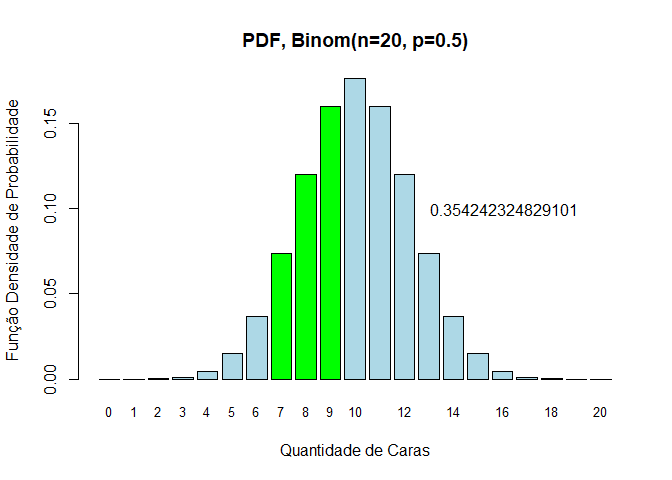

o gráfico acima empregamos o **gráfico de densidade de probabilidade**
com valores de *P*(*X* = *x*), mas como você notou a soma de várias
probabilidades
*P*(*X* = *x*1) + *P*(*X* = *x*2) + ... + *P*(*X* = *x**n*)
parece ser bastante útil e por isso uma outra forma de representarmos
essas probabilidades é empregar um **gráfico de densidade de
probabilidade acumulada** exibindo os valores de *P*(*X* ≤ *x*) para
todo *x*. Assim o gráfico fornece na posição 7 exatamente o valor de
$P(X 7) $, isto é, a probabilidade acumulada
*P*(*X* ≤ 7) = *P*(*x* = 0) + *P*(*x* = 1) + ... + *P*(*x* = 7).

Assim como para funções de distribuição, o R também fornece a função de
Função de Probabilidade Acumulada para várias distribuições e, para a
distribuição binomial empregamos:

    pbinom(q, size, prob, lower.tail = TRUE, log.p = FALSE)

Veja `help('pbinom')`.

Para outras distribuições a função de probabilidade acumulada também
será **p**<nome-da-distribuição>. Por exemplo `pnorm()` para a
distribuição normal.

Assim, podemos obter o gráfico de Probabilidade Acumulada:

    n = 20
    p = 0.5

    prob = pbinom(c(0:n), n, p)

    barplot(prob,
            names.arg = seq(0,n,1),
            xlab = 'Quantidade de Caras',
            ylab = 'Função de Probabilidade Acumulada',
            col='lightblue',
            cex.names = 0.8)  
    title('CDF, Binom(n=20, p=0.5)')

    text(4,pbinom(7, n, p)+0.1,round(pbinom(7, n, p),4))
    abline(h=pbinom(7, n, p),col='red',lty='dotted',lwd=1.5) 
    abline(v=7+2,col='red',lty='dotted',lwd=1.5)

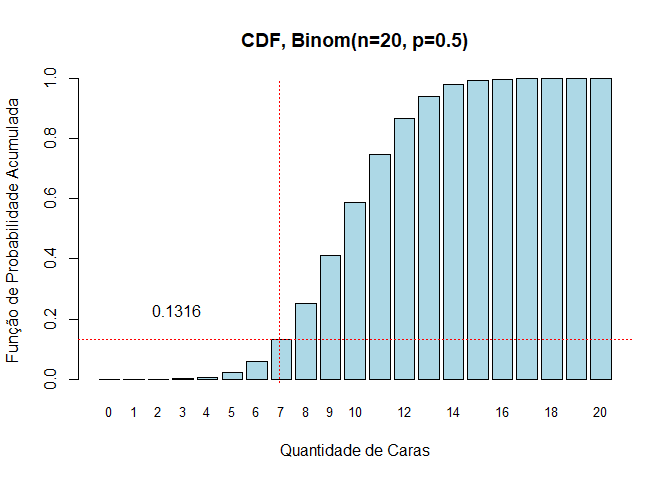

A função de probabilidade acumulada permite então obter diretamente a
probabilidade de até 7 caras *P*(*x* ≤ 7). Assim o cálculo é diretamente
obtido:

    pbinom(7, n, p)

    ## [1] 0.131588

E ainda podemos obter a probabilidade de termos exatos 7 a 9 caras:

*P*(7 ≤ *x* ≤ 9) = *P*(*x* ≤ 9) − *P*(*x* ≤ 6) = 0.3542...

    pbinom(9, n, p) - pbinom(6, n, p)

    ## [1] 0.3542423

Embora este seja um exemplo simples, uma série de problemas práticos
estão associados a esta mesma função de distribuição de probabilidades.
Por exemplo você pode pensar na probabilidade de se obter até 10 peças
com defeito em um lote de 100 peças adquiridas sabendo que a média de
defeitos do fabricante é de 1% nas peças produzidas. Ou, para estimar
atrasos ou o retrabalho em desenvolvimento de software nos próximos
meses, obtendo a probabilidade de ser necessário mais de 5 correções de
programas de software a cada lote 100 desenvolvidos por uma fábrica de
software que apresenta em média 5% de retrabalho com esse fornecedor.

Função de Probabilidade Contínua: Distribuição Normal
-----------------------------------------------------

Também bastante comum é a correspondente contínua da distribuição
binomial, a distribuição normal. Essa distribuição é bastante popular e
talvez você até mesmo já tenha ouvido falar dela. Sua importância e
popularidade reside no fato de estar associada a uma série de fenômenos
naturais e bastante comuns. Por exemplo medidas como altura, peso,
circunferência toráxica ou o número do calçado das pessoas seguem uma
distribuição normal (dependendo do contexto, como na física e
engenharia, podemos usar o termo Gaussiana). Você poderia, então,
empregar isso para definir as melhores quantidades de cada número de
sapato ou de tamanhos de camisa a serem fabricados, uma vez que a
procura desses produtos depende das medidas das pessoas que vão adquirir
esses produtos (e de fato é em geral assim que é feito!). Mas não são
somente medidas do ser humano que seguem essa distribuição e podemos
também encontrar essa mesma distribuição no peso de sementes na
agricultura, notas nos resultados do vestibular ou de um concurso,
velocidade dos veículos em uma estrada, medidas do coeficiente de
inteligência (*QI*) ou ainda no peso de bebês recém nascidos.

Diferentemente da distribuição binomial que envolve a probabilidade de
valores discretos (inteiros, como as quantidades de lançamentos de uma
moeda) a distribuição normal está associada a valores contínuos. O peso
e altura de uma pessoa, ou o peso de um recém nascido, pode assumir
quaisquer valores em um intervalo contínuo. Por exemplo, medindo-se o
peso de vários bebês recém nascidos você deve encontrar uma média em
tôrno de 3Kg, mas pode encontrar *qualquer* valor em torno dessa média,
por exemplo no intervalo \[0.8, 6.0\], e não é difícil imaginar que
valores cada vez maiores (ou menores) sejam cada vez menos prováveis.

$$P(x) = \\frac{1}{\\sigma \\sqrt{2\\pi}}e^{ - ( x - \\mu )^2  / {2\\sigma ^2}}$$

onde *μ* é a média da população e *σ* o desvio padrão.

Da mesma forma que antes, não é importante que você compreenda essa
fórmula agora e você aprenderá como empregar o R para fazer esses
cálculos. Mas vamos no concentrar novamente em entender *o quê* podemos
fazer se conhecemos essa função.

Do mesmo modo que na distribuição contínua podemos os gráficos PDF e CDF
dessa distribuição.

Sabendo que a média de peso de recém nascidos é de 3kg com um desvio
padrão de 1Kg, empregamos isso para gerar uma amostra hipotética de peso
de 100 bebês com uma distribuição normal e comparar isso à distribuição
normal ideal.

    set.seed(seed=1234) # fixa a semente de geração aleatória

    mu = 3
    sigma = 1

    valores = rnorm(n=100,mean=mu,sd=sigma)  

    hist(valores, breaks=20, freq=FALSE, col='lightblue', 
          main = 'PDF, N(mu=3, sigma=1)',
          xlab = 'Peso dos Recém Nascidos',
          ylab = 'Função Densidade de Probabilidade')

    # add a 'best fit' line
    y = ((1 / (sqrt(2 * pi) * sigma)) *
         exp(-0.5 * (1 / sigma * (seq(0,6,0.05) - mu))**2))
    lines(seq(0,6,0.05), y, col='red',lty='dashed',lwd=1.5)

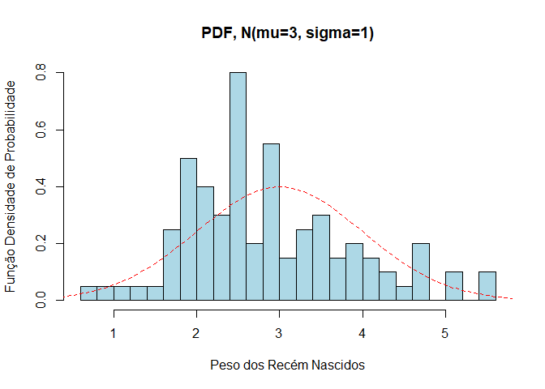

A função,

    rnorm(n, mean = 0, sd = 1)

Veja o `help(rnorm)`.

Gera valores aleatórios com a distribuição normal com a média e desvio
padrão indicados. Segue o mesmo esquema das funções anteriores, valores
**r**andômicos são gerados com `rnorm` com distribuição normal,
**r**<nome-da-distribuição> para outras distribuições. Por exemplo,
`rbinom()` para a distribuição binomial, mas obviamente você notou que
as funções têm parâmetros que diferem para cada tipo de distribuição.

De forma análoga ao caso discreto, a área sob o gráfico da PDF pode ser
empregada para o cálculo da probabilidade de um evento e você pode obter
a probabilidade de nascimento de um bebê de até 2kg obtendo a área sob a
curva até o valor 2.

No gráfico abaixo empregamos a função de densidade de probabilidade
(PDF) da distribuição normal `dnorm()` de modo análogo ao que empregamos
anteriormente para a distribuição binomial, com `dbinom()`. É importante
que você note que cada tipo de distribuição apresenta parâmetros
diferentes. Enquanto, no caso discreto, a distribuição binomial tinha
parâmetros como a quantidade de eventos e sua probabilidade, a
distribuição normal tem como parâmetros a média e o desvio padrão.

    prob = c(0)

    mu = 3
    sigma = 1

    prob = dnorm(seq(0,6,0.05), mean=mu, sd=sigma)

    barplot(prob,
            names.arg = seq(0,6,0.05),
            xlab = 'Peso dos Recém Nascidos',
            ylab = 'Função Densidade de Probabilidade',
            col='lightblue')
    title('PDF, Norm(mean=3,sd=1)')

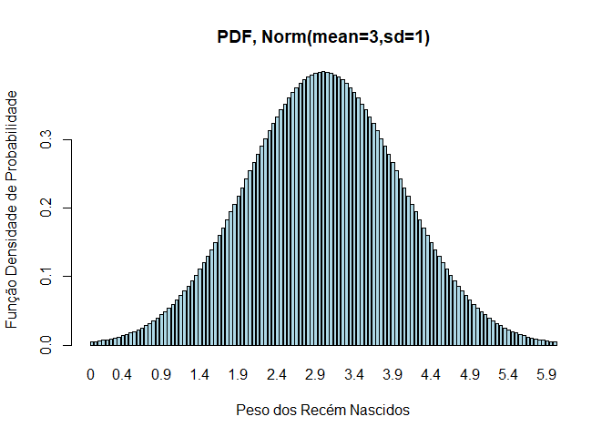

Mas sendo valores contínuos é mais adequado neste caso empregarmos a
função `plot()` no lugar de um histograma.

    prob = c(0)

    mu = 3
    sigma = 1

    prob = dnorm(seq(0,6,0.05), mean=mu, sd=sigma)

    plot(seq(0,6,0.05),
            prob,
            type='l',
            xlab = 'Peso dos Recém Nascidos',
            ylab = 'Função Densidade de Probabilidade',
            col='darkblue')
    title('PDF, Norm(mean=3,sd=1)')

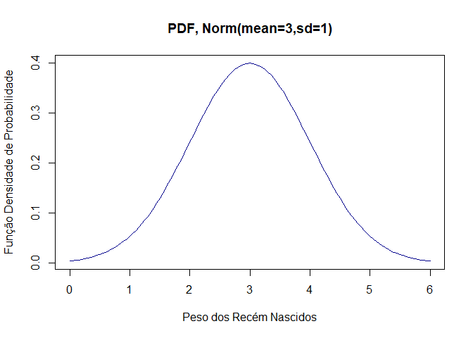

Agora, de forma análoga ao caso discreto, a área sob o gráfico da PDF
pode ser empregada para o cálculo da probabilidade de um evento e você
pode obter a probabilidade de nascimento de um bebê de até 2kg obtendo a
área sob a curva até o valor 2.

    prob = c(0)

    mu = 3
    sigma = 1

    x =seq(0,6,0.05)
    prob = dnorm(x, mean=mu, sd=sigma)

    plot(x,
         prob,
         type='l',
         xlab = 'Peso dos Recém Nascidos',
         ylab = 'Função Densidade de Probabilidade',
         col='darkblue')
    title('PDF, Norm(mean=3,sd=1)')

    lb = 0 # limite inferior
    ub = 2 # limite superior

    i <- x >= lb & x <= ub
    lines(x, prob)                                       # desenha as linhas limite
    polygon(c(lb,x[i],ub), c(0,prob[i],0), col="green")  # preenche a área sob a curva

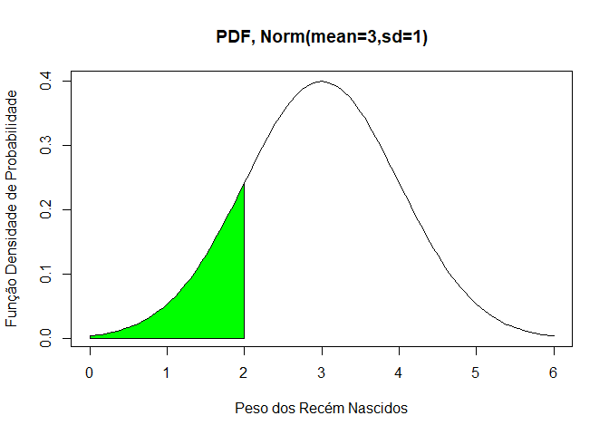

O cálculo dessa área não é tão simples quanto a soma dos valores das
probabilidades discretas que fizemos anteriormente. Mas você pode lançar
mão função de probabilidades acumulada. Assim como no caso discreto a
função **p**<nome-da-distribuição>:

    pnorm(q, mean = 0, sd = 1, lower.tail = TRUE, log.p = FALSE)

fornece o valor da função de probabilidade acumulada e podemos então
calcular,

*P*(*x* ≤ 2) = 0.1586
para uma distribuição normal com média 3 e desvio padrão 1:

    pnorm(2,mean=3,sd=1)

    ## [1] 0.1586553

E também construir o gráfico de CDF correspondente:

    prob = c(0)

    mu = 3
    sigma = 1

    x =seq(0,6,0.05)
    prob = pnorm(x, mean=mu, sd=sigma)

    plot(x,
         prob,
         type='l',
         xlab = 'Peso dos Recém Nascidos',
         ylab = 'Função Densidade de Probabilidade',
         col='darkblue')
    title('PDF, Norm(mean=3,sd=1)')

    text(4,pnorm(2,mean=3,sd=1)+0.1,round(pnorm(2,mean=3,sd=1),4))

    abline(h=pnorm(2,mean=3,sd=1),col='red',lty='dotted',lwd=1.5) 
    abline(v=2,col='red',lty='dotted',lwd=1.5)

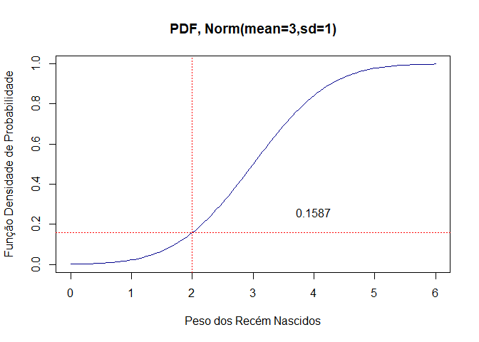

Como no caso discreto podemos também calcular a probabilidade de
intervalos, como a probabilidade de que o recém nascido tenha exatamente
entre 2.5 e 4.0kg.

    prob = c(0)

    mu = 3
    sigma = 1

    x =seq(0,6,0.05)
    prob = dnorm(x, mean=mu, sd=sigma)

    plot(x,
         prob,
         type='l',
         xlab = 'Peso dos Recém Nascidos',
         ylab = 'Função Densidade de Probabilidade',
         col='darkblue')
    title('PDF, Norm(mean=3,sd=1)')

    lb = 2.5 # limite inferior
    ub = 4 # limite superior

    i <- x >= lb & x <= ub
    lines(x, prob)                                       # desenha as linhas limite
    polygon(c(lb,x[i],ub), c(0,prob[i],0), col="green")  # preenche a área sob a curva

    p_intervalo = pnorm(4,mean=3,sd=1) - pnorm(2.5,mean=3,sd=1)
    text(3.2,0.2, round(p_intervalo,4))

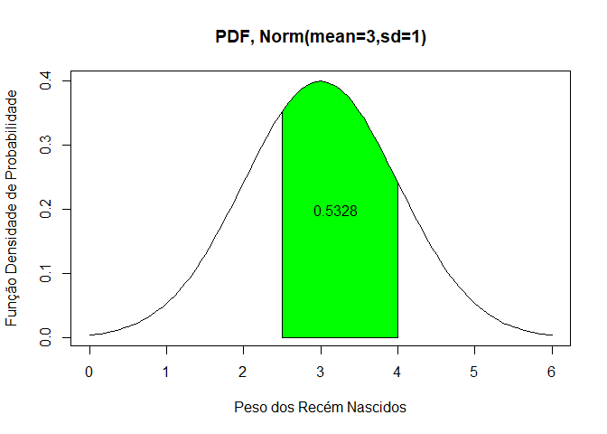

*P*(2.5 ≤ *x* ≤ 4) = *P*(*x* ≤ 4) − *P*(*x* ≤ 2.5) = 0.5328

    pnorm(4,mean=3,sd=1) - pnorm(2.5,mean=3,sd=1)

    ## [1] 0.5328072

PDF, CDF e ICDF
---------------

Há ainda uma outra função importante. A ICDF é a função de distribuição
acumulada inversa e dá o valor associado a uma certa probabilidade
acumulada. Pegue o exemplo anterior, com 0.15 de chance (probabilidade)
até que peso podemos esperar dos bebês?

    qnorm(0.15,mean=3,sd=1)

    ## [1] 1.963567

Não é surpresa que o valor é bastante próximo do peso de 2Kg já que essa
é a probabilidade de crianças até 2Kg que obtivemos foi:

    pnorm(2,mean=3,sd=1)

    ## [1] 0.1586553

E podemos ainda fazer para obter o valor exato:

    qnorm( pnorm(2,mean=3,sd=1) ,mean=3,sd=1)

    ## [1] 2

Podemos também construir um gráfico da ICDF e resumir as funções que
empregamos até aqui nos seguintes programas:

    prob = c(0)

    mu = 0           # Aqui empregaremos média 0
    sigma = 1

    x = seq(mu - 3.5*sigma,mu + 3.5*sigma,0.05)

    par(mfrow = c(1, 3))

    prob = dnorm(x, mean=mu, sd=sigma)
    plot(x,
         prob,
         type='l',
         xlab = 'Valor',
         ylab = 'Função Densidade de Probabilidade',
         col='darkblue')
    title('PDF, Norm(mean=0,sd=1)')

    prob = pnorm(x, mean=mu, sd=sigma)
    plot(x,
         prob,
         type='l',
         xlab = 'Valor',
         ylab = 'Função Probabilidade Acumulada',
         col='darkblue')
    title('CDF, Norm(mean=0,sd=1)')

    prob = seq(0,1,0.05)
    valor = qnorm(prob, mean=mu, sd=sigma)
    plot(prob,
         valor,
         type='l',
         ylab = 'Valor',
         xlab = 'Probabilidade Acumulada Inversa',
         col='darkblue')
    title('ICDF, Norm(mean=0,sd=1)')

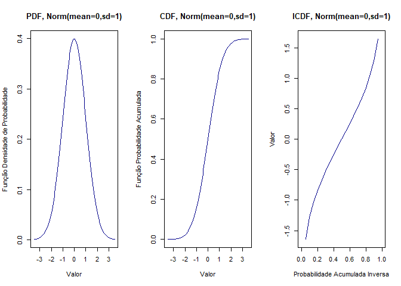 Ou
para o caso discreto,

    n = 50           # Aqui com 50 lançamentos
    p = 0.5

    prob = c(0)

    par(mfrow = c(1, 3))

    x = c(0:n)
    prob = dbinom(x, n, p)

    barplot(prob,
            names.arg = x,
            xlab = 'Valor',
            ylab = 'Função Densidade de Probabilidade',
            col='lightblue',
            cex.names = 0.8)  
    title('PDF, Binom(n=50,p=0.5)')

    x = c(0:n)
    prob = pbinom(x, n, p)

    barplot(prob,
            names.arg = x,
            xlab = 'Valor',
            ylab = 'Função Probabilidade Acumulada',
            col='lightblue',
            cex.names = 0.8)  
    title('CDF, Binom(n=50,p=0.5)')

    prob = seq(0,1,0.05)
    valor = qbinom(prob, n, p)

    plot(prob,
         valor,
         type='l',
         ylab = 'Valor',
         xlab = 'Probabilidade Acumulada Inversa',
         col='darkblue')
    title('ICDF, Binom(n=50,p=0.5)')

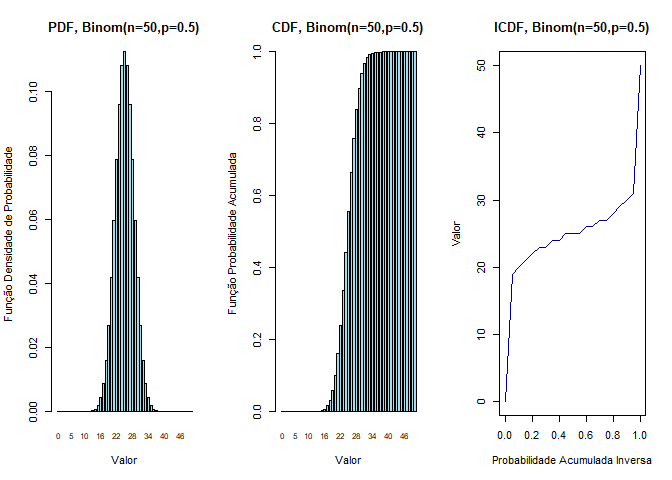

Resumo das Funções de Probabilidade em R
----------------------------------------

Como vimos você encontra funções equivalentes em R para:

-   Funções (de Densidade) de Probabilidade
-   Funções de Probabilidade Acumulada
-   Geração aleatória de valores

para as distribuições binomial e normal:

    dbinom(x, size, prob, log = FALSE)
    pbinom(q, size, prob, lower.tail = TRUE, log.p = FALSE)
    rbinom(n, size, prob)

    dnorm(x, mean = 0, sd = 1, log = FALSE)
    pnorm(q, mean = 0, sd = 1, lower.tail = TRUE, log.p = FALSE)
    rnorm(n, mean = 0, sd = 1)

Mas existem outros tipos de distribuições e ainda uma outra função,
inversa da função de probabilidade acumulada (retorna o valor de uma
variável para uma determinada probabilidade) e que veremos mais adiante.
O quadro abaixo resume essas funções e as principais distribuições.

<h4>
Table 1:Funções de Distribuição de Probabilidade em R
</h4>
<table>
<thead>
<tr class="header">
<th align="left">
Name
</th>
<th align="left">
Probability Density
</th>
<th align="left">
Cumulative Distribution
</th>
<th align="left">
Quantile
</th>
</tr>
</thead>
<tbody>
<tr class="odd">
<td align="left">
Normal
</td>
<td align="left">
dnorm(Z,mean,sd)
</td>
<td align="left">
pnorm(Z,mean,sd)
</td>
<td align="left">
qnorm(Q,mean,sd)
</td>
</tr>
<tr class="even">
<td align="left">
Poisson
</td>
<td align="left">
dpois(N,lambda)
</td>
<td align="left">
ppois(N,lambda)
</td>
<td align="left">
qpois(Q,lambda)
</td>
</tr>
<tr class="odd">
<td align="left">
Binomial
</td>
<td align="left">
dbinom(N,size,prob)
</td>
<td align="left">
pbinom(N,size,prob)
</td>
<td align="left">
qbinom(Q,size,prob)
</td>
</tr>
<tr class="even">
<td align="left">
Exponential
</td>
<td align="left">
dexp(N,rate)
</td>
<td align="left">
pexp(N,rate)
</td>
<td align="left">
qexp(Q,rate)
</td>
</tr>
<tr class="odd">
<td align="left">
*χ*2
</td>
<td align="left">
dchisq(X,df)
</td>
<td align="left">
pchisq(X.df)
</td>
<td align="left">
qchisq(X,df)
</td>
</tr>
</tbody>
</table>

E talvez você prefira empregar a seguinte dica prática:

**Dica prática:**

“d” = **d**ensidade de probabilidade “p” = **p**robabilidade acumulada
“q” = **q**uartis (probabilidade acumulada inversa) “r” = **r**andom
values

Exemplo: Preços da Gasolina
---------------------------

Uma empresa de pagamentos eletrônicos divulgou um levantamento do preço
da gasolina no país. O preço médio encontrado foi de R$ 4.651 com um
desvio padrão de 0.198. Os dados levaram em conta cerca de 20 mil postos
de combustível. De acordo com eles, o Acre tem a gasolina mais cara (R$
5.115 / l), e Santa Catarina, a mais barata (média de média de R$ 4.185
/ l). Considerando uma distribuição normal do preços da gasolina podemos
então fazer uma série de análises.

-   Qual a probabilidade de encontrarmos o preço da gasolina abaixo de
    R$ 5.000 o litro?

<!-- -->

    mu = 4.651
    sigma = 0.198

    pnorm(5, mean=4.651, sd=sigma)

    ## [1] 0.9610182

-   Qual a probabilidade de encontrarmos o preço da gasolina maior que o
    preço médio do Acre, de R$ 5.115 o litro?

<!-- -->

    mu = 4.651
    sigma = 0.198

    1 - pnorm(5.115, mean=4.651, sd=sigma)

    ## [1] 0.009553562

-   Qual o preço máximo você colocaria no litro da gasolina para
    garantir estar entre os 85% preços mais baixos e assim garantir uma
    maior procura do seu produto?

<!-- -->

    mu = 4.651
    sigma = 0.198

    qnorm(0.85, mean=4.651, sd=sigma)

    ## [1] 4.856214

Graficamente podemos representar as soluções como abaixo. Mas veja que
demos as respostas sem a necessidade de exibi-las ou solucionar
graficamente. De fato não é necessário e é bastante complicado produzir
gráficos desse modo, e esses gráficos estão aqui apenas para ajudá-lo a
compreender a solução. Note também que empregamos do CDF (o gráfico de
probabilidade acumulada) e a região colorida da curva está indicando
apenas o lado a que corresponde a probabilidade indicada e não a área da
curva, o que só empregamos para gráficos de densidade de probabilidade
(PDF).

    prob = c(0)

    mu = 4.651
    sigma = 0.198

    x =seq(mu - 3*sigma,mu + 3*sigma,0.001)
    prob = pnorm(x, mean=mu, sd=sigma)

    par(mfrow = c(1, 3))

    plot(x,
         prob,
         type='l',
         xlab = 'Preço do Combustível',
         ylab = 'Função Acumulada de Probabilidade',
         col='darkblue')
    t = paste('CDF, Norm(mean=', mu ,'sd=', sigma, ')')  
    title(t) 

    text(4.5,pnorm(5, mean=mu, sd=sigma)-0.1,round(pnorm(5, mean=mu, sd=sigma),4))

    abline(h=pnorm(5, mean=mu, sd=sigma),col='red',lty='dotted',lwd=1.5) 
    abline(v=5,col='red',lty='dotted',lwd=1.5)

    lb = 0 # limite inferior
    ub = 5 # limite superior

    i <- x >= lb & x <= ub
    lines(x, prob)                                       # desenha as linhas limite
    polygon(c(lb,x[i],ub), c(0,prob[i],0), 
            col="red")  # preenche a área sob a curva

    plot(x,
         prob,
         type='l',
         xlab = 'Preço do Combustível',
         ylab = 'Função Acumulada de Probabilidade',
         col='darkblue')
    t = paste('CDF, Norm(mean=', mu ,'sd=', sigma, ')')  
    title(t) 

    text(4.6,pnorm(5.115, mean=mu, sd=sigma)-0.1,
         paste('1 - ', round(pnorm(5.115, mean=mu, sd=sigma),4),' = ',
         round(1-pnorm(5.115, mean=mu, sd=sigma),4))) 

    abline(h=pnorm(5.115, mean=mu, sd=sigma),col='red',lty='dotted',lwd=1.5) 
    abline(v=5.115,col='red',lty='dotted',lwd=1.5)

    lb = 5.115 # limite inferior
    ub = max(x) # limite superior

    i <- x >= lb & x <= ub
    lines(x, prob)                                       # desenha as linhas limite
    polygon(c(lb,x[i],ub), c(0,prob[i],0), 
            col="red")  # preenche a área sob a curva

    prob = seq(0,1,0.001)
    valor = qnorm(prob, mean=mu, sd=sigma)

    plot(prob,
         valor,
         type='l',
         ylab = 'Preço do Combustível',
         xlab = 'Probabilidade Acumulada Inversa',
         col='black')
    t = paste('ICDF, Norm(mean=', mu ,'sd=', sigma, ')')  
    title(t) 

    text(0.4,qnorm(0.85, mean=mu, sd=sigma)+0.1,round(qnorm(0.85, mean=mu, sd=sigma),3))

    abline(h=qnorm(0.85, mean=mu, sd=sigma),col='red',lty='dotted',lwd=1.5) 
    abline(v=0.85,col='red',lty='dotted',lwd=1.5)

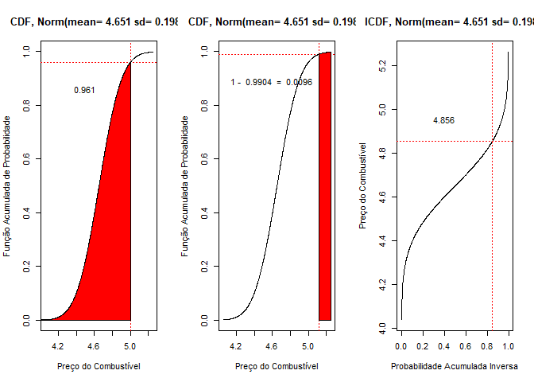

Referências
-----------

Navarro, Danielle, **Learning Statistics with R**, disponível em:
<a href="https://learningstatisticswithr.com/" class="uri">https://learningstatisticswithr.com/</a>
( LSR version 0.6 (pdf) ). Acesso: 26/02/2021. Alternativamente em
formato bookdown:
<a href="https://learningstatisticswithr.com/book/" class="uri">https://learningstatisticswithr.com/book/</a>
Acesso: 07/03/2021.

Wickham, H., Grolemund, G. **R for Data Science**. O’Reilly Media, Inc.,
2016.

Glen, S. **Welcome to Statistics How To!** From StatisticsHowTo.com:
Elementary Statistics for the rest of us! disponível em:
<a href="https://www.statisticshowto.com/" class="uri">https://www.statisticshowto.com/</a>
Acesso: 09/03/2021.

Brown, R. J.**Connecting the CDF and the PDF** disponível em:
<a href="http://demonstrations.wolfram.com/ConnectingTheCDFAndThePDF/" class="uri">http://demonstrations.wolfram.com/ConnectingTheCDFAndThePDF/</a>
*Wolfram Demonstrations Project*. Published: November 2 2007 Acesso:
09/03/2021.
