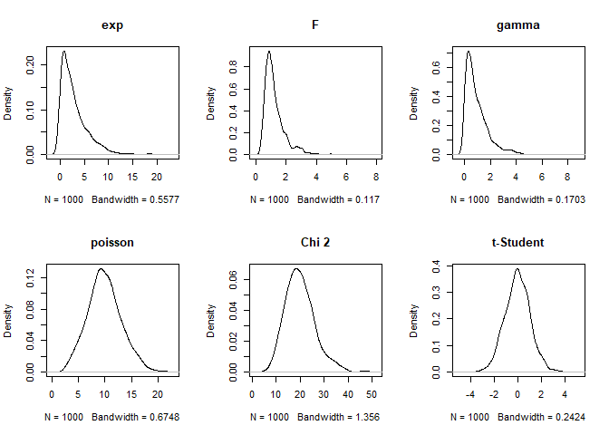

Distribuições de Probabilidade
==============================

------------------------------------------------------------------------


<br> <br> <br> <br> <br>

Exercícios
----------

### Exercício 1

1.  Em uma companhia de Seguros 80% das pessoas que compram seguro de
    veículos são homens. Se 100 proprietários de seguros forem
    selecionados aleatoriamente, encontre a probabilidade de que
    exatamente 12 sejam mulheres.

**Dica** Empregue a distribuição binomial

**Solução**

1.  Mensalmente a empresa vai sortear grupos de 100 clientes e enviar
    brindes para as clientes do sexo feminino. Quantos brindes para
    mulheres devem ser comprados para garantir em 95% dos grupos
    sorteados?

**Solução**

1.  Mensalmente a empresa vai sortear grupos de 100 clientes e enviar
    brindes para as clientes do sexo feminino. Dentre os brindes haverá
    viagem em grupo. Há entretanto uma limitação de 18 passageiros para
    o pacote de viagem. Qual o percentual de grupos deve ser atendido
    com esse número?

**Solução**

1.  A empresa deveria rever a campanha de viagens, por exemplo incluindo
    mais um transporte para 18 passageiros? Se sim, qual o percentual
    passaria a ser atendido.

**Solução**

### Exercício 2

1.  Uma bateria (pilha) tem duração média de 60 horas com uma
    distribuição normal desvio padrão de 3 horas. Qual é a probabilidade
    de uma bateria durar menos de 65 horas?

**Dica** menos de 65h = até 65h (estamos trabalhando com dados
contínuos)

**Solução**

1.  Qual a probabilidade da pilha durar mais que a média?

**Solução**

1.  Qual a probabilidade da pilha durar mais que 65h?

**Solução**

### Exercício 3

1.  Um servidor tem duração média de 18000 horas ininterruptas de
    operação, sem falhas de Hardware, com uma distribuição normal de
    desvio padrão de 500 horas. Em um novo Data Center foram instalados
    1000 desses servidores. A empresa quer fazer uma reserva para as
    manutenções. Quantos servidores é esperado apresentar falhas até o
    segundo ano?

**Dica** 1 ano = 365\*24 horas

**Solução**

1.  Quantos servidores devem apresentar falha no terceiro ano?

**Solução**

### Exercício 4

1.  Notas de rendimento escolar, vestibulares e concursos em geral
    seguem uma distribuição normal, do mesmo modo que o QI. Neste ano a
    pontuação média para uma determinada carreira foi de 72 pontos com
    um desvio padrão de 12. Qual o percentual de de alunos com 84 ou
    mais pontos nesse exame?

**Solução**

1.  Qual é a porcentagem de alunos com até 70 pontos no exame?

**Solução**

1.  Qual a nota dos alunos abaixo e acima dos percentis de 10% e 90% de
    notas?

**Dica** empregue `round()` para arredondar o valor para pontos inteiros

**Solução**

1.  Qual a nota de corte para abranger 75% dos candidatos para uma
    segunda fase?

**Dica** empregue `round()` para arredondar o valor para pontos inteiros

**Dica** veja que a nota de corte permite que mais alunos participem da
segunda fase. É, portanto, em geral um valor abaixo da média!

**Solução**

### Exercício 5

1.  Nos gráficos abaixo você encontra valores aleatórios gerados para
    diferentes distribuições que, assim como a distribuição binomial e
    normal, aparecem para um grande número de problemas. Note que
    empregamos a função `r-<nome-da-distribuição>` e para cada uma delas
    você encontrará também as funções de densidade de probabilidade
    (`d-<nome-da-distribuição>`), probabilidade acumulada
    (`p-<nome-da-distribuição>`) e quartis (`q-<nome-da-distribuição>`).

Agora, observe as distribuições abaixo e responda: que 3 distribuições
estariam mais próximas de representar (a) a distribuição de renda entre
os brasileiros e (b) a altura em cm dos brasileiros? (considere apenas a
forma das curvas, os valores empregados foram aleatórios e não estão
centrados na renda ou altura dos brasileiros).

``` r
par(mfrow = c(2, 3))
set.seed(1234)
plot(density(rexp(n=1000,rate=1/3)),main='exp')
plot(density(rf(n=1000,df1=100,df2=10)),main='F')
plot(density(rgamma(n=1000,shape=1)),main='gamma')
plot(density(rpois(n=1000,lambda=10)),main='poisson')
plot(density(rchisq(n=1000,df=20)),main='Chi 2')
plot(density(rt(n=1000,df=10)),main='t-Student')
```



**Solução**
