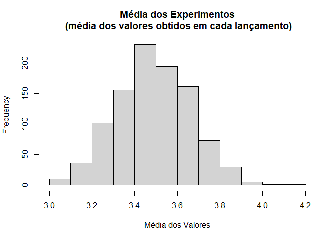

Probabilidade e Estatística - Aula 5
================
Rogério de Oliveira
2021-05-24

# Inferência Estatística

-----


<br> <br> <br> <br> <br>

Você já aprendeu o que são as as distribuições de probabilidade e
algumas de suas funções mais importantes como as funções de densidade e
probabilidade acumulada. Com isso já somos capazes de ‘inferir’ sobre a
probabilidade de alguns eventos. Mas podemos fazer ainda mais. Aqui você
vai aprender alguns resultados importantes para a inferência estatística
como a Lei dos Grandes Números e o Teorema Central do Limite. Vai também
explorar outras distribuições, e conhecer a distribuição t-Student que
tem um papel bastante importante em muitos testes de hipóteses que serão
vistos a seguir.

## Introdução

A ideia central da inferência estatística é que podemos estimar ou
*inferir* características de uma população a partir de uma amostra dessa
população. Isto é, não precisamos acessar ou medir toda a população\! A
partir de uma amostra, podemos estimar os parâmetros de uma população,
como por exemplo a média e a variância. A Lei dos Grandes números afirma
que a medida que crescemos a amostra esses parâmetros da amostra tendem
aos mesmos parâmetros da população e Teorema do Limite Central destaca a
importância da distribuição normal para a inferência de parâmetros.

## Lei dos Grandes Números e o Teorema Central do Limite

Uma das principais atividades da estatística é a generalização dos
resultados obtidos em uma amostra para população de onde obtivemos a
amostra. Isto é, você faz uma inferência dos resultados da população com
base nos dados da amostra. Por exemplo, você pode inferir a média de
peso dos recém nascidos com base em uma amostra de, digamos, 30 bebês, e
as distribuições de probabilidade têm um papel fundamental nessa tarefa
de inferência.

A Lei dos Grandes Números e o Teorema Central do Limite são dois
teoremas fundamentais da teoria da probabilidade para inferência
estatística. Eles impactam no tamanho amostral e como usamos a
distribuição normal para fazer inferências.

A **Lei dos Grandes Números (LGN)**, afirma que a média dos resultados
de um experimento realizado repetidas vezes *tende* a se aproximar do
valor esperado à medida que novas tentativas se sucedem. Isto, é, a
média amostral *tende* ou **converge** à média populacional à medida
que mais experimentos são realizados. Em outras palavras, quanto maior a
amostra, mais os resultados se aproximam dos resultados da população.

Uma demonstração simples pode ser feita pelo jogo de moedas. Em uma
moeda não viciada sabe-se que há uma probabilidade de 0.5 do resultado
ser cara (valor 1) e a mesma probabilidade 0.5 de ser coroa (valor 0).
Então, se assumirmos  como o número de caras de cada experimento
:

  
  
A razão de caras no momento  é dada por:

  
  
e, pela **Lei dos Grandes Números (LGN)**, quanto maior o número de
experimentos mais próximo da probabilidade 0.5 será o nosso resultado:

  
  
Você pode observar essa *convergência* para o valor 0.5 no gráfico a
seguir onde simulamos 200 lançamentos de uma moeda.

``` r
set.seed(1234)
lanctos = as.numeric(runif(200) >= 0.5)
print(lanctos[1:100])
```

    ##   [1] 0 1 1 1 1 1 0 0 1 1 1 1 0 1 0 1 0 0 0 0 0 0 0 0 0 1 1 1 1 0 0 0 0 1 0 1 0
    ##  [38] 0 1 1 1 1 0 1 0 1 1 0 0 1 0 0 1 1 0 1 0 1 0 1 1 0 0 0 0 1 0 1 0 1 0 1 0 1
    ##  [75] 0 1 0 0 0 1 1 0 0 1 0 1 0 0 0 1 0 1 0 0 0 1 0 0 0 1

``` r
media = c(0)

for (i in 1:200){
  media[i] = sum(lanctos[1:i]) / i 
}

plot(media,type='l',main='Média dos Lançamentos de uma Moeda', 
     ylim=c(0,1),
     xlab='Lançamentos',
     ylab='R_n')
abline(h=0.5,col='red',lty='dotted',lwd=2)
text(194,0.6, 'p = 0.5', font=2, cex=1)
```

<!-- -->

O **Teorema Central do Limite (TCL)** é um outro resultado importante e
foi considerado como “Central” pelo matemático George Pólya. Esse
teorema afirma que a distribuição da média de um grande número de
variáveis aleatórias independentes e identicamente distribuídas será
aproximadamente normal, independentemente da distribuição subjacente
(dessas variáveis).

Por isso você verá que a distribuição normal é utilizada para inferência
e em muitos testes estatísticos.

``` r
layout.matrix <- matrix(c(1, 1, 1, 0), nrow = 2, ncol = 2)

layout(mat = layout.matrix,
       heights = c(2, 2), # Heights of the two rows
       widths = c(2, 2)) # Widths of the two columns

set.seed(1234)
hist(sample(1:6,100, replace=TRUE),
     breaks=c(0,1,2,3,4,5,6),
     main='Lançamentos 1',
     xlab='resultados')
```

<!-- -->

``` r
set.seed(1984)
hist(sample(1:6,100, replace=TRUE),
     breaks=c(0,1,2,3,4,5,6),
     main='Lançamentos 2',
     xlab='resultados')
```

<!-- -->

``` r
set.seed(7777)
hist(sample(1:6,100, replace=TRUE),
     breaks=c(0,1,2,3,4,5,6),
     main='Lançamentos 3',
     xlab='resultados')
```

<!-- -->

Vamos considerar o experimento acima de lançamento de um dado não
viciado. Como cada resultado de 1 a 6 tem probabilidade 1/6 de ocorrer
**essa é uma distribuição uniforme** (importante: note aqui, todos os
valores tem a mesma probabilidade e, portanto, o gráfico de densidade de
probabilidade tem um formato de caixa ou retângulo, e também denominamos
essa distribuição de retangular).

Acima você encontra os resultados de 3 experimentos de 100 lançamentos
cada. Note o formato das distribuições em ‘caixa’.

O que o **Teorema Central do Limite** afirma é que se fizermos vários
desses experimentos, a média desses experimentos terá uma distribuição
normal. Veja abaixo a simulação de 1000 experimentos de 100 lançamentos
cada e a distribuição da média obtida\>

``` r
set.seed(1234)
media = c(0)

for (i in 1:1000){
  media[i] = mean(sample(1:6,100, replace=TRUE))
}

hist(media,
     main='Média dos Experimentos\n (média dos valores obtidos em cada lançamento)',
     xlab='Média dos Valores')
```

<!-- -->

Um resultado surpreendente não acha? Sim, veja que essa **distribuição
normal** ocorre independentemente da distribuição subjacente das
variáveis que apresentam, neste caso, uma distribuição uniforme, mas
poderiam apresentar qualquer outra forma de distribuição.

## Regra Prática

Uma característica importante da distribuição normal (e outras
distribuições simétricas) é uma regra empírica que descrevemos a
seguir.

De com essa regra, em uma variável aleatória normalmente distribuída,
cerca de 68% das observações estará contida no intervalo de -1 a +1
desvio-padrão (), 95% das observações estará entre
 e
 e cerca de 99.7% das observações estará entre
 e
+3 desvios-padrão.

``` r
library(latex2exp)
```

    ## Warning: package 'latex2exp' was built under R version 4.0.4

``` r
# par(mfrow = c(1, 3))
layout.matrix <- matrix(c(1, 1, 1, 0), nrow = 2, ncol = 2)

layout(mat = layout.matrix,
       heights = c(2, 2), # Heights of the two rows
       widths = c(2, 2)) # Widths of the two columns

prob = c(0)

mu = 0
sigma = 1

x =seq(-4,4,0.05)
prob = dnorm(x, mean=mu, sd=sigma)

plot(x,
     prob,
     type='l',
     xlab = 'z-score',
     ylab = 'Função Densidade de Probabilidade',
     col='darkblue')
title('PDF, Norm(mean=0,sd=1)')

lb = -1 # limite inferior
ub = 1 # limite superior

i <- x >= lb & x <= ub
lines(x, prob)                                       # desenha as linhas limite
polygon(c(lb,x[i],ub), c(0,prob[i],0), col="green")  # preenche a área sob a curva

p_intervalo = pnorm(1,mean=0,sd=1) - pnorm(-1,mean=0,sd=1)
text(0,0.2, round(p_intervalo,4), font=2)
text(-1.4,0.05, TeX('$- \\sigma$'), font=2, cex=1.5)
text(1.3,0.05, TeX('$+ \\sigma$'), font=2, cex=1.5)
```

<!-- -->

``` r
prob = c(0)

mu = 0
sigma = 1

x =seq(-4,4,0.05)
prob = dnorm(x, mean=mu, sd=sigma)

plot(x,
     prob,
     type='l',
     xlab = 'z-score',
     ylab = 'Função Densidade de Probabilidade',
     col='darkblue')
title('PDF, Norm(mean=0,sd=1)')

lb = -2 # limite inferior
ub = 2 # limite superior

i <- x >= lb & x <= ub
lines(x, prob)                                       # desenha as linhas limite
polygon(c(lb,x[i],ub), c(0,prob[i],0), col="green")  # preenche a área sob a curva

p_intervalo = pnorm(2,mean=0,sd=1) - pnorm(-2,mean=0,sd=1)
text(0,0.2, round(p_intervalo,4), font=2)
text(-2.4,0.05, TeX('$- 2\\sigma$'), font=2, cex=1.5)
text(2.3,0.05, TeX('$+ 2\\sigma$'), font=2, cex=1.5)
```

<!-- -->

``` r
prob = c(0)

mu = 0
sigma = 1

x =seq(-4,4,0.05)
prob = dnorm(x, mean=mu, sd=sigma)

plot(x,
     prob,
     type='l',
     xlab = 'z-score',
     ylab = 'Função Densidade de Probabilidade',
     col='darkblue')
title('PDF, Norm(mean=0,sd=1)')

lb = -3 # limite inferior
ub = 3 # limite superior

i <- x >= lb & x <= ub
lines(x, prob)                                       # desenha as linhas limite
polygon(c(lb,x[i],ub), c(0,prob[i],0), col="green")  # preenche a área sob a curva

p_intervalo = pnorm(3,mean=0,sd=1) - pnorm(-3,mean=0,sd=1)
text(0,0.2, round(p_intervalo,4), font=2)
text(-3.4,0.05, TeX('$- 3\\sigma$'), font=2, cex=1.5)
text(3.3,0.05, TeX('$+ 3\\sigma$'), font=2, cex=1.5)
```

<!-- -->

Importante você notar que com outras distribuições o resultado vai ser
diferente\!

## z-score ou escore padrão

O z-score é uma medida importante em estatística para compararmos
valores de diferentes conjuntos de dados. Ele nos dá **quantos desvios
padrões um dado valor está distante em relação à média**, um z-score
positivo indica um valor acima da média (e negativos, abaixo). Ele pode
ser calculado como:

  
  

onde  é a
média dos valores e
 o
desvio padrão.

Veja um exemplo. Suponha dois jogadores de poker que apresentam o
seguinte histórico de desempenho.

Jogador 1: vence 70% das vezes com um desvio padrão de 20%. Jogador 2:
vence 40% das vezes com um desvio padrão de 10%.

Em um determinado campeonato o jogador 1 teve 75% de acertos e o jogador
2, 65%. Qual dos jogadores apresentou nesse campeonato um desempenho
acima do esperado (isto é superior ao seu histórico)?

Embora o jogador 1 tenha tido um desempenho melhor, o jogador 2 acertou
25% a mais do que seria esperado já que seu desempenho histórico é de
40%  10%,
tendo 2.5  desvios padrão acima da sua média histórica, enquanto o
jogador 2 teve um desempenho apenas 0.25

desvios padrão acima da sua média e não foi, portanto, dos seus
campeonatos mais felizes ao contrário do jogador 2.

Um **erro comum** é pensarmos que o z-score é uma medida de dispersão de
uma amostra. Mas basta voltarmos para definição para vermos que não é,
ele é uma medida de **quantos desvios padrões um dado valor está
distante em relação à média**. Mas essa medida tem um papel importante
nas definições que seguem, da distribuição chi-quadrado até a importante
distribuição de t-student.

## Distribuição chi-quadrado

Considere  uma variável
aleatória com distribuição normal ") e $ z =  $ a correspondente variável normal
padronizada. A variável aleatória
 é uma variável
aleatória com uma distribuição que denominamos distribuição qui-quadrado
com um grau de liberdade.

Grau de liberdade é um conceito bastante complexo de estatística.
Considere um conjunto de dados qualquer, os graus de liberdade é o
número de valores deste conjunto de dados que podem variar após terem
sido impostas certas restrições a todos os valores. Para dar um exemplo,
considere que 10 estudantes obtiveram em um teste média 7.0. Assim, a
soma das 10 notas deve ser 70 (essa será a restrição). Você terá, então,
10 − 1 = 9 graus de liberdade, pois as nove primeiras notas podem ser
escolhidas aleatoriamente, contudo a 10a nota deve ser igual a \[70 −
(soma das 9 primeiras)\]. É algo bem abstrato e aqui, em geral, bastará
você pensar em que o grau de liberdade como o número de amostras menos
1. O grau de liberdade aparece nas funções de distribuição em R como
`df` (degrees of freedom).

Veja abaixo uma distribuição de probabilidades chi-quadrado com 10 graus
de liberdade.

``` r
library(latex2exp)

prob = c(0)

x = seq(0,60,1)
prob = dchisq(x, df=10)

par(mfrow = c(1, 2))

plot(x,
     prob,
     type='l',
     xlab = 'Valor',
     ylab = 'Função Densidade de Probabilidade',
     col='darkblue')
title('PDF, Chi-quadrado(df=10)')

lb = 10 # limite inferior
ub = 20 # limite superior

i <- x >= lb & x <= ub
lines(x, prob)                                       # desenha as linhas limite
polygon(c(lb,x[i],ub), c(0,prob[i],0), col="green")  # preenche a área sob a curva

p_intervalo = pchisq(20,df=10) - pchisq(10,df=10)
text(30,0.02, round(p_intervalo,2))

prob = pchisq(x, df=10)
plot(x,
     prob,
     type='l',
     xlab = 'valor',
     ylab = 'Função Probabilidade Acumulada',
     col='darkblue')
title('CDF, Chi-quadrado(df=10)')
```

<!-- -->

## Distribuição t-Student

A distribuição t de Student, ou simplesmente t-Student, é uma das
distribuições mais utilizadas na estatística com aplicações desde a
modelagem estatística até testes de hipóteses que você vai ver a seguir.

Suponha que uma variável aleatória
 tenha a distribuição
normal padrão e outra variável aleatória
 tenha a distribuição
Chi-Quadrado com  graus
de liberdade. e
 são ainda independentes
e, então, a seguinte 
segue uma distribuição t-Student com
 graus de liberdade.

  
  

A t-Student tem uma série de propriedades importantes que você deve
saber:

1.  Cada grau de liberdade dá origem a uma distribuição t diferente.
2.  A função densidade tem a mesma forma em sino da distribuição Normal,
    mas reflete uma maior variabilidade (com curvas mais alargadas) que
    é de se esperar em amostras pequenas.
3.  A distribuição t-Student se aproxima da normal quando aumenta o
    número de graus de liberdade.

Na prática a distribuição t-Student é empregada fazermos inferências de
uma variável com uma distribuição supostamente normal, mas que temos
acesso somente a uma amostra dos dados (e não aos dados de toda a
população). Por isso a distribuição t-Student se aproxima da normal a
medida que aumentamos o número de graus de liberdade, o que é o mesmo
que dizer que aumentamos o número de amostras (lembre: que os graus de
liberdade são dados por  para 
amostras\!). E você pode observar que
 amostras já
são amostras suficientemente grandes que aproximam bastante bem a
distribuição normal.

``` r
library(latex2exp)

prob = c(0)

x = seq(-4,4,0.01)

prob = dnorm(x)
plot(x,
     prob,
     type='l',lty=2, lwd=1,
     xlab = 'Valor',
     ylab = 'Função Densidade de Probabilidade',
     col='black',
     ylim=c(0,0.45))
title('PDF, t-Student e Normal')

cores = c('darkblue', 'red', 'blue', 'green', 'magenta')
color = 2

for (df in c(2,5,15,30)){
prob = dt(x, df=df)

lines(x, prob, col=cores[color])
color = color + 1


}

legend("topright", legend=c('N(0,1)','df=2','df=5','df=15','df=30'),
       title='Distributions',
       col=c('black', 'red', 'blue', 'green', 'magenta'), lty = c(2,1,1,1,1), cex=0.8)
```

<!-- -->

## Outras Distribuições

Exitem muitas outras distribuições importantes, mas para concluir antes
de vermos alguns exemplos, vamos ver apenas mais duas distribuições
bastantes empregadas, a distribuição de Poisson e a Exponencial. Com
isso você já terá um ferramental bastante grande e poderá explorar
outras distribuições quando precisar.

### Distribuição de Poisson

A distribuição de Poisson é a distribuição de probabilidade da
ocorrência de eventos independentes em um intervalo. Se
 é
a ocorrência média por intervalo, então a probabilidade de ter
 ocorrências dentro de
um determinado intervalo é:

  
 = \\frac{\\lambda^x e^{-\\lambda}}{x!} ")  
onde .

Novamente, felizmente, temos o R para fazer esses cálculos para nós de
forma prática. Vamos ver um exemplo de aplicação dessa distribuição.

Suponha que você no seu negócio faz 30 vendas de aparelhos celulares por
semana. Qual é a probabilidade de você fazer 25 a 35 vendas em uma dada
semana?

A distribuição de probabilidades é dada por uma distribuição de Poisson
como abaixo.

``` r
library(latex2exp)

prob = c(0)

x = seq(0,60,1)
prob = dpois(x, lambda=30)

par(mfrow = c(1, 2))

plot(x,
     prob,
     type='l',
     xlab = 'Quantidade de Vendas',
     ylab = 'Função Densidade de Probabilidade',
     col='darkblue')
title('PDF, Poisson(lambda=30)')

lb = 25 # limite inferior
ub = 35 # limite superior

i <- x >= lb & x <= ub
lines(x, prob)                                       # desenha as linhas limite
polygon(c(lb,x[i],ub), c(0,prob[i],0), col="green")  # preenche a área sob a curva

p_intervalo = ppois(35,lambda=30) - ppois(25,lambda=30)
text(30,0.02, round(p_intervalo,2))

prob = ppois(x, lambda=30)
plot(x,
     prob,
     type='l',
     xlab = 'Quantidade de Vendas',
     ylab = 'Função Probabilidade Acumulada',
     col='darkblue')
title('CDF, Poisson(lambda=30)')
```

<!-- -->

### Distribuição Exponencial

A distribuição exponencial descreve o tempo de chegada de uma sequência
de eventos independentes recorrentes aleatoriamente. Se
 é o tempo
médio de espera para a próxima recorrência do evento, sua função de
densidade é dada por:

$$ P(x) = {

.

$$

Abaixo a distribuição para .

``` r
library(latex2exp)

prob = c(0)

x = seq(0,60,1)
prob = dexp(x, rate=0.25)

par(mfrow = c(1, 2))

plot(x,
     prob,
     type='l',
     xlab = 'Quantidade de Vendas',
     ylab = 'Função Densidade de Probabilidade',
     col='darkblue')
title('PDF, Exp(mu=1)')

prob = pexp(x, rate=0.25)
plot(x,
     prob,
     type='l',
     xlab = 'Quantidade de Vendas',
     ylab = 'Função Probabilidade Acumulada',
     col='darkblue')
title('CDF, Exp(mu=1)')
```

<!-- -->

O quadro abaixo mais uma vez resume as principais distribuições de
probabilidade com seus comandos em R e acrescentamos a distribuição
t-student. O comando `help("distribution")` pode auxiliar você para
explorar outras distribuições em R.

<h4>

Table 1:Funções de Distribuição de Probabilidade em R

</h4>

<table>

<thead>

<tr class="header">

<th align="left">

Name

</th>

<th align="left">

Probability Density

</th>

<th align="left">

Cumulative Distribution

</th>

<th align="left">

Quantile

</th>

</tr>

</thead>

<tbody>

<tr class="odd">

<td align="left">

Normal

</td>

<td align="left">

dnorm(Z,mean,sd)

</td>

<td align="left">

pnorm(Z,mean,sd)

</td>

<td align="left">

qnorm(Q,mean,sd)

</td>

</tr>

<tr class="even">

<td align="left">

Poisson

</td>

<td align="left">

dpois(N,lambda)

</td>

<td align="left">

ppois(N,lambda)

</td>

<td align="left">

qpois(Q,lambda)

</td>

</tr>

<tr class="odd">

<td align="left">

Binomial

</td>

<td align="left">

dbinom(N,size,prob)

</td>

<td align="left">

pbinom(N,size,prob)

</td>

<td align="left">

qbinom(Q,size,prob)

</td>

</tr>

<tr class="even">

<td align="left">

Exponential

</td>

<td align="left">

dexp(N,rate)

</td>

<td align="left">

pexp(N,rate)

</td>

<td align="left">

qexp(Q,rate)

</td>

</tr>

<tr class="odd">

<td align="left">

<span class="math"></span>

</td>

<td align="left">

dchisq(X,df)

</td>

<td align="left">

pchisq(X.df)

</td>

<td align="left">

qchisq(X,df)

</td>

</tr>

<tr class="even">

<td align="left">

t-Student

</td>

<td align="left">

dt(X,df)

</td>

<td align="left">

pt(X.df)

</td>

<td align="left">

qt(X,df)

</td>

</tr>

</tbody>

</table>

E talvez você prefira empregar a seguinte dica prática:

**Dica prática:**

“d” = **d**ensidade de probabilidade “p” = **p**robabilidade acumulada
“q” = **q**uartis (probabilidade acumulada inversa) “r” = **r**andom
values

## Exemplo: Fila do Caixa

Suponha que o tempo médio de checkout de um caixa eletrônico é de 5
minutos.

  - Encontre a probabilidade do check-out de um cliente ser concluído em
    menos de dois minutos.

A taxa de processamento do checkout é 1 sob o tempo médio de conclusão
do checkout. Assim, são efetuados 1/5 check-outs por minuto, sendo essa
a taxa a ser aplicada a função de probabilidade acumulada permite
calcular ").

``` r
pexp(2, rate=1/5)
```

    ## [1] 0.32968

  - Encontre a probabilidade do check-out de um cliente ser concluído
    entre 4 e 6 min.

Do mesmo modo você pode calcular  = P( x \\le 6) - P( x \\le 4)").

``` r
pexp(6, rate=1/5) - pexp(4, rate=1/5) 
```

    ## [1] 0.1481348

## Exemplo: Pacotes de Frutas Frescas

Suponha que uma empresa venda Pacotes de Frutas Frescas de 1 Kg. A
medida não consegue ser exata pois as frutas não fornecem uma faixa de
pesos contínua.

  - Qual a probabilidade de termos uma amostra de 10 pacotes com média
    de mais de 1kg?

O 1Kg é obviamente uma medida média e tratando-se de uma amostras vamos
empregar uma distribuição t-Student e a função de distribuição de
probabilidade acumulada. O grau de liberdade é
. Você deve lembrar ainda que para calcular ") precisamos empregar ").

``` r
1 - pt(1,df=9)
```

    ## [1] 0.1717182

  - Qual a probabilidade de termos uma amostra de 10 pacotes com peso
    entre 1.05 e 1.2?

Do mesmo modo podemos obter:

``` r
pt(1.2,df=9) - pt(1.1,df=9)
```

    ## [1] 0.01955478

  - O que ocorre se aumentarmos a amostra neste caso? Aumenta a
    probabilidade?

A curva de t-student tende a ser menos esparsa para valores de amostra
maiores, sendo praticamente idêntica à distribuição normal para valores
acima de 30 amostras. A probabilidade é portanto maior para um mesmo
intervalo.

``` r
pt(1.2,df=99) - pt(1.1,df=99)
```

    ## [1] 0.0204983

E você pode comparar a proximidade com distribuição normal.

``` r
pnorm(1.2,sd=1) - pnorm(1.1,sd=1)
```

    ## [1] 0.02059639

## Referências

Navarro, Danielle, **Learning Statistics with R**, disponível em:
<https://learningstatisticswithr.com/> ( LSR version 0.6 (pdf) ).
Acesso: 26/02/2021. Alternativamente em formato bookdown:
<https://learningstatisticswithr.com/book/> Acesso: 07/03/2021.

Freire, Sergio Miranda. **Bioestatística Básica**. disponível em:
<http://www.lampada.uerj.br/arquivosdb/_book/bioestatisticaBasica.html>.
Acesso: 10/04/2021.
