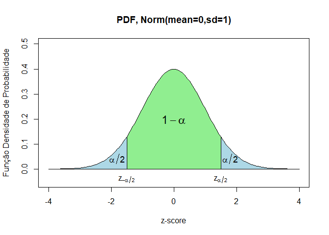
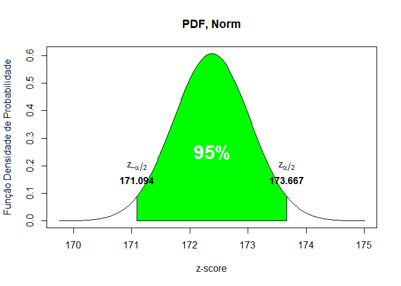
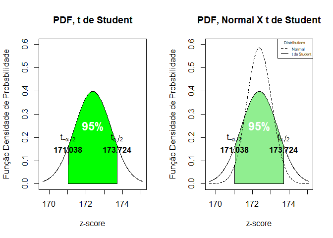
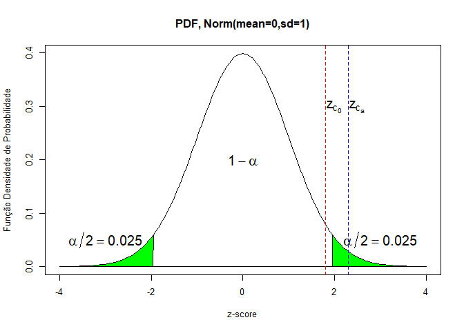
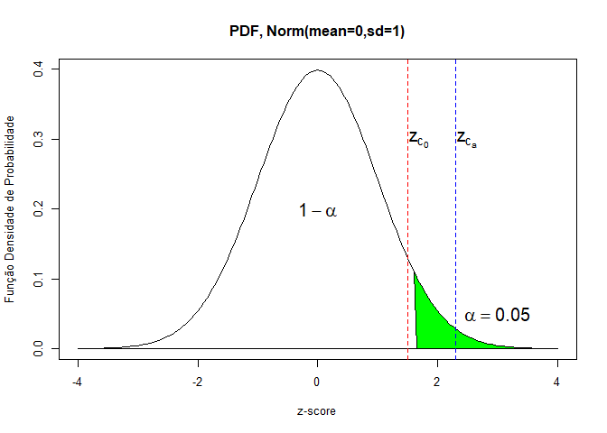
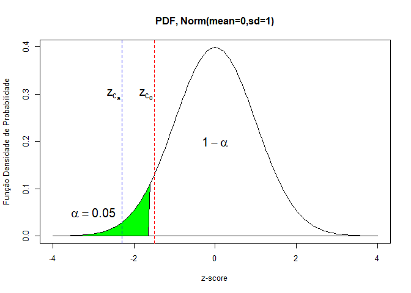

Probabilidade e Estatística - Aula 6
================
Rogério de Oliveira
2021-05-24

# Testes de Hipóteses

-----


<br> <br> <br> <br> <br>

Você vai aprender aqui como determinar intervalos de confiança que
permitem avaliar a confiança de valores esperados em uma população.
Outro instrumento importante da Inferência Estatística são os Testes de
Hipótese, e você vai aprender aqui como aplicar testes de hipóteses para
diferentes tipos de variáveis e como empregar esses testes para comparar
médias ou valores de diferentes conjuntos de dados.

## Introdução

De modo simples temos dois objetivos aqui: estimar parâmetros de
população a partir de uma amostra; e validar uma certa hipótese sobre
os dados com base nessas estimativas. Como você verá esses são
instrumentos poderosos e bastante práticos da inferência estatística e,
você também verá, não são difíceis de serem aplicados com R. Para o
primeiro objetivo empregaremos a Estimativa de Intervalos e, para o
segundo, os Testes de Hipótese. Faremos uma abordagem bastante prática
com exemplos para que você esteja apto a realmente aplicar esses
conceitos no seu dia a dia quando precisar.

## Estimativas de Intervalo

Aqui você estimar os parâmetros de uma população com base em dados de
amostras aleatórias simples. Para qualquer amostra aleatória, sempre
podemos calcular sua média de amostra. Embora na maioria das vezes não
seja a média da população real, ela serve como uma boa estimativa
pontual . Por exemplo, podemos empregar uma pesquisa que faz o
levantamento sobre uma amostra de estudantes para inferir parâmetros da
população total.

``` r
library(MASS)
head(survey)
```

    ##      Sex Wr.Hnd NW.Hnd W.Hnd    Fold Pulse    Clap Exer Smoke Height      M.I
    ## 1 Female   18.5   18.0 Right  R on L    92    Left Some Never 173.00   Metric
    ## 2   Male   19.5   20.5  Left  R on L   104    Left None Regul 177.80 Imperial
    ## 3   Male   18.0   13.3 Right  L on R    87 Neither None Occas     NA     <NA>
    ## 4   Male   18.8   18.9 Right  R on L    NA Neither None Never 160.00   Metric
    ## 5   Male   20.0   20.0 Right Neither    35   Right Some Never 165.00   Metric
    ## 6 Female   18.0   17.7 Right  L on R    64   Right Some Never 172.72 Imperial
    ##      Age
    ## 1 18.250
    ## 2 17.583
    ## 3 16.917
    ## 4 20.333
    ## 5 23.667
    ## 6 21.000

``` r
help(survey)
```

    ## starting httpd help server ... done

O conjunto de dados acima apresenta respostas de 237 estudantes de
Estatística da Universidade de Adelaide com dados de altura, idade,
tabagismo etc. e pode para estimar o parãmetros da população de
estudantes de Adelaide. E podemos então obter a estimativa pontual da
média de altura ou idade dos estudantes.

``` r
mean(survey$Age)
```

    ## [1] 20.37451

``` r
mean(survey$Height)
```

    ## [1] NA

``` r
mean(survey$Height, na.rm=TRUE)
```

    ## [1] 172.3809

Como em muitas pesquisas acontece às vezes de o respondente da pesquisa
não informar algum valor. Por exemplo, nessa pesquisa, existem dados
ausentes (`NA` ou `null`) de altura (`Height`) para alguns estudantes
que, talvez, não sabiam dizer sua altura no momento da pesquisa ou não
quiseram informar. Note que precisamos ter uma forma de indicar valores
ausentes e não podemos empregar um valor como 0, por exemplo. Em R os
valores ausentes são identificados com `NA`e os comandos abaixo mostram
algumas formas de identificarmos valores ausentes em um dataframe.

``` r
any(is.na(survey)) # retorna se existe algum nulo
```

    ## [1] TRUE

``` r
sum(is.na(survey)) # retorna a quantidade de nulos
```

    ## [1] 107

``` r
sum(is.na(survey$Height)) # retorna a quantidade de nulos em Height
```

    ## [1] 28

``` r
names(which(colSums(is.na(survey)) > 0)) # retorna as colunas que contêm valores nulos
```

    ## [1] "Sex"    "Wr.Hnd" "NW.Hnd" "W.Hnd"  "Pulse"  "Clap"   "Smoke"  "Height"
    ## [9] "M.I"

Não é possível calcularmos a média de uma coleção de valores onde existe
um valor ausente. Afinal esse valor poderia ser qualquer valor e
poderia, então, alterar totalmente a média. Por isso nosso primeiro
calculo de média de altura acima retorna também um valor ausente.
Existem várias abordagens para o tratamento de dados ausentes, desde a
exclusão de dados até técnicas para imputar os valores ausentes. Aqui
vamos simplesmente excluir os valores ausentes do cálculo e para isso
empregamos o parâmetro `na.rm=TRUE` (que significa `NA remove True`).

## Estimativa de intervalo da média da população com variância conhecida

O problema agora, de empregar a média da amostra com estimativa pontual
da média da população é que gostaríamos de saber qual a precisão dessa
estimativa. Vamos começar com o caso em que a variância da população,

é considerada conhecida.

Para amostra aleatória de tamanho suficientemente grande, os pontos
finais da estimativa do intervalo no nível de confiança ") são dados por:

  
  

onde
 é o percentil ") da distribuição normal padrão.

Vamos entender isso melhor a partir de um exemplo. Mas antes, entenda o
que é um intervalo de confiança.

### Intervalos de Confiança

O \*\*intervalo de \*confiança\*\* é encontrado adicionando e subtraindo
o erro da média. Por exemplo, vamos assumir que a média de uma amostra é
5, o desvio padrão conhecido da população é 2 e o tamanho da amostra é
20. Vamos então encontrar o intervalor de confiança com para um nível de
confiança de 95%.

O **nível de confiança** 95% significa que em 95% das médias obtidas de
amostras você espera encontrar o mesmo valor de média. Veja a figura
abaixo.

``` r
library(latex2exp)
```

    ## Warning: package 'latex2exp' was built under R version 4.0.4

``` r
prob = c(0)

mu = 0
sigma = 1

x =seq(-4,4,0.05)
prob = dnorm(x, mean=mu, sd=sigma)

plot(x,
     prob,
     type='l',
     xlab = 'z-score',
     ylab = 'Função Densidade de Probabilidade',
     col='black',
     ylim=c(-0.05,0.5))
title('PDF, Norm(mean=0,sd=1)')

lb = -4 # limite inferior
ub = 4 # limite superior

i <- x >= lb & x <= ub
polygon(c(lb,x[i],ub), c(0,prob[i],0), col="lightblue")  # preenche a área sob a curva

lb = -1.5 # limite inferior
ub = 1.5 # limite superior

i <- x >= lb & x <= ub
lines(x, prob)                                       # desenha as linhas limite
polygon(c(lb,x[i],ub), c(0,prob[i],0), col="lightgreen")  # preenche a área sob a curva

p_intervalo = pnorm(1,mean=0,sd=1) - pnorm(-1,mean=0,sd=1)
text(0,0.2, TeX('$ 1 - \\alpha $'), font=2, cex=1.5)
text(-1.8,0.04, TeX('$ \\alpha / 2$'), font=2, cex=1.1)
text(1.8,0.04, TeX('$ \\alpha / 2$'), font=2, cex=1.1)

text(1.5,-0.04, TeX('$ z_{\\alpha / 2}$'), font=2, cex=1.0)
text(-1.5,-0.04, TeX('$ z_{-\\alpha / 2}$'), font=2, cex=1.0)
```

<!-- -->

 é o
**nível de significância** e, aqui um **ponto importante**. Veja que os
valores fora do intervalo de 95% de confiança podem residir tanto na
faixa azul inferior como na faixa azul superior do gráfico acima
(‘bicaldal’). Desse modo, o percentil para obtermos o intervalo de
valores (aplicaremos o `qnorm`, a função de probabilidade acumulada
inversa) é portanto 0.975\! Mas cuidado, em alguns casos, quando
buscamos uma confiança de valores apenas maiores ou menores, você
precisa considerar apenas uma das áreas.

Para uma confiança de 95% *bicaldal*:   
  
  
  

  
  

Sendo a curva de distribuição normal simétrica podemos então empregar
apenas `qnorm(0.975)`:

``` r
mu = 5                                # Média da amostra
sigma = 2                             # Desvio padrão conhecido da população
n = 20                                # Tamanho da amostra
stdm =  sigma/sqrt(n)                 # Desvio padrão da média da amostra (std mean)

error = qnorm(0.975)*stdm; error
```

    ## [1] 0.8765225

``` r
xbar= c(mu - error, mu + error); xbar
```

    ## [1] 4.123477 5.876523

Isto é:

  
  
  
  
E 95% das amostras devem assim apresentar média entre
![\[4.12, 5.87\]](https://latex.codecogs.com/png.latex?%5B4.12%2C%205.87%5D
"[4.12, 5.87]").

Note ainda que calculamos `stdm = sigma/sqrt(n)` o desvio padrão da
média da amostra (std mean) ajustando a distribuição normal de média 0
e sd=1 para os nossos dados.

### Exemplo

Vamos considerar que conhecemos a variância da medida de altura da
população no caso da pesquisa anterior dos alunos de Alberta. Vamos
considerar que conhecemos o valor do desvio padrão dessa medida que é
9.49. Note que conhecer a variância
 e conhecer o desvio padrão
 são
a mesma coisa , já que um é o quadrado do outro.

Em muitos casos isso pode ser mesmo conhecido ou aproximado por
pesquisas anteriores, outras formas de estimativa etc. o fato é de que,
de algum modo, *temos* um valor de variância da população.

Vamos agora buscar a margem de erro e a estimativa do intervalo para um
nível de confiança de 95%.

Primeiro calcule o desvio padrão da média. Para isso dividimos o desvio
padrão pelo quadrado do número de observações:

``` r
n = sum(!is.na(survey$Height))
sigma = 9.49                  
stdm = sigma/sqrt(n); stdm
```

    ## [1] 0.656437

Veja que, como existem valores nulos, desconsideramos esses elementos
calculando o número de amostras como `sum(!is.na(survey$Height))`
(valores não ‘\!’ NA).

Como existem duas caudas da distribuição normal, o nível de confiança de
95% implica no percentil 97.5 da distribuição normal na cauda superior
e, portanto,  será dado por `qnorm(0.975)`.

``` r
error = qnorm(.975) * stdm; error  
```

    ## [1] 1.286593

E o intervalo de confiança como:

``` r
mu = mean(survey$Height, na.rm=TRUE)
xbar= c(mu - error, mu + error); xbar
```

    ## [1] 171.0943 173.6675

Em resumo temos todos os passos juntos aqui:

``` r
mu = mean(survey$Height, na.rm=TRUE)  # Média da amostra
sigma = 9.49                          # Desvio padrão conhecido da população
n = sum(!is.na(survey$Height))        # Tamanho da amostra
stdm =  sigma/sqrt(n)                 # Desvio padrão da média da amostra (std mean)

error = qnorm(0.975)*stdm; error
```

    ## [1] 1.286593

``` r
xbar= c(mu - error, mu + error); xbar
```

    ## [1] 171.0943 173.6675

e podemos representar esses resultados como abaixo.

``` r
library(latex2exp)

prob = c(0)

mu = mean(survey$Height, na.rm=TRUE)
sigma = 9.49/sqrt(n)

x = seq(mu - 4*sigma,mu + 4*sigma,0.01)
prob = dnorm(x, mean=mu, sd=sigma)

plot(x,
     prob,
     type='l',
     xlab = 'z-score',
     ylab = 'Função Densidade de Probabilidade',
     col='black')
title('PDF, Norm')

lb = xbar[1] # limite inferior
ub = xbar[2] # limite superior

i <- x >= lb & x <= ub
lines(x, prob)  
polygon(c(lb,x[i],ub), c(0,prob[i],0), col="green")  # preenche a área sob a curva

text(mu,0.25, '95%' , font=2, cex=2, col='white')

text(mu + qnorm(0.975)*sigma,0.2, TeX('$ z_{\\alpha / 2}$'), font=2, cex=1.0)
text(mu - qnorm(0.975)*sigma,0.2, TeX('$ z_{-\\alpha / 2}$'), font=2, cex=1.0)

text(mu + qnorm(0.975)*sigma,0.15, round(xbar[2],3), font=2, cex=1.0)
text(mu - qnorm(0.975)*sigma,0.15, round(xbar[1],3), font=2, cex=1.0)
```

<!-- -->

## Estimativa de intervalo da média da população com variação desconhecida

Veja agora o caso em que a variância da população não é assumida. Para
isso, no lugar de empregar a distribuição normal podemos empregar a
distribuição t de Student e os pontos finais da estimativa do intervalo
no nível de confiança ") são assim dados por:

  
  

``` r
mu = mean(survey$Height, na.rm=TRUE)  # Média da amostra
sigma = sd(survey$Height, na.rm=TRUE) # Desvio padrão da amostra
n = sum(!is.na(survey$Height))        # Tamanho da amostra
stdm =  sigma / sqrt(n)               # ESTIMATIVA do desvio padrão da média da amostra (std mean)

error = qt(0.975, df= n - 1 )*stdm; error
```

    ## [1] 1.342878

``` r
xbar= c(mu - error, mu + error); xbar
```

    ## [1] 171.0380 173.7237

A diferença agora é que empregamos o cálculo do desvio padrão da amostra
(e não um valor dado previamente), estimando o erro da amostra, e que
empregamos uma distribuição t de Student. Tomamos ainda o grau de
liberdade com .

Note: **o intervalo obtido é maior**. Por que? Como não conhecemos a
variância da população teremos menos *confiança* no resultado e, para
assegurarmos que 95% das medidas estejam no mesmo intervalo temos que
ter um intervalo maior. Regra prática: maior incerteza requer maiores
intervalos de confiança.

Você pode observar esses resultados nos gráficos abaixo.

``` r
library(latex2exp)
par(mfrow = c(1, 2))

prob = c(0)

mu = mean(survey$Height, na.rm=TRUE)
sigma = sd(survey$Height, na.rm=TRUE)/sqrt(n)

x = seq(mu - 4*sigma,mu + 4*sigma,0.01)
prob = dt(x - mu, df = n - 1)                 # Atenção: x - mu!
plot(x,
     prob,
     type='l',
     xlab = 'z-score',
     ylab = 'Função Densidade de Probabilidade',
     col='black',
     ylim=c(0,0.6))
title('PDF, t de Student')

lb = xbar[1] # limite inferior
ub = xbar[2] # limite superior

i <- x >= lb & x <= ub
lines(x, prob)  
polygon(c(lb,x[i],ub), c(0,prob[i],0), col="green")  # preenche a área sob a curva

text(mu,0.25, '95%' , font=2, cex=1.5, col='white')

text(mu + qt(0.975, df = n - 1)*sigma,0.2, TeX('$ t_{\\alpha / 2}$'), font=2, cex=1.0)
text(mu - qt(0.975, df = n - 1)*sigma,0.2, TeX('$ t_{-\\alpha / 2}$'), font=2, cex=1.0)

text(mu + qt(0.975, df = n - 1)*sigma,0.15, round(xbar[2],3), font=2, cex=1.0)
text(mu - qt(0.975, df = n - 1)*sigma,0.15, round(xbar[1],3), font=2, cex=1.0)

plot(x,
     prob,
     type='l',
     xlab = 'z-score',
     ylab = 'Função Densidade de Probabilidade',
     col='black',
     ylim=c(0,0.6))
title('PDF, Normal X t de Student')

lb = xbar[1] # limite inferior
ub = xbar[2] # limite superior

i <- x >= lb & x <= ub
lines(x, prob)  
polygon(c(lb,x[i],ub), c(0,prob[i],0), col="lightgreen")  # preenche a área sob a curva

text(mu,0.25, '95%' , font=2, cex=1.5, col='white')

text(mu + qt(0.975, df = n - 1)*sigma,0.2, TeX('$ t_{\\alpha / 2}$'), font=2, cex=1.0)
text(mu - qt(0.975, df = n - 1)*sigma,0.2, TeX('$ t_{-\\alpha / 2}$'), font=2, cex=1.0)

text(mu + qt(0.975, df = n - 1)*sigma,0.15, round(xbar[2],3), font=2, cex=1.0)
text(mu - qt(0.975, df = n - 1)*sigma,0.15, round(xbar[1],3), font=2, cex=1.0)

probnorm = dnorm(x - mu, sd=sigma)
lines(x,probnorm,lty=2)

legend("topright", legend=c('Normal','t de Student'),
       title='Distributions',
       col=c('black', 'black'), lty = c(2,1), cex=0.5)
```

<!-- -->

### t-test

O R nos fornece a função `t.test()` para fazer esse cálculo diretamente
e se você quiser empregá-la basta pode usar:

``` r
result = t.test(na.omit(survey$Height))
result
```

    ## 
    ##  One Sample t-test
    ## 
    ## data:  na.omit(survey$Height)
    ## t = 253.07, df = 208, p-value < 2.2e-16
    ## alternative hypothesis: true mean is not equal to 0
    ## 95 percent confidence interval:
    ##  171.0380 173.7237
    ## sample estimates:
    ## mean of x 
    ##  172.3809

Aqui comando `na.omit()` foi empregado para eliminar os valores
ausentes. Mais adiante aprenderemos mais sobre esse comando.

``` r
names(result)
```

    ##  [1] "statistic"   "parameter"   "p.value"     "conf.int"    "estimate"   
    ##  [6] "null.value"  "stderr"      "alternative" "method"      "data.name"

``` r
print('-------------------------------------------------------------------------')
```

    ## [1] "-------------------------------------------------------------------------"

``` r
result$conf.int
```

    ## [1] 171.0380 173.7237
    ## attr(,"conf.level")
    ## [1] 0.95

``` r
print('-------------------------------------------------------------------------')
```

    ## [1] "-------------------------------------------------------------------------"

``` r
result$conf.int[1]
```

    ## [1] 171.038

``` r
result$conf.int[2]
```

    ## [1] 173.7237

``` r
attr(result$conf.int,'conf.level')
```

    ## [1] 0.95

## Tamanho da Amostragem da Média da População

A qualidade de uma pesquisa por amostragem pode ser melhorada aumentando
o tamanho da amostra. Como obter então o tamanho ideal da amostra. Vamos
nos deter aqui apenas no caso mais simples de obter o tamanho da amostra
para um erro  máximo
desejado e uma variância

conhecida. Existem outras formas de dimensionar as amostras, mas aqui
esse modo será suficiente. O tamanho da amostra é dado então por:

  
}{E^2} ")  
Parece um cálculo difícil, mas o R permite fazermos esse cálculo de modo
bastante simples e prático. E para o problema da altura dos estudantes
podemos chegar ao número mínimo de 241 amostras:

``` r
zstar = qnorm(0.975) 
sigma = 9.49 
E = 1.2 
zstar**2 * sigma**2 / E**2
```

    ## [1] 240.2515

## Testes de Hipóteses

Vamos estudar agora outro método comumente usado para inferência
estatística: os testes de hipóteses. Os testes de hipóteses permitem a
partir de uma amostra de dados de uma população e inferir sobre duas de
hipóteses concorrentes qual é a correta.

Uma aplicação comum dos testes de hipóteses, que você já deve ter
ouvido, é empregado para verificar se um medicamento ou vacina tem
efeito positivo sobre uma certa doença. Neste caso, um grupo de
indíviduos recebe o medicamento ou vacina, enquanto o outro grupo
recebe um placebo sem saber que não está tomando o medicamento. Em
seguida os resultados dos dois grupos, como por exemplo um quantidade de
infectados ou o número de dias necessários para recuperação dos doentes,
são comparados. O teste consiste em verificar duas hipóteses
concorrentes no que se refere a média de valores dos grupos:

  
  
  
  
A primeira chamamos de **hipótese nula**, a segunda de **hipótese
alternativa**, e no caso dos grupos apresentarem resultados diferentes é
esperado que os medicamentos tiveram algum efeito sobre os indivíduos. A
hipótese alternativa pode envolver ,  ou ainda  dependo do que se quer comparar. No nosso
exemplo, podemos considerar o grupo 0 como o grupo que toma o
medicamento e o grupo 1 o grupo de controle. A medida pode ser então a
média de dias para recuperação, sendo
 a média de
cada grupo.

A **hipótese alternativa**, em geral, tende a ser a hipótese que o
pesquisador busca comprovar com a pesquisa ou coleta dos dados. Já a
**hipótese nula** sempre é adotada como a mais conservadora, isto é, ela
sempre representa a hipótese associada a inexistência de um
relacionamento de causa e efeito, de associação entre variáveis ou de
diferença entre grupos. A hipótese nula considera que qualquer condição
observada na população pode ser melhor explicada pelo acaso e, por isso,
o nome de hipótese *nula*. Entenda que a média dos dois grupos, podendo
assumir valores contínuos, dificilmente será idêntica. Entretanto, e
essa é a ideia dos testes de hipótese: será que a diferença que muito
provavelmente vamos observar é pela explicada pelo acaso (mais
exatamente pela distribuição de probabilidades), caso em que aceitamos a
hipotese nula, ou os valores de fato são significativamente diferentes
e, então aceitamos a hipótese alternativa? De modo prático: em geral os
valores  e  vão sempre diferir, a questão é então saber se eles diferem
*significativamente* (e portanto aceitamos ) ou não (e aceitamos ).

### Nível de significância

Adotamos o **nível de significância**
()
como o máximo erro aceitável da probabilidade de se rejeitar a hipótese
nula quando ela é, de fato, verdadeira. Sendo uma probabilidade
 é um
valor entre ![\[0,1\]](https://latex.codecogs.com/png.latex?%5B0%2C1%5D
"[0,1]") e se o nível de significância for 1, todos os resultados irão
concluir pela rejeição da hipótese nula - já que aceitamos até 100% de
probabilidade de erro. Embora qualquer valor de significância possa ser
escolhido o mais comum é adotarmos o **nível de significância em 5%
(0.05)**, ou ainda 1% (0.01), e a maior parte dos pacotes de Software e
o R adotam o valor padrão de 0.05 (será valor empregado caso você não
especifique um valor diferente).

### Tipos de Erro

Os testes de hipótese podem levar a conclusões incorretas sobre o
parâmetro da população porque temos apenas uma amostra de dados da
população. Existem dois tipos de erros associados aos testes de
hipóteses.

$H\_0 | Verdeira | Falsa |

|               |                       |                                                           |
| ------------- | --------------------- | --------------------------------------------------------- |
| Rejeit Aceita | a | Erro Ti | Decisão | po I FP | Decisão correta VP correta VN | Erro tipo II FN |

Um **erro do tipo I** ocorre quando você obtém resultados **falsos
positivos (FP)**: no nosso exemplo, você conclui que o medicamento tem
um efeito positivo quando na verdade não tem. A melhora dos pacientes
podendo ter ocorrido por outros fatores aleatórios, como a mudança de
estação do ano, ou erros de medição. O risco de cometer esse erro é o
nível de significância
 que
você escolher e você pode escolher valores ainda menores que
 para reduzir
esse risco.

Um **erro do tipo II** ocorre quando você obtém resultados **falsos
negativos (FN)**: você conclui que o medicamento não tem um efeito
positivo quando na verdade tem. Seu estudo pode, por exemplo, não ter
considerado algum indicador chave de melhora dos indivíduos.O erro tipo
II é mais complexo e, em geral, está associado a capacidade do
experimento em medir os seus resultados (por exemplo o tamanho da
amostra).

É importante também entender como esses erros estão associados. Reduzir
o erro do tipo I leva ao aumento do erro do tipo II e vice-versa. Desse
modo, em um caso real, você precisará verificar as consequências do erro
do tipo I (falsos positivos) e do erro do tipo II (falsos negativos)
para tomar uma decisão. No nosso exemplo, o erro Tipo I ou Falso
Positivo FP (o medicamento é eficaz quando não é) parece ser o de maior
risco pois levaria pacientes a pensarem que estão melhorando e livres de
riscos da doença. Esse é portanto, o erro que se deveria previlegiar a
redução. O aumento do erro Tipo II ou Falso Negativo FN (o medicamento é
eficaz mas concluímos que não é) representa um risco bastante menor para
os pacientes.

### Estatística de teste

A estatística de teste é que efetuamos sobre os dados amostrais para
verificar qual é a evidência que temos para aceitar ou rejeitar a
hipótese {H\_0}. A estatística de teste é uma estatística (uma função
das quantidades amostrais e seus valores) e é uma variável aleatória que
supomos uma determinada **distribuição de probabilidade conhecida**.
Assim, para uma distribuição t de Student, podemos calcular a
estatística de teste :

  
  
onde  é o desvio padrão
da amostra, e para uma distribuição normal, podemos calcular a
estatística de teste :

  
  
onde 
é o desvio padrão da população.

**Importante**, você notar que existem vários testes de hipótese (e
mesmo diferentes formas de se obter estatísticas de teste) e que eles
dependem de uma distribuição conhecida. Aqui nos deteremos sobre testes
com distribuição de t de Student e normal que são bastante comuns e
alguns casos práticos da sua aplicação, e testes para outras
distribuições e outras aplicações seguem procedimentos semelhantes,
mas não exatamente os mesmos cálculos.

### Realizando um teste de hipótese

A figura abaixo ilustra como tomamos a decisão de rejeitar ou aceitar a
hipótese  (e
consequentemente rejeitar ou aceitar a hipótese alternativa
) com base em uma
estatística, um nível de significância  e o tipo de hipótese alternativa (bilateral,
unilateral a direita ou a esquerda).

``` r
library(latex2exp)

# par(mfrow = c(1, 3))
layout.matrix <- matrix(c(1, 1, 1, 0), nrow = 2, ncol = 2)

layout(mat = layout.matrix,
       heights = c(2, 2), # Heights of the two rows
       widths = c(2, 2)) # Widths of the two columns

prob = c(0)

mu = 0
sigma = 1

x =seq(-4,4,0.05)
prob = dnorm(x, mean=mu, sd=sigma)

plot(x,
     prob,
     type='l',
     xlab = 'z-score',
     ylab = 'Função Densidade de Probabilidade',
     col='darkblue')
title('PDF, Norm(mean=0,sd=1)')

lb = -4 # limite inferior
ub = 4 # limite superior

i <- x >= lb & x <= ub
lines(x, prob)                                       # desenha as linhas limite
polygon(c(lb,x[i],ub), c(0,prob[i],0), col="green")  # preenche a área sob a curva

lb = -qnorm(0.975) # limite inferior
ub = qnorm(0.975) # limite superior

i <- x >= lb & x <= ub
lines(x, prob)                                       # desenha as linhas limite
polygon(c(lb,x[i],ub), c(0,prob[i],0), col="white")  # preenche a área sob a curva

text(0,0.2, TeX('$1 - \\alpha$'), font=2, cex=1.5)
text(-3,0.05, TeX('$\\alpha / 2 = 0.025$'), font=2, cex=1.5)
text(3,0.05, TeX('$\\alpha / 2 = 0.025$'), font=2, cex=1.5)

text(2,0.3, TeX('$z_{c_0}$'), cex=1.5)
abline(v=1.8, lty=2, col='red')

text(2.5,0.3, TeX('$z_{c_a}$'), cex=1.5)
abline(v=2.3, lty=2, col='blue')
```

<!-- -->

``` r
#-------------------------------------------------------------------------------

prob = c(0)

mu = 0
sigma = 1

x =seq(-4,4,0.05)
prob = dnorm(x, mean=mu, sd=sigma)

plot(x,
     prob,
     type='l',
     xlab = 'z-score',
     ylab = 'Função Densidade de Probabilidade',
     col='darkblue')
title('PDF, Norm(mean=0,sd=1)')

lb = -4 # limite inferior
ub = 4 # limite superior

i <- x >= lb & x <= ub
lines(x, prob)                                       # desenha as linhas limite
polygon(c(lb,x[i],ub), c(0,prob[i],0), col="green")  # preenche a área sob a curva

lb = -4 # limite inferior
ub = qnorm(0.95) # limite superior

i <- x >= lb & x <= ub
lines(x, prob)                                       # desenha as linhas limite
polygon(c(lb,x[i],ub), c(0,prob[i],0), col="white")  # preenche a área sob a curva

text(0,0.2, TeX('$1 - \\alpha$'), font=2, cex=1.5)
text(3,0.05, TeX('$\\alpha = 0.05$'), font=2, cex=1.5)

text(1.7,0.3, TeX('$z_{c_0}$'), cex=1.5)
abline(v=1.5, lty=2, col='red')

text(2.5,0.3, TeX('$z_{c_a}$'), cex=1.5)
abline(v=2.3, lty=2, col='blue')
```

<!-- -->

``` r
#-------------------------------------------------------------------------------

prob = c(0)

mu = 0
sigma = 1

x =seq(-4,4,0.05)
prob = dnorm(x, mean=mu, sd=sigma)

plot(x,
     prob,
     type='l',
     xlab = 'z-score',
     ylab = 'Função Densidade de Probabilidade',
     col='darkblue')
title('PDF, Norm(mean=0,sd=1)')

lb = -4 # limite inferior
ub = 4 # limite superior

i <- x >= lb & x <= ub
lines(x, prob)                                       # desenha as linhas limite
polygon(c(lb,x[i],ub), c(0,prob[i],0), col="green")  # preenche a área sob a curva

lb = qnorm(0.05) # limite inferior
ub = 4 # limite superior

i <- x >= lb & x <= ub
lines(x, prob)                                       # desenha as linhas limite
polygon(c(lb,x[i],ub), c(0,prob[i],0), col="white")  # preenche a área sob a curva

text(-0,0.2, TeX('$1 - \\alpha$'), font=2, cex=1.5)
text(-3,0.05, TeX('$\\alpha = 0.05$'), font=2, cex=1.5)

text(-1.7,0.3, TeX('$z_{c_0}$'), cex=1.5)
abline(v=-1.5, lty=2, col='red')

text(-2.5,0.3, TeX('$z_{c_a}$'), cex=1.5)
abline(v=-2.3, lty=2, col='blue')
```

<!-- -->

Assim para a estatística obtida
 (ou
) é um ponto
crítico que define a aceitação ou rejeição da hipótese nula. Na figura
as estatísticas 
encontram-se no ponto de aceitação da hipótese nula (e rejeição da
hipótese alternativa), enquando as estatísticas
 encontram-se no
ponto de aceitação da hipótese alternativa (e, portanto, rejeição da
hipótese nula).

### Exemplo

O salário médio de gerentes de TI no ano passado foi de R$ 15.4 (mil)
sendo conhecido um desvio padrão de R$ 2.5 (mil). Uma amostra este ano
de 35 salários tem média de R$ 14.77 (mil). COm base nesta amostra é
possível dizer que a média de salários este ano é diferente do ano
passado?

A hipótese nula é de que as médias não diferem, a alternativa a de que
as médias diferem. Note que já sabemos que o valor da amostra ( R$ 14.77
) difere do valor do ano passado ( R$ 15.4 ) e haveria pouca chance de
ser diferente. A questão é se essa diferença é significativa e de fato
os salário diferem, ou a diferença é simplesmente consequência da
amostra.

  
  

  
  

Podemos então calcular a estatística dos salários.

  
  
  
  

``` r
xbar = 14.6            # média da amostra
mu0 = 15.4             # hipótese da média  
sigma = 2.5            # sd da amostra
n = 35                 # tamanho da amostra

z = (xbar-mu0)/(sigma/sqrt(n))
z
```

    ## [1] -1.893146

E os intervalos para um nível de significância:

``` r
alpha = .05
z.alpha = qnorm(1-alpha/2)
c(-z.alpha, z.alpha)
```

    ## [1] -1.959964  1.959964

Note que esse é um teste bilateral (a pergunta é se a média de salários
é diferente, e independe se é maior ou menor). Desse modo o nível de
significância aparece dividido por 2. Como
 é  aceitamos a hipótese nula e os
salários não diferem.

Você pode achar isso surpreendente, afinal parece haver uma grande
diferença entre R$ 14.77 e R$ 15.4 ), mas como há um desvio padrão
elevado ( R$ 2.5 ) essa diferença pode de fato ser encontrada em uma
escolha ao acaso sem haver diferença significativa entre a média dos
valores. E esse é o poder dos testes de hipótese\!

## Usando o p-value

Em estatística, *p-value* é a probabilidade de se obter resultados fora
do intervalo de aceitação da hipótese nula. O uso de *p-value* é uma
alternativa ao uso dos intervalos de aceite e rejeição e uma forma
bastante usual de se aplicar testes de hipótese. Um p-value menor que o
nível de significância dá evidências a favor da hipótese alternativa
enquanto valores maiores rejeitam a hipótese alternativa.

  
  
  
  
O que é o mesmo que dizer:

  
  

  
  

### Exemplo

Podemos calcular a probabilidade p-value com a função `pnorm()` que
fornece a probabilidade acumulada para o valor crítico
. Aplicando ao mesmo
problema dos salários do exemplo anterior temos
 como:

``` r
xbar = 14.6            # média da amostra
mu0 = 15.4             # hipótese da média  
sigma = 2.5            # sd da amostra
n = 35                 # tamanho da amostra

z = (xbar-mu0)/(sigma/sqrt(n))
z
```

    ## [1] -1.893146

e, portanto, podemos calcular o p-value para esse valor como:

``` r
pval = 2 * pnorm(z)  
pval                         
```

    ## [1] 0.05833852

Note que multiplicamos o valor obtido por 2 por ser um teste bilateral
e, portanto, a probabilidade (a área do gráfico até
) precisa ser
considerada duas vezes (a probabilidade do valor ser menor e a
probabilidade do valor ser maior).

Desse modo, como p-value \> 0.05, aceitamos a hipótese nula, e os
salários não são significativamente diferentes. Que é o mesmo resultado
do teste anterior com os intervalos de aceite e rejeição.

## Empregando o `t.test`

Vamos considerar agora o mesmo problema anterior dos salários mas no
caso em que a variância não é conhecida. Para isso vamos simular a
amostra de 35 salários coletados criando valores aleatórios de média
14.6 e desvio padrão 2.5 e aplicar o teste de hipóteses considerando
agora uma distribuição t de Student.

``` r
set.seed(1)
x = rnorm(35, mean = 14.6, sd = 2.5) 
xbar = mean(x); xbar
```

    ## [1] 14.79189

``` r
mu0 = 15.4             
sigma = sd(x); sigma          
```

    ## [1] 2.295689

``` r
n = length(x)           

t = (xbar-mu0)/(sigma/sqrt(n)); t
```

    ## [1] -1.567126

Obtido o valor crítico podemos então calcular o p-value:

``` r
pval = 2 * pt(t, df=n-1); pval
```

    ## [1] 0.1263463

O resultado é p-value \> 0.05 e, portanto, rejeitamos a hipótese
alternativa de que os salários diferem.

Há entretanto, no caso do teste t, uma função em R que permite aplicar o
teste diretamente e que já empregamos antes, é a função `t.test`
(existem outros pacotes que também executam outros testes diretamente e
você pode procurar na internet algum que seja do seu interesse).

``` r
test = t.test(x, mu=mu0)
test$p.value
```

    ## [1] 0.1263463

``` r
t.test(x, mu=mu0)
```

    ## 
    ##  One Sample t-test
    ## 
    ## data:  x
    ## t = -1.5671, df = 34, p-value = 0.1263
    ## alternative hypothesis: true mean is not equal to 15.4
    ## 95 percent confidence interval:
    ##  14.00329 15.58049
    ## sample estimates:
    ## mean of x 
    ##  14.79189

Ela retorna diretamente o p-value, além do intervalo de confiança para a
significância dada. O resultado é p-value = 0.1263 \> 0.05 e, portanto,
rejeitamos a hipótese alternativa de que os salários diferem e está
consistente com os valores e resultado do teste anterior.

Empregue `help(t.test)` para saber mais da função e veja que o padrão
empregado é `alternative = "two.sided"`.

## Outros Casos de Uso

Agora que você já estudou todos os conceitos dos testes de hipótese,
vamos ver alguns casos de uso comuns de aplicação dos testes de
hipótese. Para isso vamos empregar os seguintes conjuntos de amostras
de notas de alunos.

``` r
set.seed(1234)
turma_A = data.frame(id = paste0(rep("aluno_", 10), 1:10),
                     nota = round(rnorm(10, mean=6, sd=1.5), 1))
turma_A
```

    ##          id nota
    ## 1   aluno_1  4.2
    ## 2   aluno_2  6.4
    ## 3   aluno_3  7.6
    ## 4   aluno_4  2.5
    ## 5   aluno_5  6.6
    ## 6   aluno_6  6.8
    ## 7   aluno_7  5.1
    ## 8   aluno_8  5.2
    ## 9   aluno_9  5.2
    ## 10 aluno_10  4.7

``` r
turma_B = data.frame(id = paste0(rep("aluno_", 10), 1:10),
                     nota = round(rnorm(10, mean=7.5, sd=1.0), 1))
turma_B
```

    ##          id nota
    ## 1   aluno_1  7.0
    ## 2   aluno_2  6.5
    ## 3   aluno_3  6.7
    ## 4   aluno_4  7.6
    ## 5   aluno_5  8.5
    ## 6   aluno_6  7.4
    ## 7   aluno_7  7.0
    ## 8   aluno_8  6.6
    ## 9   aluno_9  6.7
    ## 10 aluno_10  9.9

### Teste de uma amostra bilateral

Empregamos quando queremos verificar a hipótese de que a média difere de
um valor dado.

  
  

  
  

``` r
t.test(turma_A$nota, mu=6)
```

    ## 
    ##  One Sample t-test
    ## 
    ## data:  turma_A$nota
    ## t = -1.2171, df = 9, p-value = 0.2545
    ## alternative hypothesis: true mean is not equal to 6
    ## 95 percent confidence interval:
    ##  4.370536 6.489464
    ## sample estimates:
    ## mean of x 
    ##      5.43

Como p-value \> 0.05, aceitamos a hipótese nula e a média não difere de
6. O teste ainda fornece o intervalo de confiança ![\[4.37
, 6.48\]](https://latex.codecogs.com/png.latex?%5B4.37%20%2C%206.48%5D
"[4.37 , 6.48]").

### Teste de uma amostra lateral a direita

Empregamos quando queremos verificar a hipótese de que a média é maior
que um valor dado.

  
  

  
  

``` r
t.test(turma_A$nota, mu=6.5, alternative='greater')
```

    ## 
    ##  One Sample t-test
    ## 
    ## data:  turma_A$nota
    ## t = -2.2847, df = 9, p-value = 0.9759
    ## alternative hypothesis: true mean is greater than 6.5
    ## 95 percent confidence interval:
    ##  4.571476      Inf
    ## sample estimates:
    ## mean of x 
    ##      5.43

Como p-value \> 0.05, aceitamos a hipótese nula e a média não é maior
que 6.5. O teste fornece ainda valor crítico, 4.57, que corresponde ao
valor limite com p-value = 0.05.

``` r
t.test(turma_A$nota, mu=4.57, alternative='greater')
```

    ## 
    ##  One Sample t-test
    ## 
    ## data:  turma_A$nota
    ## t = 1.8363, df = 9, p-value = 0.04975
    ## alternative hypothesis: true mean is greater than 4.57
    ## 95 percent confidence interval:
    ##  4.571476      Inf
    ## sample estimates:
    ## mean of x 
    ##      5.43

### Teste de uma amostra lateral a esquerda

Empregamos quando queremos verificar a hipótese de que a média é menor
que um valor dado.

  
  

  
  

``` r
t.test(turma_A$nota, mu=6.5, alternative='less')
```

    ## 
    ##  One Sample t-test
    ## 
    ## data:  turma_A$nota
    ## t = -2.2847, df = 9, p-value = 0.0241
    ## alternative hypothesis: true mean is less than 6.5
    ## 95 percent confidence interval:
    ##      -Inf 6.288524
    ## sample estimates:
    ## mean of x 
    ##      5.43

Como p-value \< 0.05, aceitamos a hipótese alternativa e a média é menor
que 6.5 (o que era esperado pelo resultado anterior). Analogamente você
também encontra o valor crítico 6.28 para p-value = 0.05.

### Teste de duas amostras bilateral

Testes de hipóteses tem muitas aplicações, mas um outro caso de uso
importante é o comparar duas séries de dados. O teste se baseia em
avaliar a média de diferença das médias duas séries e é conhecido como
*Welch test*. Por exemplo, podemos querer comparar a média de notas das
duas turmas de alunos do nosso exemplo e verificar se as médias diferem.

  
  

  
  

``` r
t.test(turma_A$nota, turma_B$nota)
```

    ## 
    ##  Welch Two Sample t-test
    ## 
    ## data:  turma_A$nota and turma_B$nota
    ## t = -3.3954, df = 16.361, p-value = 0.0036
    ## alternative hypothesis: true difference in means is not equal to 0
    ## 95 percent confidence interval:
    ##  -3.181533 -0.738467
    ## sample estimates:
    ## mean of x mean of y 
    ##      5.43      7.39

Como p-value = 0.0036 \< 0.05, aceitamos a hipótese alternativa e a
média das turmas difere. Veja que o intervalo de confiança é o
intervalo da diferença das médias.

### Teste de duas amostras laterais

Do mesmo modo que no caso de uma amostra podemos estar interessados em
testes laterais de maior ou menor valor da média. Empregamos a função do
mesmo modo. Por exemplo, podemos querer comparar a média de notas da
turma a é menor as notas da turma b.

  
  

  
  

``` r
t.test(turma_A$nota, turma_B$nota, alternative='less')
```

    ## 
    ##  Welch Two Sample t-test
    ## 
    ## data:  turma_A$nota and turma_B$nota
    ## t = -3.3954, df = 16.361, p-value = 0.0018
    ## alternative hypothesis: true difference in means is less than 0
    ## 95 percent confidence interval:
    ##        -Inf -0.9535438
    ## sample estimates:
    ## mean of x mean of y 
    ##      5.43      7.39

Como p-value = 0.0018 \< 0.05, aceitamos a hipótese alternativa de que a
turma\_A tem média de notas inferior a turma\_B.

## Referências

Navarro, Danielle, **Learning Statistics with R**, disponível em:
<https://learningstatisticswithr.com/> ( LSR version 0.6 (pdf) ).
Acesso: 26/02/2021. Alternativamente em formato bookdown:
<https://learningstatisticswithr.com/book/> Acesso: 07/03/2021.

Chester Ismay, Albert Y. Kim. **Statistical Inference via Data Science:
A ModernDive into R and the Tidyverse\!** (2021) disponível
em:<https://moderndive.com/index.html>. Acesso: 10/04/2021.

Yau, Chi. **R Tutorial: An Introduction to Statistics**. disponível em:
<http://www.r-tutor.com/>. Acesso: 10/04/2021.

Ferreira, Eric Batista, Oliveira, Marcelo Silva de. **Introdução à
Estatística com R**. Editora Universidade Federal de Alfenas, 2020.
