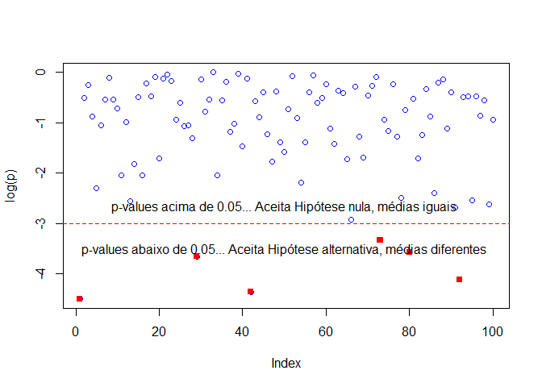

Testes de Hipóteses
===================

------------------------------------------------------------------------


<br> <br> <br> <br> <br>

Exercícios
----------

Lembrando aqui os exemplos empregados no inicío, sobre intervalos de
confiança, para variância conhecida da população e não conhecida (uso de
uma amostra).

``` r
library(MASS)
head(survey)
```

    ##      Sex Wr.Hnd NW.Hnd W.Hnd    Fold Pulse    Clap Exer Smoke Height      M.I
    ## 1 Female   18.5   18.0 Right  R on L    92    Left Some Never 173.00   Metric
    ## 2   Male   19.5   20.5  Left  R on L   104    Left None Regul 177.80 Imperial
    ## 3   Male   18.0   13.3 Right  L on R    87 Neither None Occas     NA     <NA>
    ## 4   Male   18.8   18.9 Right  R on L    NA Neither None Never 160.00   Metric
    ## 5   Male   20.0   20.0 Right Neither    35   Right Some Never 165.00   Metric
    ## 6 Female   18.0   17.7 Right  L on R    64   Right Some Never 172.72 Imperial
    ##      Age
    ## 1 18.250
    ## 2 17.583
    ## 3 16.917
    ## 4 20.333
    ## 5 23.667
    ## 6 21.000

``` r
mu = 5                                # Média da amostra, valor dado
sigma = 2                             # Desvio padrão conhecido da população
n = 20                                # Tamanho da amostra
stdm =  sigma/sqrt(n)                 # Desvio padrão da média da amostra (std mean)

error = qnorm(0.975)*stdm; error
```

    ## [1] 0.8765225

``` r
xbar= c(mu - error, mu + error); xbar
```

    ## [1] 4.123477 5.876523

``` r
mu = mean(survey$Height, na.rm=TRUE)  # Média da amostra
sigma = sd(survey$Height, na.rm=TRUE) # Desvio padrão da amostra
n = sum(!is.na(survey$Height))        # Tamanho da amostra
stdm =  sigma / sqrt(n)               # ESTIMATIVA do desvio padrão da média da amostra (std mean)

error = qt(0.975, df= n - 1 )*stdm; error
```

    ## [1] 1.342878

``` r
xbar= c(mu - error, mu + error); xbar
```

    ## [1] 171.0380 173.7237

Para os testes de hipóteses vamos empregar o `t.test()` a menos de
menção contrária.

### Exercício 1

Considere a base abaixo.

``` r
head(ToothGrowth)
```

    ##    len supp dose
    ## 1  4.2   VC  0.5
    ## 2 11.5   VC  0.5
    ## 3  7.3   VC  0.5
    ## 4  5.8   VC  0.5
    ## 5  6.4   VC  0.5
    ## 6 10.0   VC  0.5

``` r
help(ToothGrowth)
```

    ## starting httpd help server ... done

1.  Calcule o intervalo de confiança de `len`, de dados sobre
    crescimento dentário, para um nível de confiança de 95% (Você
    conhece a variância? acho que não :-) ).

**Solução**

1.  Altere o nível de confiança para 98%. O resultado é o que você
    esperava? O que você observa, o intervalo é maior ou menor?
    (lembre-se de que você vai empregar uma distribuição bilateral)

**Solução**

1.  Para o mesmo problema gere um gráfico com os valores de E (o tamanho
    do intervalo /2) para os intervalos de nível de confiança de 50% a
    99%. Qual o erro para 98%?

**Solução**

### Exercício 2

Considere a base de dados.

``` r
bitcoin = read.csv('https://raw.githubusercontent.com/holtzy/data_to_viz/master/Example_dataset/3_TwoNumOrdered.csv',sep=' ',header=T)
head(bitcoin)
```

    ##         date  value
    ## 1 2013-04-28 135.98
    ## 2 2013-04-29 147.49
    ## 3 2013-04-30 146.93
    ## 4 2013-05-01 139.89
    ## 5 2013-05-02 125.60
    ## 6 2013-05-03 108.13

1.  Considerando a série toda a histórica do valor do Bitcoin, qual o
    intervalo de confiança com nível de 95%? (vamos considerar que não
    conhecemos a variância, ela será mais conservadora).

2.  Crie um atributo `year` para as cotações de bitcoin. Empregue esse
    campo para auxiliá-lo para construir o gráfico a seguir. Para cada
    ano exiba em um gráfico o intervalo de confiança com nível de
    confiabilidade de 95% para cada ano.

**Dica**: Empregue e modifique os exercícios e exemplos anteriores.
Selecione o ano `bitcoin[bitcoin$Year == ano ]$value`. Você também pode
querer empregar `unique(bitcoin$year)`.

Que anos apresentam intervalos de confiança maiores?

**Solução**

### Exercício 3

Considere a base.

``` r
head(USArrests)
```

    ##            Murder Assault UrbanPop Rape
    ## Alabama      13.2     236       58 21.2
    ## Alaska       10.0     263       48 44.5
    ## Arizona       8.1     294       80 31.0
    ## Arkansas      8.8     190       50 19.5
    ## California    9.0     276       91 40.6
    ## Colorado      7.9     204       78 38.7

1.  Compare o intervalo de confiança de média de assassinatos dos
    estados com população urbana acima \> 50% e abaixo de \<= 50%.
    Empregue um nível de confiabilidade de 95%. Quais os valores
    obtidos?

Será que você pode garantir que os valores são de fato diferentes?
(aplique um `t.test`)

**Solução**

### Exercício 4

1.  Qual o valor de t e de p-value para duas amostras de distribuição
    normal idênticas?

**Dica**: Empregue o `rnorm()` para gerar as amostras e o `t.test()`
para obter os valores.

**Solução**

1.  Considere agora as amostras:

<!-- -->

    x = rnorm(25, mean = 100, sd = 10);  
    y = rnorm(25, mean = 101, sd = 10)

Elas têm médias iguais na maior ou na menor parte das vezes?

**Dica** Gere 100 experimentos (amostras diferentes de x e y) e
verifique o p-value do `t.test` e produza um gráfico ou algo semelhante
para observar a proporção de valores dos p-values.

**Solução**

``` r
p = c(0)
for (i in 1:100){
  x = rnorm(25, mean = 100, sd = 10); # x
  y = rnorm(25, mean = 101, sd = 10); # y
  result = t.test(x,y)
  # names(result)
  if (result$p.value < 0.05) print(result$p.value)
  p[i] = result$p.value
}
```

    ## [1] 0.01117514
    ## [1] 0.02586614
    ## [1] 0.0128719
    ## [1] 0.0359551
    ## [1] 0.0283068
    ## [1] 0.01636715

``` r
plot(log(p),col='blue')
for (i in 1:100){
  if (p[i] < 0.05) lines(i,log(p[i]),pch=15,type='b',col='red') 
}
abline(h=log(0.05),col='red',lty=2)
text(50,log(0.07),'p-values acima de 0.05... Aceita Hipótese nula, médias iguais')
text(50,log(0.03),'p-values abaixo de 0.05... Aceita Hipótese alternativa, médias diferentes')
```



1.  Considere agora as amostras:

<!-- -->

    x = rnorm(25, mean = 100, sd = 2.5);  
    y = rnorm(25, mean = 101, sd = 2.5)

O fato de diminuírmos o desvio padrão aumenta a chance dos dados terem
média significativamente iguais ou diferentes?

**Solução**

### Exercício 5

Você recebe 25 amostras de embalagens de frutas especificadas como
embalagens de 100g. Seus pesos são:

``` r
set.seed(1234)
x = rnorm(25, mean = 100, sd = 12); x
```

    ##  [1]  85.51521 103.32915 113.01329  71.85163 105.14950 106.07267  93.10312
    ##  [8]  93.44042  93.22658  89.31955  94.27369  88.01936  90.68495 100.77351
    ## [15] 111.51393  98.67657  93.86789  89.06566  89.95394 128.99002 101.60906
    ## [22]  94.11177  94.71343 105.51507  91.67536

``` r
mean(x)
```

    ## [1] 97.09861

As amostras mostram um valor de média menor que 100g. O produto ainda
assim está dentro da especificação (dentro de uma significância de 95%)?

**Solução**

### Exercício 6

Considere a base de remunareções (*wage*) abaixo.

``` r
data(CPS85 , package = "mosaicData")
head(CPS85)
```

    ##   wage educ race sex hispanic south married exper union age   sector
    ## 1  9.0   10    W   M       NH    NS Married    27   Not  43    const
    ## 2  5.5   12    W   M       NH    NS Married    20   Not  38    sales
    ## 3  3.8   12    W   F       NH    NS  Single     4   Not  22    sales
    ## 4 10.5   12    W   F       NH    NS Married    29   Not  47 clerical
    ## 5 15.0   12    W   M       NH    NS Married    40 Union  58    const
    ## 6  9.0   16    W   F       NH    NS Married    27   Not  49 clerical

1.  Faça o `boxplot` da remuneração de homens e mulheres e observe as
    distribuições. Empregue o teste de hipóteses para responder se os
    ganhos (`wage`) de homens e mulheres é significativamente diferente.

**Dica** Empregue o `t.test()`.

**Solução**

1.  Empregue o teste de hipóteses para responder se os ganhos (`wage`)
    de casados é significativamente maior que dos solteiros.

**Dica** Empregue o `t.test()`. Note que aqui o teste é unilateral.

**Solução**

### Exercício 7

Considere a base de salários deste ano (abaixo). O Salário médio da
empresa no ano passado foi de 96.000 (atributo `income`). A empresa fez
uma série de ações no campo da remuneração para reduzir custos este ano
(base atual) e tornar-se mais competitiva. Essas ações tiveram um efeito
significativo? Isto é, o salário é significativamente menor?
(significância de 0.05)

``` r
data = read.csv('http://meusite.mackenzie.br/rogerio/TIC/Projects/glassdoordata.csv')
head(data)
```

    ##              jobtitle gender age performance education     department seniority
    ## 1    Graphic Designer Female  18           5   College     Operations         2
    ## 2   Software Engineer   Male  21           5   College     Management         5
    ## 3 Warehouse Associate Female  19           4       PhD Administration         5
    ## 4   Software Engineer   Male  20           5   Masters          Sales         4
    ## 5    Graphic Designer   Male  26           5   Masters    Engineering         5
    ## 6                  IT Female  20           5       PhD     Operations         4
    ##   income bonus
    ## 1  42363  9938
    ## 2 108476 11128
    ## 3  90208  9268
    ## 4 108080 10154
    ## 5  99464  9319
    ## 6  70890 10126

**Solução**

### Exercício 8

1.  Considere o preço de imóveis de Melbourne da base abaixo. Você quer
    vender um imóvel em Melbourne e acredita que vendas do tipo
    (atributo `Method`) ‘PI’ (‘passed in’) - digamos, com o uso de um
    intermediador - não tem qualquer vantagem sobre o método ‘S’
    (‘sold’) - digamos, venda direta - em termos de preço e que,
    portanto você estaria perdendo tempo e dinheiro buscando a venda por
    um intermediário (digamos, corretor). Você estaria correto? Avalie
    com um teste de hipótese de significância 0.05.

**Dica** Antes de fazer o teste, pense se perder dinheiro é bilateral o
unilateral.

``` r
houses = read.csv('https://meusite.mackenzie.br/rogerio/TIC/Melbourne_housing_FULL.csv')
head(houses)
```

    ##       Suburb            Address Rooms Type   Price Method SellerG      Date
    ## 1 Abbotsford      68 Studley St     2    h      NA     SS  Jellis 3/09/2016
    ## 2 Abbotsford       85 Turner St     2    h 1480000      S  Biggin 3/12/2016
    ## 3 Abbotsford    25 Bloomburg St     2    h 1035000      S  Biggin 4/02/2016
    ## 4 Abbotsford 18/659 Victoria St     3    u      NA     VB  Rounds 4/02/2016
    ## 5 Abbotsford       5 Charles St     3    h 1465000     SP  Biggin 4/03/2017
    ## 6 Abbotsford   40 Federation La     3    h  850000     PI  Biggin 4/03/2017
    ##   Distance Postcode Bedroom2 Bathroom Car Landsize BuildingArea YearBuilt
    ## 1      2.5     3067        2        1   1      126           NA        NA
    ## 2      2.5     3067        2        1   1      202           NA        NA
    ## 3      2.5     3067        2        1   0      156           79      1900
    ## 4      2.5     3067        3        2   1        0           NA        NA
    ## 5      2.5     3067        3        2   0      134          150      1900
    ## 6      2.5     3067        3        2   1       94           NA        NA
    ##          CouncilArea Lattitude Longtitude            Regionname Propertycount
    ## 1 Yarra City Council  -37.8014   144.9958 Northern Metropolitan          4019
    ## 2 Yarra City Council  -37.7996   144.9984 Northern Metropolitan          4019
    ## 3 Yarra City Council  -37.8079   144.9934 Northern Metropolitan          4019
    ## 4 Yarra City Council  -37.8114   145.0116 Northern Metropolitan          4019
    ## 5 Yarra City Council  -37.8093   144.9944 Northern Metropolitan          4019
    ## 6 Yarra City Council  -37.7969   144.9969 Northern Metropolitan          4019

**Solução**

1.  A função `t.test()` apresenta uma forma de automaticamente separar
    dois (apenas dois!) conjuntos de valores em um dataframe empregando
    a fórmula:

<!-- -->

    Atributo_test ~ Atributo_grupo

Procure no help do comando `t.test` e aplique ao exercício anterior.
