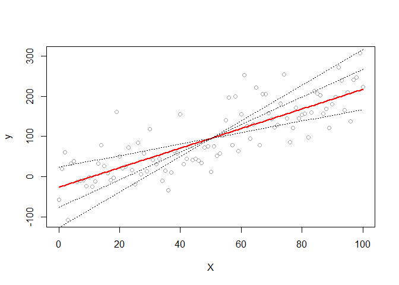
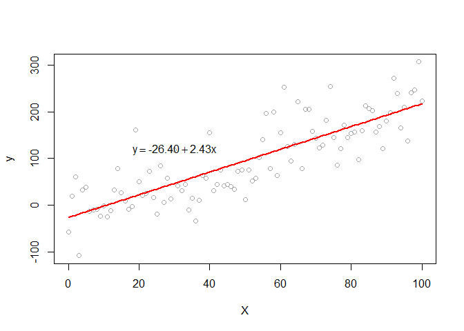
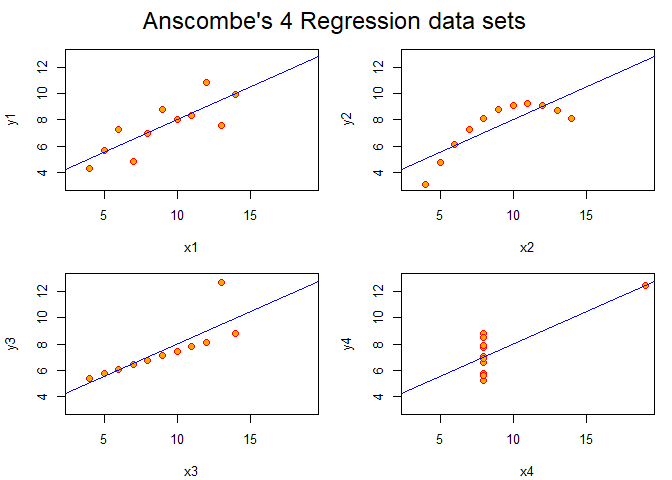
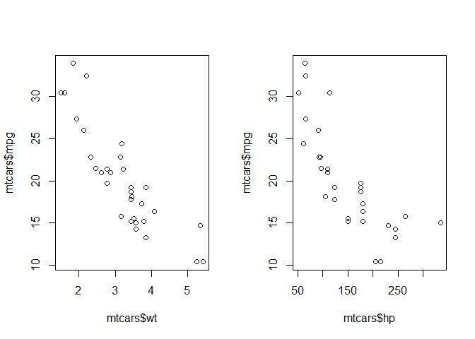
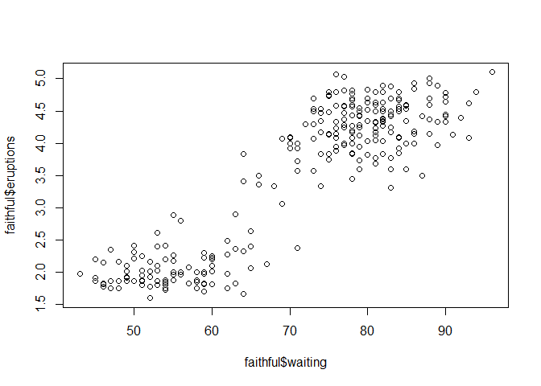
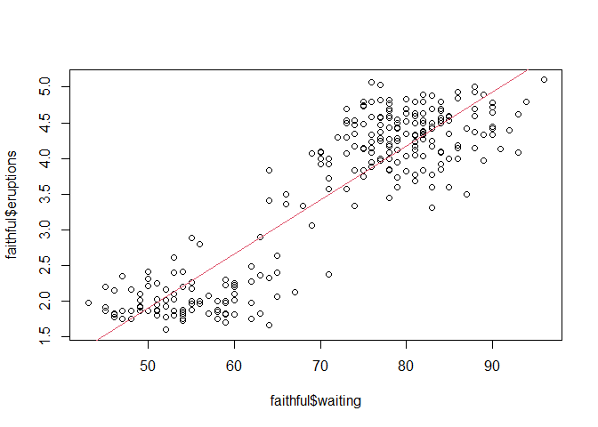
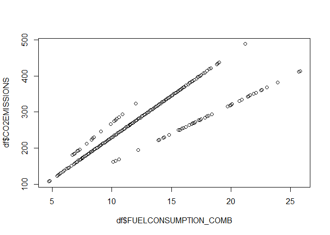
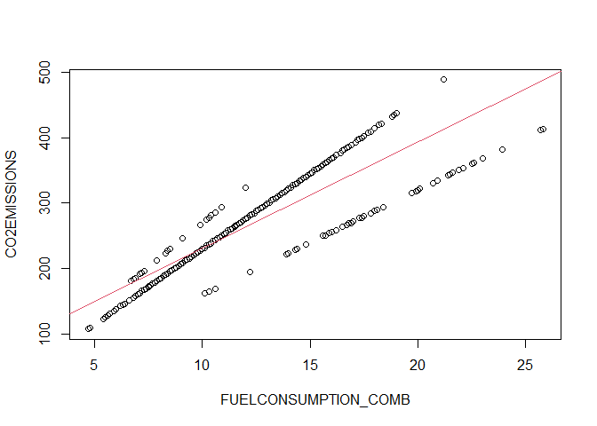

Probabilidade e Estatística - Aula 7
================
Rogério de Oliveira
2021-05-24

# Regressão Linear

-----


<br> <br> <br> <br> <br>

Aprenda aqui como fazer a aproximação de dados a uma função linear. Aqui
você vai aprender como estimar os valores dos coeficientes para
regressões simples e múltiplas. Aprenderá como avaliar
quantitativamente esses modelos lineares (coeficiente de determinação,
p-value dos coeficientes), criar linhas de tendências dos dados e
aplicar esses modelos para fazer estimativa de valores com R.

## Introdução

Uma parte importante da inferência estatística diz respeito a predição
de valores e classes de conjuntos de dados. Em estatística, para a
predição de valores, os métodos os mais empregados são os métodos de
regressão. Aqui vamos nos deter aos métodos de regressão linear, tanto
simples como múltipla. E você vai aprender como fazer uma estimativa de
valores a partir de uma aproximação de linear de valores, e como avaliar
a qualidade de diferentes modelos de regressão.

Modelos de regressão são modelos estatísticos para predição de uma
variável dependente 
como uma função de uma ou mais variáveis independentes
. Esses modelos podem
ser divididos em modelos de **regressão simples** e **múltipla**,
conforme empregue uma única variável preditora
 (simples) ou várias
(múltipla). E ainda podemos encontrar modelos de **regressão linear** e
**não linear**. Os modelos lineares aproximam a função
") de
uma reta (regressão simples) ou um *hiperplano*, isto é, uma função
linear com mais de uma dimensão. As regressões não lineares podem ser de
vários tipos, como polinomial e exponencial, mas aqui nos limitaremos a
estudar os métodos lineares simples e múltiplos.

## Calculando os Coeficientes de uma Regressão Simples

No caso mais simples, da regressão linear simples, nosso problema
consiste, dados um conjunto de pontos
"), como
determinar os coeficientes da reta que melhor aproxima
?

``` r
set.seed(1234)
x = seq(0, 100)
y = 2*x + 3
y1 = y + rnorm(101, 0, 50)
reta = lm(y1~x)
a = reta$coefficients[1]
b = reta$coefficients[2]
y2 = a + b*x
y3 = (y2[51] - 50*(b-1))+(b-1)*x
y4 = (y2[51] - 50*(b+1))+(b+1)*x
y5 = (y2[51] - 50*(b+2))+(b+2)*x
plot(x, y1, xlab='X', ylab='y',col='darkgrey')
lines(x, y2, lwd=2, col='red')
lines(x, y3, lty=3)
lines(x, y4, lty=3)
lines(x, y5, lty=3)
```

<!-- -->

Você não precisa se preocupar com esse código agora. Retomamos o uso da
função `lm()` mais adiante. De qualquer modo, aparentemente podemos
traçar várias retas que aproximam de diferentes modos o conjunto de
pontos e a regressão linear simples é definida pela reta que minimiza o
erro ou a distância dos pontos
 dos valores preditos
.

De modo geral, data um conjunto de pontos , i=0,...,n") queremos buscar a reta  = a + b x") que reduz o erro das estimativas de
. Esse erro é
simplesmente a distância dos pontos
 e
 e podemos escrever esse erro em função de
 e
, que ainda não
conhecemos os valores:

  
 = \\sum_{i=1}^{n}(y_i - a - b x_i)^2 ")  

O ponto de mínimo (valores  e  dos coeficientes
da reta) dessa função pode ser então obtido buscando o valor das
derivadas zero.

  
 = 0")  

  
 = 0 ")  
Resolvendo-se esse sistema de equações você irá obter:

  
  
onde  e
 são a média dos valores
 e
, e:

  
 (y_i - \\bar{y})}{\\sum_{i=1}^{n} (x_i - \\bar{x})^2 } ")  

Os valores dessa expressão não devem ser estranhos para você. De fato já
conhecemos esses valores, eles são a
") e a
") e,
desse modo, podemos escrever simplesmente:

  
}{var(x)}  ")  

E empregando o conjunto de pontos gerado acima podemos verificar os
coeficientes produzidos por essas expressões:

``` r
b = cov(x,y1) / var(x); b
```

    ## [1] 2.436987

``` r
a = mean(y1) - b*mean(x); a
```

    ## [1] -26.40464

Assim determinamos a reta que melhor estima os valores de
:

  
  

``` r
library(latex2exp)
```

    ## Warning: package 'latex2exp' was built under R version 4.0.4

``` r
set.seed(1234)
x = seq(0, 100)
y = 2*x + 3
y1 = y + rnorm(101, 0, 50)

y2 = a + b*x

plot(x, y1, xlab='X', ylab='y',col='darkgrey')
lines(x, y2, lwd=2, col='red')
text(30, 120, TeX('$y = -26.40 + 2.43 x$'))
```

<!-- -->

E o erro, é dado por:

``` r
sum( (y1 - y2)^2 )  
```

    ## [1] 234099.5

É o menor erro que pode ser obtido para
 por uma aproximação
linear.

Esse cálculo dos coeficientes pode ser feito de forma mais simples em R
com a função `lm()` (*linear model*) que empregamos acima. Note ainda
que aqui empregamos a notação . Isso é diferente da notação  que você em geral aprende nos cursos do ensino médio ao
estudar funções lineares e retas. Mas trata-se apenas de convenções
diferentes, em ambos os casos temos da forma linear temos coeficientes
lineares para cada variável preditora e um único coeficiente constante,
referente o valor de 
(*intercept*) quando todas as variáveis preditoras são nulas. Em
estatística, é mais comum encontrarmos a primeira forma e, em
matemática geral a segunda. Desse modo o ideal é que você *entenda*
quais são os coeficientes das variáveis e o *intercept* para não se
confundir com as notações.

## Regressao Linear, caso geral

O resultado anterior de regressão simples pode ser generalizado para os
casos em que você encontra mais do que uma variável preditora. Um modelo
linear aproxima o valor de variável objetivo
 a partir de uma
combinação linear das variáveis preditoras
.

  
  

A cada variável preditora corresponde um coeficiente
, havendo um
coeficiente independente que corresponte ao valor de 
para 
(*intercept*).

Os coeficientes 
podem ser obtidos minimizando-se a soma da distância entre os valores
reais  e os valores
estimados  o
que, em geral é feito a partir do método dos mínimos quadrados.

## Coeficiente de Determinação, 

Você provavelmente lembra da figura abaixo que vimos ao estudar a
visualização de dados.

    ##        x1             x2             x3             x4           y1        
    ##  Min.   : 4.0   Min.   : 4.0   Min.   : 4.0   Min.   : 8   Min.   : 4.260  
    ##  1st Qu.: 6.5   1st Qu.: 6.5   1st Qu.: 6.5   1st Qu.: 8   1st Qu.: 6.315  
    ##  Median : 9.0   Median : 9.0   Median : 9.0   Median : 8   Median : 7.580  
    ##  Mean   : 9.0   Mean   : 9.0   Mean   : 9.0   Mean   : 9   Mean   : 7.501  
    ##  3rd Qu.:11.5   3rd Qu.:11.5   3rd Qu.:11.5   3rd Qu.: 8   3rd Qu.: 8.570  
    ##  Max.   :14.0   Max.   :14.0   Max.   :14.0   Max.   :19   Max.   :10.840  
    ##        y2              y3              y4        
    ##  Min.   :3.100   Min.   : 5.39   Min.   : 5.250  
    ##  1st Qu.:6.695   1st Qu.: 6.25   1st Qu.: 6.170  
    ##  Median :8.140   Median : 7.11   Median : 7.040  
    ##  Mean   :7.501   Mean   : 7.50   Mean   : 7.501  
    ##  3rd Qu.:8.950   3rd Qu.: 7.98   3rd Qu.: 8.190  
    ##  Max.   :9.260   Max.   :12.74   Max.   :12.500

    ## Analysis of Variance Table
    ## 
    ## Response: y1
    ##           Df Sum Sq Mean Sq F value  Pr(>F)   
    ## x1         1 27.510 27.5100   17.99 0.00217 **
    ## Residuals  9 13.763  1.5292                   
    ## ---
    ## Signif. codes:  0 '***' 0.001 '**' 0.01 '*' 0.05 '.' 0.1 ' ' 1
    ## Analysis of Variance Table
    ## 
    ## Response: y2
    ##           Df Sum Sq Mean Sq F value   Pr(>F)   
    ## x2         1 27.500 27.5000  17.966 0.002179 **
    ## Residuals  9 13.776  1.5307                    
    ## ---
    ## Signif. codes:  0 '***' 0.001 '**' 0.01 '*' 0.05 '.' 0.1 ' ' 1
    ## Analysis of Variance Table
    ## 
    ## Response: y3
    ##           Df Sum Sq Mean Sq F value   Pr(>F)   
    ## x3         1 27.470 27.4700  17.972 0.002176 **
    ## Residuals  9 13.756  1.5285                    
    ## ---
    ## Signif. codes:  0 '***' 0.001 '**' 0.01 '*' 0.05 '.' 0.1 ' ' 1
    ## Analysis of Variance Table
    ## 
    ## Response: y4
    ##           Df Sum Sq Mean Sq F value   Pr(>F)   
    ## x4         1 27.490 27.4900  18.003 0.002165 **
    ## Residuals  9 13.742  1.5269                    
    ## ---
    ## Signif. codes:  0 '***' 0.001 '**' 0.01 '*' 0.05 '.' 0.1 ' ' 1

    ##                   lm1      lm2       lm3       lm4
    ## (Intercept) 3.0000909 3.000909 3.0024545 3.0017273
    ## x1          0.5000909 0.500000 0.4997273 0.4999091

    ## $lm1
    ##              Estimate Std. Error  t value    Pr(>|t|)
    ## (Intercept) 3.0000909  1.1247468 2.667348 0.025734051
    ## x1          0.5000909  0.1179055 4.241455 0.002169629
    ## 
    ## $lm2
    ##             Estimate Std. Error  t value    Pr(>|t|)
    ## (Intercept) 3.000909  1.1253024 2.666758 0.025758941
    ## x2          0.500000  0.1179637 4.238590 0.002178816
    ## 
    ## $lm3
    ##              Estimate Std. Error  t value    Pr(>|t|)
    ## (Intercept) 3.0024545  1.1244812 2.670080 0.025619109
    ## x3          0.4997273  0.1178777 4.239372 0.002176305
    ## 
    ## $lm4
    ##              Estimate Std. Error  t value    Pr(>|t|)
    ## (Intercept) 3.0017273  1.1239211 2.670763 0.025590425
    ## x4          0.4999091  0.1178189 4.243028 0.002164602

<!-- -->

Ela ajuda a entender a importância do coeficiente de determinação, ou
 ou ainda
.
Veja que para determinação dos coeficientes de uma regressão linear de
um conjunto de pontos
") basta
termos os valores médios de cada variável,
 e
, a variância
") e a
covariância
"). Como essas estatísticas podem ser obtidas para quaiquer
conjuntos de pontos, **podemos calcular a regressão de quaisquer
conjuntos de pontos, mesmo que eles não tenham um comportamento
linear\!\!\!**.

Isso fica evidente no quarteto de Anscombe em que os valores médios e
variâncias dos pontos diferem somente a partir da 3a casa decimal. Todos
os pontos levam à *mesma regressão linear*. Entretanto, claramente, nem
todos os pontos tem um *comportamento linear*. Precisamos, então,
encontrar um modo de verificar se a aproximação linear obtida de fato
representa adequademente nosso conjunto de dados. Particularmente para
os casos de regressão múltipla isso é essencial uma vez que não
conseguimos visualizar a aproximação como fizemos acima com o quarteto
de Anscombe.

O Coeficiente de Determinação, Coeficiente de Correlação, ou ainda
Square é uma medida
de ![\[0,1\]](https://latex.codecogs.com/png.latex?%5B0%2C1%5D "[0,1]")
que indica o quanto um modelo linear explica um conjunto de dados.
Quanto mais próximo de 1, mais os dados se aproximam de um modelo
linear.

  
  

onde

  
^2 ")  
é o (erro) *resíduo* e,

  
^2 ")  

o *erro total*.

Basicamente essa é um medida de proporção que verifica o quanto
variância dos dados está representada no modelo com relação ao modelo
trivial .

<br> <br> <br>

<br> <br> <br>

À esquerda, em vermelho, as variâncias com relação ao modelo trivial e,
à direita, as variâncias do modelo de regressão (em azul).

##  dos Coeficientes

Outra medida importante na análise da qualidade de uma regressão são os
*p-value* dos coeficientes. Assumindo a hipótese nula do coeficiente ser
igual a zero, buscamos coeficientes cujo *p-value* rejeitem a hipótese
nula.

  
  
  
  

Esses valores são apresentados no resumo da função `lm()` e você verá
mais sobre isso adiante.

## Intervalo de Confiança dos Coeficientes

Por último, também podemos analisar os Intervalos de Confiança dos
Coeficientes. os Intervalos de Confiança dos Coeficientes possuem duas
definições equivalentes:

1.  O intervalo é o conjunto de valores para os quais um teste de
    hipótese para o nível de 5% não pode ser rejeitado.
2.  O intervalo tem uma probabilidade de 95% de conter o verdadeiro
    valor de  ou
    ainda, em 95% de todas as amostras que poderiam ser coletadas, o
    intervalo de confiança cobrirá o valor real de
    .

O , o p-value
dos coeficientes e seus intervalos de confiança, resumem os indicadores
que devem ser analisados em uma regressão linear e constituem a base da
**validação dos modelos de regressão linear**.

## Exemplo: `mtcars`

Vamos verificar alguns desses conceitos sobre a base `mtcars`.

``` r
head(mtcars)
```

    ##                    mpg cyl disp  hp drat    wt  qsec vs am gear carb
    ## Mazda RX4         21.0   6  160 110 3.90 2.620 16.46  0  1    4    4
    ## Mazda RX4 Wag     21.0   6  160 110 3.90 2.875 17.02  0  1    4    4
    ## Datsun 710        22.8   4  108  93 3.85 2.320 18.61  1  1    4    1
    ## Hornet 4 Drive    21.4   6  258 110 3.08 3.215 19.44  1  0    3    1
    ## Hornet Sportabout 18.7   8  360 175 3.15 3.440 17.02  0  0    3    2
    ## Valiant           18.1   6  225 105 2.76 3.460 20.22  1  0    3    1

O comando `pairs()` pode ser útil para identificar uma relações
linerares em pares de variáveis e aqui vamos explorar apenas alguns
atributos.

``` r
pairs(mtcars[ ,c('mpg','hp','wt','disp')])
```

<!-- -->

Podemos então avaliar as relações lineares, por exemplo de `wt` (weight,
ou peso dos veículos) e `mpg`, ou `hp` e `mpg`.

``` r
par(mfrow = c(1, 2))
plot(mtcars$wt, mtcars$mpg)
plot(mtcars$hp, mtcars$mpg)
```

<!-- -->

e então calcular a regressão linear.

``` r
r1 = lm(mpg ~ wt, data=mtcars); r1
```

    ## 
    ## Call:
    ## lm(formula = mpg ~ wt, data = mtcars)
    ## 
    ## Coefficients:
    ## (Intercept)           wt  
    ##      37.285       -5.344

``` r
r2 = lm(mpg ~ hp, data=mtcars); r2
```

    ## 
    ## Call:
    ## lm(formula = mpg ~ hp, data = mtcars)
    ## 
    ## Coefficients:
    ## (Intercept)           hp  
    ##    30.09886     -0.06823

A função `lm()` tem como primeiro argumento a *função* que se quer
determinar no formato `y ~ x1 + x2 + ...` onde `y` é a variável objetivo
e `x1 + x2 + ...` as variáveis, ou atributos, preditores.

``` r
summary(r1)
```

    ## 
    ## Call:
    ## lm(formula = mpg ~ wt, data = mtcars)
    ## 
    ## Residuals:
    ##     Min      1Q  Median      3Q     Max 
    ## -4.5432 -2.3647 -0.1252  1.4096  6.8727 
    ## 
    ## Coefficients:
    ##             Estimate Std. Error t value Pr(>|t|)    
    ## (Intercept)  37.2851     1.8776  19.858  < 2e-16 ***
    ## wt           -5.3445     0.5591  -9.559 1.29e-10 ***
    ## ---
    ## Signif. codes:  0 '***' 0.001 '**' 0.01 '*' 0.05 '.' 0.1 ' ' 1
    ## 
    ## Residual standard error: 3.046 on 30 degrees of freedom
    ## Multiple R-squared:  0.7528, Adjusted R-squared:  0.7446 
    ## F-statistic: 91.38 on 1 and 30 DF,  p-value: 1.294e-10

``` r
summary(r2)
```

    ## 
    ## Call:
    ## lm(formula = mpg ~ hp, data = mtcars)
    ## 
    ## Residuals:
    ##     Min      1Q  Median      3Q     Max 
    ## -5.7121 -2.1122 -0.8854  1.5819  8.2360 
    ## 
    ## Coefficients:
    ##             Estimate Std. Error t value Pr(>|t|)    
    ## (Intercept) 30.09886    1.63392  18.421  < 2e-16 ***
    ## hp          -0.06823    0.01012  -6.742 1.79e-07 ***
    ## ---
    ## Signif. codes:  0 '***' 0.001 '**' 0.01 '*' 0.05 '.' 0.1 ' ' 1
    ## 
    ## Residual standard error: 3.863 on 30 degrees of freedom
    ## Multiple R-squared:  0.6024, Adjusted R-squared:  0.5892 
    ## F-statistic: 45.46 on 1 and 30 DF,  p-value: 1.788e-07

Qual dos dois modelos é melhor para obtermos uma predição dos valores de
`mpg`. Observando as estatísticas dos modelos acima você pode notar que
`wt` (o peso dos veículos) tem um coeficiente de determinação , maior que da regressão com `hp` e é, portanto um melhor
modelo. E você ainda pode observar os valores dos p-values dos
coeficientes, todos menores que 0.05 e, portanto relevantes (em destaque
no report com ’\*\*\*’).

Mas podemos ainda buscar um modelo de regressão múltipla para determinar
`mpg`.

``` r
fit = lm(mpg ~ wt + hp, data=mtcars); fit
```

    ## 
    ## Call:
    ## lm(formula = mpg ~ wt + hp, data = mtcars)
    ## 
    ## Coefficients:
    ## (Intercept)           wt           hp  
    ##    37.22727     -3.87783     -0.03177

``` r
summary(fit)
```

    ## 
    ## Call:
    ## lm(formula = mpg ~ wt + hp, data = mtcars)
    ## 
    ## Residuals:
    ##    Min     1Q Median     3Q    Max 
    ## -3.941 -1.600 -0.182  1.050  5.854 
    ## 
    ## Coefficients:
    ##             Estimate Std. Error t value Pr(>|t|)    
    ## (Intercept) 37.22727    1.59879  23.285  < 2e-16 ***
    ## wt          -3.87783    0.63273  -6.129 1.12e-06 ***
    ## hp          -0.03177    0.00903  -3.519  0.00145 ** 
    ## ---
    ## Signif. codes:  0 '***' 0.001 '**' 0.01 '*' 0.05 '.' 0.1 ' ' 1
    ## 
    ## Residual standard error: 2.593 on 29 degrees of freedom
    ## Multiple R-squared:  0.8268, Adjusted R-squared:  0.8148 
    ## F-statistic: 69.21 on 2 and 29 DF,  p-value: 9.109e-12

Esse modelo apresenta um  ainda melhor que o modelo anterior e parece ser,
portanto, um modelo mais adequado para predições de `mpg`.

  
  
Podemos agora empregar esses coeficientes para estimar `mpg` para novos
valores de `wt` e `hp`, por exemplo para os valores 4.0 e 150
respectivamente.

``` r
fit$coef
```

    ## (Intercept)          wt          hp 
    ## 37.22727012 -3.87783074 -0.03177295

``` r
mpg = fit$coef[2] * 4 + fit$coef[3] * 150 + fit$coef[1]

sprintf('Valor de mpg = %0.2f', mpg)
```

    ## [1] "Valor de mpg = 16.95"

Ou ainda empregar a função `predict()`.

``` r
mpg = predict(fit, data.frame(wt=c(4),hp=c(150))) 

sprintf('Valor de mpg = %0.2f', mpg)
```

    ## [1] "Valor de mpg = 16.95"

Essa forma parece mais prática para se fazer a predição de vários
valores e, particularmente, quando envolve muitos coeficientes e você
deve preferencialmente empregar esse modo. Note, entretanto, que os
dados das variáveis precisam ser fornecidos no mesmo formato que foram
empregados para o cálculo dos coeficientes, e o comando
`data.frame(wt=c(4),hp=c(150))` simplesmente cria os novos valores no
mesmo formato dos dados iniciais.

``` r
data.frame(wt=c(4),hp=c(150))
```

    ##   wt  hp
    ## 1  4 150

## Exemplo: `faithful`

Vamos considerar os valores da base de dados `faithful` sobre duas
medidas de erupções.

``` r
head(faithful)
```

    ##   eruptions waiting
    ## 1     3.600      79
    ## 2     1.800      54
    ## 3     3.333      74
    ## 4     2.283      62
    ## 5     4.533      85
    ## 6     2.883      55

``` r
help("faithful")
```

    ## starting httpd help server ... done

``` r
plot(faithful$waiting,faithful$eruptions)
```

<!-- -->

Podemos então buscar o modelo de regressão linear dessas variaveis,

``` r
fit = lm(eruptions ~ waiting, data=faithful)
summary(fit)
```

    ## 
    ## Call:
    ## lm(formula = eruptions ~ waiting, data = faithful)
    ## 
    ## Residuals:
    ##      Min       1Q   Median       3Q      Max 
    ## -1.29917 -0.37689  0.03508  0.34909  1.19329 
    ## 
    ## Coefficients:
    ##              Estimate Std. Error t value Pr(>|t|)    
    ## (Intercept) -1.874016   0.160143  -11.70   <2e-16 ***
    ## waiting      0.075628   0.002219   34.09   <2e-16 ***
    ## ---
    ## Signif. codes:  0 '***' 0.001 '**' 0.01 '*' 0.05 '.' 0.1 ' ' 1
    ## 
    ## Residual standard error: 0.4965 on 270 degrees of freedom
    ## Multiple R-squared:  0.8115, Adjusted R-squared:  0.8108 
    ## F-statistic:  1162 on 1 and 270 DF,  p-value: < 2.2e-16

``` r
plot(faithful$waiting,faithful$eruptions)
abline(coefficients(fit),col=2)
```

<!-- --> A análise
do gráfico não garante que esse seja um modelo adequado para *modelar*
os valores de `eruptions` a partir de `waiting`. Para isso vamos
analisar as estatíticas do modelo.

``` r
summary(fit)
```

    ## 
    ## Call:
    ## lm(formula = eruptions ~ waiting, data = faithful)
    ## 
    ## Residuals:
    ##      Min       1Q   Median       3Q      Max 
    ## -1.29917 -0.37689  0.03508  0.34909  1.19329 
    ## 
    ## Coefficients:
    ##              Estimate Std. Error t value Pr(>|t|)    
    ## (Intercept) -1.874016   0.160143  -11.70   <2e-16 ***
    ## waiting      0.075628   0.002219   34.09   <2e-16 ***
    ## ---
    ## Signif. codes:  0 '***' 0.001 '**' 0.01 '*' 0.05 '.' 0.1 ' ' 1
    ## 
    ## Residual standard error: 0.4965 on 270 degrees of freedom
    ## Multiple R-squared:  0.8115, Adjusted R-squared:  0.8108 
    ## F-statistic:  1162 on 1 and 270 DF,  p-value: < 2.2e-16

Com o  sendo um valor adequado, podemos então empregar o modelo
para predição de `eruptions` para novos valores de `waiting`, por
exemplo 80 e 110.

``` r
newdata = data.frame(waiting=c(80,110))

prediction = predict(fit, newdata)    
sprintf('Valor de mpg = %0.2f', prediction)
```

    ## [1] "Valor de mpg = 4.18" "Valor de mpg = 6.45"

# Covariância, Correlação e cor.test

O coeficiente de determinação é calculado sobre o modelo de regressão.
Mas é comum, antes de calcularmos o modelo, verificar previamente a
existência de uma relação linear entre os dados. Você deve lembrar
então, do que estudamos nas estatísticas descritivas, que podemos
calcular a covariância e a correlação (coeficiente de Peason) para
avaliar essa relação linear dos dados, sendo a correlação a medida mais
indicada.

``` r
cor(faithful$waiting,faithful$eruptions)
```

    ## [1] 0.9008112

``` r
cov(faithful$waiting,faithful$eruptions)
```

    ## [1] 13.97781

Associada a essas medidas ainda encontramos teste de hipótese próprio
(como vimos anteriormente existem muitos testes de hipótese para
diferentes fins) para verificar a hipótese dos dados terem ou não uma
relação linear (teste de Pearson).

``` r
cor.test(faithful$waiting,faithful$eruptions)
```

    ## 
    ##  Pearson's product-moment correlation
    ## 
    ## data:  faithful$waiting and faithful$eruptions
    ## t = 34.089, df = 270, p-value < 2.2e-16
    ## alternative hypothesis: true correlation is not equal to 0
    ## 95 percent confidence interval:
    ##  0.8756964 0.9210652
    ## sample estimates:
    ##       cor 
    ## 0.9008112

Como p-value \< 2.2e-16 \< 0.05, rejeitamos a hipótese nula (os dados
NÃO são significativamente relacionados linearmente) e, portanto,
aceitamos a hipótese alternativa de que há uma relação linear entre
eles.

## Regressão múltipla

O modelo acima pode ser aplicado diretamente a modelos de regressão
linear múltipla adicionando à fórmula os atributos de cada variável de
entrada.

    fit = lm(y ~ atributo1 + atributo2 + ... , data=data)

## Exercícios

### Exercício **RESOLVIDO**

Considere a base.

``` r
head(stackloss)
```

    ##   Air.Flow Water.Temp Acid.Conc. stack.loss
    ## 1       80         27         89         42
    ## 2       80         27         88         37
    ## 3       75         25         90         37
    ## 4       62         24         87         28
    ## 5       62         22         87         18
    ## 6       62         23         87         18

``` r
help(stackloss)
```

Qual a função linear que melhor aproxima `stack.loss` com base nos
demais valores?

``` r
fit = lm(stack.loss ~ Air.Flow + Water.Temp + Acid.Conc., data=stackloss)
summary(fit)
```

    ## 
    ## Call:
    ## lm(formula = stack.loss ~ Air.Flow + Water.Temp + Acid.Conc., 
    ##     data = stackloss)
    ## 
    ## Residuals:
    ##     Min      1Q  Median      3Q     Max 
    ## -7.2377 -1.7117 -0.4551  2.3614  5.6978 
    ## 
    ## Coefficients:
    ##             Estimate Std. Error t value Pr(>|t|)    
    ## (Intercept) -39.9197    11.8960  -3.356  0.00375 ** 
    ## Air.Flow      0.7156     0.1349   5.307  5.8e-05 ***
    ## Water.Temp    1.2953     0.3680   3.520  0.00263 ** 
    ## Acid.Conc.   -0.1521     0.1563  -0.973  0.34405    
    ## ---
    ## Signif. codes:  0 '***' 0.001 '**' 0.01 '*' 0.05 '.' 0.1 ' ' 1
    ## 
    ## Residual standard error: 3.243 on 17 degrees of freedom
    ## Multiple R-squared:  0.9136, Adjusted R-squared:  0.8983 
    ## F-statistic:  59.9 on 3 and 17 DF,  p-value: 3.016e-09

Portanto:   
  
\#\#\# Exercício **RESOLVIDO** Faça uma predição do valor de
`stock.loss` para os valores de `Air.Flow=72, Water.Temp=20,
Acid.Conc=85`.

``` r
newdata = data.frame(Air.Flow=62, Water.Temp=23, Acid.Conc.=87)
prediction = predict(fit, newdata)
prediction
```

    ##        1 
    ## 21.00694

### Exercício

O quanto esse valor difere do valor encontrado na base?

``` r
real = stackloss[stackloss$Air.Flow==62 & stackloss$Water.Temp==23 & stackloss$Acid.Conc ==87,]$stack.loss
real
```

    ## [1] 18

``` r
cat(( prediction - real )/ real * 100, '%')
```

    ## 16.70522 %

### Exercício

Considere o exercício anterior. QUal variável contribuí mais
positivamente para o incremento de stackloss?

Water.Temp

### Exercício

Considere o exercício anterior. A regressão linear é uma boa aproximação
dos dados (R-squared \> 0.85)?

Sim. Adjusted R-squared: 0.8983

### Exercício

Considere o exercício anterior. Elimine o atributo que não é
significativo para a regressão e recalcule. O modelo obtido é melhor?
(Verifique o R-squared). Dica: verifique o p-value dos coeficientes.

``` r
fit = lm(stack.loss ~ Air.Flow + Water.Temp , data=stackloss)
summary(fit)
```

    ## 
    ## Call:
    ## lm(formula = stack.loss ~ Air.Flow + Water.Temp, data = stackloss)
    ## 
    ## Residuals:
    ##     Min      1Q  Median      3Q     Max 
    ## -7.5290 -1.7505  0.1894  2.1156  5.6588 
    ## 
    ## Coefficients:
    ##             Estimate Std. Error t value Pr(>|t|)    
    ## (Intercept) -50.3588     5.1383  -9.801 1.22e-08 ***
    ## Air.Flow      0.6712     0.1267   5.298 4.90e-05 ***
    ## Water.Temp    1.2954     0.3675   3.525  0.00242 ** 
    ## ---
    ## Signif. codes:  0 '***' 0.001 '**' 0.01 '*' 0.05 '.' 0.1 ' ' 1
    ## 
    ## Residual standard error: 3.239 on 18 degrees of freedom
    ## Multiple R-squared:  0.9088, Adjusted R-squared:  0.8986 
    ## F-statistic: 89.64 on 2 and 18 DF,  p-value: 4.382e-10

Sim, R-squared maior e menor número de variáveis (hipóteses) no modelo.

### Exercício

Considere a base.

``` r
df = read.csv('https://meusite.mackenzie.br/rogerio/TIC/FuelConsumptionCo2.csv',header=T)
head(df)
```

    ##   MODELYEAR  MAKE      MODEL VEHICLECLASS ENGINESIZE CYLINDERS TRANSMISSION
    ## 1      2014 ACURA        ILX      COMPACT        2.0         4          AS5
    ## 2      2014 ACURA        ILX      COMPACT        2.4         4           M6
    ## 3      2014 ACURA ILX HYBRID      COMPACT        1.5         4          AV7
    ## 4      2014 ACURA    MDX 4WD  SUV - SMALL        3.5         6          AS6
    ## 5      2014 ACURA    RDX AWD  SUV - SMALL        3.5         6          AS6
    ## 6      2014 ACURA        RLX     MID-SIZE        3.5         6          AS6
    ##   FUELTYPE FUELCONSUMPTION_CITY FUELCONSUMPTION_HWY FUELCONSUMPTION_COMB
    ## 1        Z                  9.9                 6.7                  8.5
    ## 2        Z                 11.2                 7.7                  9.6
    ## 3        Z                  6.0                 5.8                  5.9
    ## 4        Z                 12.7                 9.1                 11.1
    ## 5        Z                 12.1                 8.7                 10.6
    ## 6        Z                 11.9                 7.7                 10.0
    ##   FUELCONSUMPTION_COMB_MPG CO2EMISSIONS
    ## 1                       33          196
    ## 2                       29          221
    ## 3                       48          136
    ## 4                       25          255
    ## 5                       27          244
    ## 6                       28          230

Construa um modelo de regressão para:

``` r
plot(df$FUELCONSUMPTION_COMB, df$CO2EMISSIONS)
```

<!-- -->

``` r
fit = lm( CO2EMISSIONS ~ FUELCONSUMPTION_COMB, data=df)
summary(fit)
```

    ## 
    ## Call:
    ## lm(formula = CO2EMISSIONS ~ FUELCONSUMPTION_COMB, data = df)
    ## 
    ## Residuals:
    ##     Min      1Q  Median      3Q     Max 
    ## -74.240 -10.257   1.925  17.241  75.749 
    ## 
    ## Coefficients:
    ##                      Estimate Std. Error t value Pr(>|t|)    
    ## (Intercept)           68.3871     3.0439   22.47   <2e-16 ***
    ## FUELCONSUMPTION_COMB  16.2200     0.2517   64.44   <2e-16 ***
    ## ---
    ## Signif. codes:  0 '***' 0.001 '**' 0.01 '*' 0.05 '.' 0.1 ' ' 1
    ## 
    ## Residual standard error: 28.64 on 1065 degrees of freedom
    ## Multiple R-squared:  0.7959, Adjusted R-squared:  0.7957 
    ## F-statistic:  4153 on 1 and 1065 DF,  p-value: < 2.2e-16

``` r
plot(df[,c('FUELCONSUMPTION_COMB','CO2EMISSIONS')]) 
abline(coefficients(fit),col=2)
```

<!-- -->

### Exercício

Estime as emissões de CO2EMISSIONS a partir de valores de
FUELCONSUMPTION\_COMB para os valores 10 e 25.

``` r
x = data.frame('FUELCONSUMPTION_COMB' = c(10,25))
print( predict(fit,x) )
```

    ##        1        2 
    ## 230.5868 473.8864

### Exercício

Acrescente ao seu modelo a variável de entrada ENGINESIZE. Qual a função
e o R-Square obtidos? É um modelo melhor que o somente baseado em
FUELCONSUMPTION\_COMB como variável independente?

``` r
fit = lm( CO2EMISSIONS ~ FUELCONSUMPTION_COMB + ENGINESIZE, data=df)
summary(fit)
```

    ## 
    ## Call:
    ## lm(formula = CO2EMISSIONS ~ FUELCONSUMPTION_COMB + ENGINESIZE, 
    ##     data = df)
    ## 
    ## Residuals:
    ##     Min      1Q  Median      3Q     Max 
    ## -76.073  -8.749   1.089  13.490  74.589 
    ## 
    ## Coefficients:
    ##                      Estimate Std. Error t value Pr(>|t|)    
    ## (Intercept)           78.3068     2.5793   30.36   <2e-16 ***
    ## FUELCONSUMPTION_COMB   9.7300     0.3662   26.57   <2e-16 ***
    ## ENGINESIZE            19.4963     0.9015   21.63   <2e-16 ***
    ## ---
    ## Signif. codes:  0 '***' 0.001 '**' 0.01 '*' 0.05 '.' 0.1 ' ' 1
    ## 
    ## Residual standard error: 23.88 on 1064 degrees of freedom
    ## Multiple R-squared:  0.8582, Adjusted R-squared:  0.8579 
    ## F-statistic:  3220 on 2 and 1064 DF,  p-value: < 2.2e-16

  
  

E é um modelo melhor com R-Squared = 0.85.

### Exercício

Faça a predição de CO2EMISSIONS com base no modelo anterior, para
`FUELCONSUMPTION_COMB = 10` e `ENGINESIZE=2`.

``` r
newdata = data.frame('FUELCONSUMPTION_COMB' = c(10),'ENGINESIZE'=c(2))
predict(fit,newdata)
```

    ##       1 
    ## 214.599

## Referências

Navarro, Danielle, **Learning Statistics with R**, disponível em:
<https://learningstatisticswithr.com/> ( LSR version 0.6 (pdf) ).
Acesso: 26/02/2021. Alternativamente em formato bookdown:
<https://learningstatisticswithr.com/book/> Acesso: 07/03/2021.

Anunciação, Luis, **Conceitos e análises estatísticas com R e JASP**,
disponível em: <https://anovabr.github.io/mqt/> Acesso: 10/04/2021.

Ferreira, Eric Batista, Oliveira, Marcelo Silva de. **Introdução à
Estatística com R**. Editora Universidade Federal de Alfenas, 2020.
