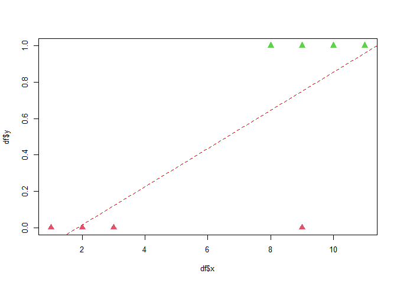

Regressão Logística
===================

------------------------------------------------------------------------


<br> <br> <br> <br> <br>

Nesta última seção você empregará vários dos conceitos aprendidos antes
para entender e aplicar um modelo de regressão logística para
classificação de dados. Esse é um importante modelo de classificação e
desempenha um papel fundamental para o entendimento de modelos mais
gerais de aprendizado de máquina supervisionados.

Introdução
----------

A regressão logística modela as probabilidades para problemas de
classificação binários (com dois resultados possíveis, como ‘y/n’ ou
‘0/1’) e pode ser entendido como uma extensão dos modelos de regressão
linear para problemas de classificação.

O modelo de regressão linear pode funcionar bem para regressão, mas
falha na classificação. No caso de duas classes, você poderia rotular
uma das classes com 0 e a outra com 1 e usar a regressão linear.
Tecnicamente isso funciona e certamente obterá os coeficientes da
regressão linear, afinal você já aprendeu que para quaisquer conjuntos
de pontos (*X*, *y*) podemos calcular os coeficientes de um modelo
linear. Mas para classificação essa abordagem apresenta muitos
problemas. Como seu resultado não é uma probabilidade, mas a
interpolação linear dos pontos, não há um limite significativo no qual
você possa distinguir uma classe da outra.

Um modelo simples pode mostrar a ineficiência da regressão linear para a
classificação. Veja a abaixo o uso de regressão linear para a
classificação dos pontos verdes e vermelhos abaixo.

``` r
# adaptado de https://christophm.github.io/interpretable-ml-book/logistic.html
# e https://stats.stackexchange.com/questions/22381/why-not-approach-classification-through-regression

df = data.frame(x = c(1,2,3,8,9,10,11,9),
  y = c(0,0,0,1,1,1,1, 0))

df_extra  = data.frame(x=c(df$x, 7, 7, 7, 20, 19, 5, 5, 4, 4.5),
  y=c(df$y, 1,1,1,1, 1, 1, 1, 1, 1))

# par(mfrow = c(1, 3))
layout.matrix <- matrix(c(1, 1, 1, 0), nrow = 2, ncol = 2)

layout(mat = layout.matrix,
       heights = c(2, 2), # Heights of the two rows
       widths = c(2, 2)) # Widths of the two columns

plot(df$x, df$y, col=df$y+2, pch=17)
fit = lm(y ~ x,data=df)
abline(coefficients(fit),col='red',lty=2)
points(df$x, df$y, col=df$y+2, pch=17, cex=1.5)
```



``` r
plot(df_extra$x, df_extra$y, col=df_extra$y+2)
fit = lm(y ~ x,data=df)
abline(coefficients(fit),col='red',lty=2)
points(df_extra$x, df_extra$y, col=df_extra$y+2, pch=17, cex=1.5)
```


``` r
plot(df$x, df$y, col=df$y+2, pch=17)
fit = lm(y ~ x,data=df)
abline(coefficients(fit),col='red',lty=2)
polygon(c(0,12,12),c(predict(fit,data.frame(x = c(0,12))),-0.1), col='#FF9966')
polygon(c(0,12,0), c(predict(fit,data.frame(x = c(0,12))),1.1), col='#CCFF00')
points(df$x, df$y, col=df$y+2, pch=17, cex=1.5)
```


``` r
plot(df_extra$x, df_extra$y, col=df_extra$y+2)
fit = lm(y ~ x,data=df)
abline(coefficients(fit),col='red',lty=2)
polygon(c(0,21,21),c(predict(fit,data.frame(x = c(0,21))),-0.1), col='#FF9966')
polygon(c(0,21,0), c(predict(fit,data.frame(x = c(0,21))),1.1), col='#CCFF00')
points(df_extra$x, df_extra$y, col=df_extra$y+2, pch=17, cex=1.5)
```


O primeiro conjunto de pontos é linearmente separável e a regressão
linear permite classificar os dados com apenas um erro de classificação
(o ponto vermelho de menor valor *x*). Mas ao inserirmos novos dos o
modelo falha.

Modelo logístico
----------------

Para resolver esse problema, em vez de modelarmos diretamente a
probabilidade de uma classe modelaremos por uma regressão linear o que é
conhecido como log de probabilidades:

$$ log( \\frac{p}{1-p}) = a\_0 + a\_1 x\_1 + ... + a\_n x\_n $$

Os resultados da regressão logística vão então informar sobre as chances
(‘Odds’) e razão das chances (‘Odds Ratio’) e não exatamente
probabilidades (por exemplo, em alguns casos os valores podem não ter
soma 1), mas podemos entender que, uma *change* reflete em uma
probabilidade maior daquele evento ocorrer. Se um evento tem
probabilidade p, suas chances são p / (1-p), e é por isso que a esquerda
lado é chamado de “odds logarítmicas” ou “logit”, e podemos obter a
probabilidade de chances invertendo a função acima:

*p* = 1/(1 + *e*<sup> − (*a*<sub>0</sub> + *a*<sub>1</sub>*x*<sub>1</sub> + ... + *a*<sub>*n*</sub>*x*<sub>*n*</sub>)</sup>)

Essa função é conhecida como função logística ou sigmóide, *σ*, é
definida como:

$$\\sigma(x)=\\frac{1}{1+e^{-x}}$$
Essa função tem o seguinte gráfico:

``` r
library(latex2exp)
```

    ## Warning: package 'latex2exp' was built under R version 4.0.4

``` r
logistic = function(x)
{1 / (1 + exp(-x))}

x = seq(-5,5,0.01)
plot(x, logistic(x), type='l', col='red')

title('Logistic Function')
text(-2,0.7, TeX('$\\sigma(x) = \\frac{1}{1+e^{-x}}$') )
```


Note que os valores dessa função variam de 0 a 1 e é portanto, possível
empregar essa função como uma medida de probabilidade das chances.

Esse procedimento funciona muito melhor para classificação e podemos
usar 0.5 como o valor limite de probabilidades entre as classes, isto é,
valores *p* \< 0.5 para uma classe e valores *p* ≥ 0.5 para outra.

Estimando os parâmetros
-----------------------

Como estimar então os coeficientes
*a*<sub>0</sub>, *a*<sub>1</sub>, .... De fato, esse cálculo já não é
tão simples como o da regressão linear. Do mesmo modo que na regressão
linear queremos minimizar o erro (o que é o mesmo que, maximizar os
*acertos*), mas no lugar de empregarmos uma solução algébrica (como o
sistema de derivadas igualado a 0 que vimos anteriormente), aqui isso é
feito em geral de forma numérica, em um procedimento iterativo de
aproximações sucessivas e algo que tem uma forte aplicação em muitos
outros modelos de aprendizado de máquina. Como você poderá ver em outros
cursos, em geral o aprendizado dos parâmetros pode ser resumido a
maximizar ou minimizar uma determinada função objetivo. O procedimento,
para classificação entre duas classes possíveis ‘0’ e ‘1’ (poderiam ser
‘y’ e ‘n’, ou ainda ‘red’ e ‘green’) é de forma geral o seguinte:

1.  Para cada amostra que realmente pertença a classe ‘1’, gostaríamos
    que p ficasse perto de 1, e para cada amostra que não fosse ‘1’,
    gostaríamos que p fosse próximo de 0 (e, portanto, 1-p deve ser
    próximo a 1).

2.  Assim, tomamos o produto de p sobre todas as amostras ‘1’ com o
    produto de 1-p sobre todas as não ‘1’ amostras para avaliar a
    precisão de nossas estimativas para os parâmetros
    *a*<sub>0</sub>, *a*<sub>1</sub>, ...

3.  Gostaríamos de fazer que a função de probabilidade seja a maior
    possível (ou seja, o mais próximo possível de 1). Começamos então
    com um palpite para os parâmetros (sim, um *chute* inicial para o
    valores!), e vamos ajustando esses valores iterativamente para
    melhorar a probabilidade até descobrirmos que não podemos mais
    aumentar essa probabilidade perturbando os coeficientes.

Um método comum para essa otimização é a descida de gradiente
estocástico, algo parecido, por exemplo o método numérico de
Newton-Raphson para solução numérica de zero (pontos de máximo ou
mínimo) de funções.

Chamamos o processo acima de **treinamento** e, estimados o parâmetros
com base em uma amostra podemos então calcular a probabilidade de um
novo conjunto de dados ser da classe 0 ou 1 (**predição**).

### Exemplo

Por exemplo, você pode pensar em um sistema de detecção de fraude de
operações de cartão de crétido com base em dados histórico das
ocorrências de fraude, valores da operação e uso do cartão nas últimas
24h (duas variáveis que são conhecidas como grandes preditoras de fraude
em transações com cartões). Para isso, depois de estimados os valores
*a*<sub>0</sub>, *a*<sub>1</sub>, ... com base nas amostras conhecidas,
bastaria se aplicar o novo valor `(Valor,Trans24h)` ao modelo logístico
estimado:

*P*(Fraude\|Valor, Trans24h) = 1/(1 + *e*<sup> − (*a*<sub>0</sub> + *a*<sub>1</sub>Valor + *a*<sub>2</sub>Trans24h)</sup>)

Vantagens e Cuidados
--------------------

Um cuidado a ser tomado no uso da regressão logística é que ela pode
*sofrer de separação completa*. Isso ocorre quando uma variável
preditora separa perfeitamente as duas classes e, neste caso, o modelo
de regressão logística não pode mais ser treinado. Isso ocorre porque o
peso dessa variável preditora não convergiria, porque o peso ideal seria
infinito. Observar isso é importante, mas você talvez não precisa-se de
um modelo como esse se tivesse uma regra simples, uma única variável
preditora, que pudesse separar as duas classes, e existem técnicas de
penalização dos pesos ou definição de uma distribuição de probabilidade
dos pesos para minimizar esse problema.

O modelo de regressão logística não é apenas um modelo de classificação,
mas também fornece probabilidades. Esta é uma grande vantagem em relação
aos modelos que fornecem apenas a classificação final, pois faz uma
grande diferença saber se a probalidade daquela classe é 99% ou 51%.
Para usar o nosso exemplo, pense em uma transação de cartão classificada
como fraude, ser uma fraude com 99% de chance parece algo bem mais
crítico que uma fraude com 51% de chance!

A regressão logística ainda é um modelo de classificação binária. Mas
ele pode ser estendido para classificação multiclasse, o que denominamos
de Regressão Multinomial. O procedimento é simples e consiste em
criarmos vários classificadores. Se você tem 3 classes, ‘Y’, ‘N’, ‘O’,
pode então ter um classificador logístico ‘Y’ e ‘não Y’, outro ‘N’ e
‘não Y’, ainda ‘O’ e ‘não O’ e, do mesmo modo, buscar o maior valor de p
entre esses classificadores. Em geral os pacotes de Software como R
fazem uma implementação multimodal da classificação logística e,
portanto, fica transparente para você a regressão logística ser um
procedimento de classificação binária.

Exemplo: `mtcars`
-----------------

Vamos agora empregar a função logística para classificar os veículos
como automáticos e não automáticos (atributo `am`), tendo como base as
variáveis preditoras `hp`, e peso, `wt`.

``` r
head(mtcars)
```

    ##                    mpg cyl disp  hp drat    wt  qsec vs am gear carb
    ## Mazda RX4         21.0   6  160 110 3.90 2.620 16.46  0  1    4    4
    ## Mazda RX4 Wag     21.0   6  160 110 3.90 2.875 17.02  0  1    4    4
    ## Datsun 710        22.8   4  108  93 3.85 2.320 18.61  1  1    4    1
    ## Hornet 4 Drive    21.4   6  258 110 3.08 3.215 19.44  1  0    3    1
    ## Hornet Sportabout 18.7   8  360 175 3.15 3.440 17.02  0  0    3    2
    ## Valiant           18.1   6  225 105 2.76 3.460 20.22  1  0    3    1

Nessa base de dados você encontra carros automáticos (1 = TRUE) e não
automáticos (0 = FALSE):

``` r
table(mtcars$am)
```

    ## 
    ##  0  1 
    ## 19 13

A função `glm()` (*general linear models*) pode ser então empregada para
estimar os parâmetros da regressão logística com base nos dados de
potência, `hp`, e peso, `wt` dos veículos. Indique o parâmetro
`family=binomial` para empregar a função logística no modelo linear
generalizado.

A `formula` (primeiro argumento) da função `glm()` segue o mesmo formato
que você empregou na regressão linear anteriormente, `y ~ x1 + x2 + ...`
onde `y` é a variável objetivo e `x1 + x2 + ...` são as variáveis
preditoras.

``` r
fit = glm(formula = am ~ hp + wt, data=mtcars, family=binomial)
summary(fit)
```

    ## 
    ## Call:
    ## glm(formula = am ~ hp + wt, family = binomial, data = mtcars)
    ## 
    ## Deviance Residuals: 
    ##     Min       1Q   Median       3Q      Max  
    ## -2.2537  -0.1568  -0.0168   0.1543   1.3449  
    ## 
    ## Coefficients:
    ##             Estimate Std. Error z value Pr(>|z|)   
    ## (Intercept) 18.86630    7.44356   2.535  0.01126 * 
    ## hp           0.03626    0.01773   2.044  0.04091 * 
    ## wt          -8.08348    3.06868  -2.634  0.00843 **
    ## ---
    ## Signif. codes:  0 '***' 0.001 '**' 0.01 '*' 0.05 '.' 0.1 ' ' 1
    ## 
    ## (Dispersion parameter for binomial family taken to be 1)
    ## 
    ##     Null deviance: 43.230  on 31  degrees of freedom
    ## Residual deviance: 10.059  on 29  degrees of freedom
    ## AIC: 16.059
    ## 
    ## Number of Fisher Scoring iterations: 8

Os coeficientes de `hp` e `wt` apresentam p-values \< 0.05 e, portanto,
são ambos significativos para a predição de `am`.

Feito do treinamento do modelo, isto é, estimado os valores do
coeficientes da regressão logística a partir dos dados, podemos empregar
o modelo, por exemplo, para fazer a predição de para um carro leve.

``` r
predict(fit, data.frame(hp=100, wt=1.8))
```

    ##        1 
    ## 7.941603

O veículo, tendo *h**p* = 100, *w**t* = 1.8 tem, então, probabilidade de
95% de ser um veículo de transmissão automática. Para obter a
classificação 1 (TRUE) e 0 (FALSE) você ainda pode fazer:

``` r
predict(fit, data.frame(hp=100, wt=1.8)) > 0.5
```

    ##    1 
    ## TRUE

Embora não haja nenhuma restrição *no modelo* quanto ao tipo dos valores
da variável objetivo, podendo ser por exemplo assumir valores
categóricos como ‘Fraude’ e ‘Não Fraude’, o pacote `glm()` requer que
esse atributo seja numérico e devolve a probabilidade da classe 1. O
exemplo abaixo pode então ser útil para você classificar dados com uma
variável objetivo categórica. Para isso adicionamos o atributo `am_text`
em `mtcars`.

``` r
mtcars$am_text = ifelse(mtcars$am == 1, 'am', 'not am')
head(mtcars)
```

    ##                    mpg cyl disp  hp drat    wt  qsec vs am gear carb am_text
    ## Mazda RX4         21.0   6  160 110 3.90 2.620 16.46  0  1    4    4      am
    ## Mazda RX4 Wag     21.0   6  160 110 3.90 2.875 17.02  0  1    4    4      am
    ## Datsun 710        22.8   4  108  93 3.85 2.320 18.61  1  1    4    1      am
    ## Hornet 4 Drive    21.4   6  258 110 3.08 3.215 19.44  1  0    3    1  not am
    ## Hornet Sportabout 18.7   8  360 175 3.15 3.440 17.02  0  0    3    2  not am
    ## Valiant           18.1   6  225 105 2.76 3.460 20.22  1  0    3    1  not am

``` r
am_text_bin = as.numeric(as.factor(mtcars$am_text)) - 1 # converte para 0,1
am_text_bin
```

    ##  [1] 0 0 0 1 1 1 1 1 1 1 1 1 1 1 1 1 1 0 0 0 1 1 1 1 1 0 0 0 0 0 0 0

``` r
fit = glm(formula = am_text_bin ~ hp + wt, data=mtcars, family=binomial)
summary(fit)
```

    ## 
    ## Call:
    ## glm(formula = am_text_bin ~ hp + wt, family = binomial, data = mtcars)
    ## 
    ## Deviance Residuals: 
    ##     Min       1Q   Median       3Q      Max  
    ## -1.3449  -0.1543   0.0168   0.1568   2.2537  
    ## 
    ## Coefficients:
    ##              Estimate Std. Error z value Pr(>|z|)   
    ## (Intercept) -18.86630    7.44356  -2.535  0.01126 * 
    ## hp           -0.03626    0.01773  -2.044  0.04091 * 
    ## wt            8.08348    3.06868   2.634  0.00843 **
    ## ---
    ## Signif. codes:  0 '***' 0.001 '**' 0.01 '*' 0.05 '.' 0.1 ' ' 1
    ## 
    ## (Dispersion parameter for binomial family taken to be 1)
    ## 
    ##     Null deviance: 43.230  on 31  degrees of freedom
    ## Residual deviance: 10.059  on 29  degrees of freedom
    ## AIC: 16.059
    ## 
    ## Number of Fisher Scoring iterations: 8

``` r
predict(fit, data.frame(hp=100, wt=1.8)) > 0.5
```

    ##     1 
    ## FALSE

E convertendo para as classes:

``` r
if (predict(fit, data.frame(hp=100, wt=1.8)) > 0.5){
  levels(as.factor(mtcars$am_text))[1] 
} else{
  levels(as.factor(mtcars$am_text))[2] 
}
```

    ## [1] "not am"

Conclusão Final
---------------

Você percorreu aqui um grande número de tópicos de Probabilidade e
Estatística e de programação com R. Aprendeu sobre estatísticas
descritivas e técnicas de visualização dos dados, entendeu as
distribuições de probabilidades discretas e contínuas e, então os
principais teoremas da inferência estatística, como a Lei dos Grandes
Números e o Teorema Central do Limite. Dentro da inferência estatística
aprendeu como fazer inferência de intervalos, quantidades de amostras, e
ainda como validar hipóteses sobre os dados. E terminamos fazendo
predições de valores e classes, envolvendo uma série dos conceitos
aprendidos ao longo do curso.

Esse é um ferramental básico mas que já fornece para você uma série de
instrumentos práticos muito úteis em qualquer campo profissional, e que
vem sendo cada dia mais exigido à medida que, com a transformação
digital, cresce a importância da tomada de decisão a partir dos dados
(*Data Driven*) nas empresas.

O que vem a seguir? Esse curso habilita você a seguir os estudos nas
áreas ciência e análise de dados em que, além desse ferramental
estatístico, empregam-se outras técnicas de aprendizado de máquina e
para o quê você teve uma pequena introdução com o estudo da regressão
logísica. Uma série de outras técnicas estatísticas importantes, como
análises de séries temporais e aglomerados de dados, não foram estudadas
aqui, também têm, nos conceitos que aprendeu aqui os seus primeiros
fundamentos. Tenho certeza, então, que esse pode não ter sido o seu
primeiro contato com estatística e probabilidades, mas certamente não
será o último, e você sempre poderá voltar aqui para retomar esses
conceitos! ;-)

Exercícios
----------

### Exercício **RESOLVIDO**

Empregue o modelo anterior e obtenha a predição para todos os veículos
de `mtcars`. Compare os valores da predição com os valores reais da
base. Verifique o número de acertos e erros do modelo.

``` r
newdata = mtcars[,c('hp','wt')]
prediction = predict(fit, newdata, type="response")
cbind(mtcars$am, prediction>0.5)
```

    ##                     [,1] [,2]
    ## Mazda RX4              1    0
    ## Mazda RX4 Wag          1    1
    ## Datsun 710             1    0
    ## Hornet 4 Drive         0    1
    ## Hornet Sportabout      0    1
    ## Valiant                0    1
    ## Duster 360             0    1
    ## Merc 240D              0    1
    ## Merc 230               0    1
    ## Merc 280               0    1
    ## Merc 280C              0    1
    ## Merc 450SE             0    1
    ## Merc 450SL             0    1
    ## Merc 450SLC            0    1
    ## Cadillac Fleetwood     0    1
    ## Lincoln Continental    0    1
    ## Chrysler Imperial      0    1
    ## Fiat 128               1    0
    ## Honda Civic            1    0
    ## Toyota Corolla         1    0
    ## Toyota Corona          0    0
    ## Dodge Challenger       0    1
    ## AMC Javelin            0    1
    ## Camaro Z28             0    1
    ## Pontiac Firebird       0    1
    ## Fiat X1-9              1    0
    ## Porsche 914-2          1    0
    ## Lotus Europa           1    0
    ## Ford Pantera L         1    0
    ## Ferrari Dino           1    0
    ## Maserati Bora          1    0
    ## Volvo 142E             1    0

``` r
table(prediction>0.5,mtcars$am)
```

    ##        
    ##          0  1
    ##   FALSE  1 12
    ##   TRUE  18  1

Na diagonal encontram-se os acertos. Fora da diagonal as predições que
diferem do valor real.

### Exercício

Considere a base.

``` r
df = read.csv('https://meusite.mackenzie.br/rogerio/TIC/FuelConsumptionCo2.csv',header=T)
head(df)
```

    ##   MODELYEAR  MAKE      MODEL VEHICLECLASS ENGINESIZE CYLINDERS TRANSMISSION
    ## 1      2014 ACURA        ILX      COMPACT        2.0         4          AS5
    ## 2      2014 ACURA        ILX      COMPACT        2.4         4           M6
    ## 3      2014 ACURA ILX HYBRID      COMPACT        1.5         4          AV7
    ## 4      2014 ACURA    MDX 4WD  SUV - SMALL        3.5         6          AS6
    ## 5      2014 ACURA    RDX AWD  SUV - SMALL        3.5         6          AS6
    ## 6      2014 ACURA        RLX     MID-SIZE        3.5         6          AS6
    ##   FUELTYPE FUELCONSUMPTION_CITY FUELCONSUMPTION_HWY FUELCONSUMPTION_COMB
    ## 1        Z                  9.9                 6.7                  8.5
    ## 2        Z                 11.2                 7.7                  9.6
    ## 3        Z                  6.0                 5.8                  5.9
    ## 4        Z                 12.7                 9.1                 11.1
    ## 5        Z                 12.1                 8.7                 10.6
    ## 6        Z                 11.9                 7.7                 10.0
    ##   FUELCONSUMPTION_COMB_MPG CO2EMISSIONS
    ## 1                       33          196
    ## 2                       29          221
    ## 3                       48          136
    ## 4                       25          255
    ## 5                       27          244
    ## 6                       28          230

``` r
table(df$FUELTYPE)
```

    ## 
    ##   D   E   X   Z 
    ##  27  92 514 434

### Exercício

Crie um modelo logístico para classificar os veículos, com base nos
dados de consumo de combinado de combustível FUELCONSUMPTION\_COMB e
emissões CO2EMISSIONS, em veículos de gasolina especial ‘X’ e demais
combustíveis (atributo FUELTYPE).

Dica: FUELTYPE tem mais de dois valores e a regressão logística somente
pode classificar em combustível ‘X’ ou não ‘X’. Crie um novo atributo
FUELX, com 1 se ‘X’ ou 0 caso contrário, e faça a regressão logística
sobre esse valor.

``` r
df['FUELX'] = ifelse(df$FUELTYPE=='X',1,0)
head(df[c('FUELTYPE','FUELX')])
```

    ##   FUELTYPE FUELX
    ## 1        Z     0
    ## 2        Z     0
    ## 3        Z     0
    ## 4        Z     0
    ## 5        Z     0
    ## 6        Z     0

``` r
table(df$FUELX)
```

    ## 
    ##   0   1 
    ## 553 514

``` r
fit = glm(formula=FUELX ~ FUELCONSUMPTION_COMB + CO2EMISSIONS, data=df)
summary(fit)
```

    ## 
    ## Call:
    ## glm(formula = FUELX ~ FUELCONSUMPTION_COMB + CO2EMISSIONS, data = df)
    ## 
    ## Deviance Residuals: 
    ##      Min        1Q    Median        3Q       Max  
    ## -0.70071  -0.49365   0.06613   0.44653   0.81798  
    ## 
    ## Coefficients:
    ##                        Estimate Std. Error t value Pr(>|t|)    
    ## (Intercept)           0.8785712  0.0612234  14.350  < 2e-16 ***
    ## FUELCONSUMPTION_COMB -0.0692050  0.0092298  -7.498 1.36e-13 ***
    ## CO2EMISSIONS          0.0015791  0.0005077   3.111  0.00192 ** 
    ## ---
    ## Signif. codes:  0 '***' 0.001 '**' 0.01 '*' 0.05 '.' 0.1 ' ' 1
    ## 
    ## (Dispersion parameter for gaussian family taken to be 0.2251915)
    ## 
    ##     Null deviance: 266.39  on 1066  degrees of freedom
    ## Residual deviance: 239.60  on 1064  degrees of freedom
    ## AIC: 1442.3
    ## 
    ## Number of Fisher Scoring iterations: 2

### Exercício

Estime a probabilidade de um veículo com ‘FUELCONSUMPTION\_COMB’=9,
‘CO2EMISSIONS’=180 ser um veículo de gasolina especial ‘X’.

``` r
newdata = data.frame('FUELCONSUMPTION_COMB'=9, 'CO2EMISSIONS'=180)
prediction = predict(fit, newdata, type="response")
prediction
```

    ##         1 
    ## 0.5399624

### Exercício

Empregue o modelo anterior e obtenha a predição para todos os veículos
de df. Compare os valores da predição com os valores reais da base.
Verifique o número de acertos e erros do modelo. É um bom modelo?

``` r
newdata = df[,c('FUELCONSUMPTION_COMB', 'CO2EMISSIONS')]
prediction = predict(fit, newdata, type="response")
matrix = table(prediction>0.5,df$FUELX)
matrix
```

    ##        
    ##           0   1
    ##   FALSE 298 162
    ##   TRUE  255 352

``` r
cat('percentual de acertos: ', sum(diag(matrix))/sum(matrix))
```

    ## percentual de acertos:  0.6091846

``` r
fit = glm(formula=FUELX ~ CO2EMISSIONS + FUELCONSUMPTION_COMB_MPG, data=df)
summary(fit)
```

    ## 
    ## Call:
    ## glm(formula = FUELX ~ CO2EMISSIONS + FUELCONSUMPTION_COMB_MPG, 
    ##     data = df)
    ## 
    ## Deviance Residuals: 
    ##     Min       1Q   Median       3Q      Max  
    ## -1.1166  -0.4277  -0.1704   0.4959   0.6269  
    ## 
    ## Coefficients:
    ##                            Estimate Std. Error t value Pr(>|t|)    
    ## (Intercept)              -0.9103569  0.2551929  -3.567 0.000377 ***
    ## CO2EMISSIONS              0.0018707  0.0005429   3.446 0.000592 ***
    ## FUELCONSUMPTION_COMB_MPG  0.0345195  0.0046069   7.493 1.41e-13 ***
    ## ---
    ## Signif. codes:  0 '***' 0.001 '**' 0.01 '*' 0.05 '.' 0.1 ' ' 1
    ## 
    ## (Dispersion parameter for gaussian family taken to be 0.2252067)
    ## 
    ##     Null deviance: 266.39  on 1066  degrees of freedom
    ## Residual deviance: 239.62  on 1064  degrees of freedom
    ## AIC: 1442.4
    ## 
    ## Number of Fisher Scoring iterations: 2

``` r
newdata = df[,c('CO2EMISSIONS','FUELCONSUMPTION_COMB_MPG')]
prediction = predict(fit, newdata, type="response")
matrix = table(prediction>0.5, df$FUELX)
matrix
```

    ##        
    ##           0   1
    ##   FALSE 404 263
    ##   TRUE  149 251

``` r
cat('percentual de acertos: ', sum(diag(matrix))/sum(matrix))
```

    ## percentual de acertos:  0.6138707

### Exercício

Considere a base.

``` r
library(MASS)
help("biopsy")
```

    ## starting httpd help server ... done

``` r
bio = na.omit(biopsy[,-c(1)]) # 1 = ID
bio$class = as.numeric(bio$class) - 1 
head(bio)
```

    ##   V1 V2 V3 V4 V5 V6 V7 V8 V9 class
    ## 1  5  1  1  1  2  1  3  1  1     0
    ## 2  5  4  4  5  7 10  3  2  1     0
    ## 3  3  1  1  1  2  2  3  1  1     0
    ## 4  6  8  8  1  3  4  3  7  1     0
    ## 5  4  1  1  3  2  1  3  1  1     0
    ## 6  8 10 10  8  7 10  9  7  1     1

Implemente um modelo logístico para classificação “benign” or
“malignant” das instâncias de bio. Compare os valores da sua predição
com os valores reais da base.

Dica: para usar todos os atributos de entrada empregue ‘.’ no lugar das
variáveis de entrada.

``` r
fit = glm(formula=class ~ ., data=bio)
summary(fit)
```

    ## 
    ## Call:
    ## glm(formula = class ~ ., data = bio)
    ## 
    ## Deviance Residuals: 
    ##      Min        1Q    Median        3Q       Max  
    ## -0.83962  -0.08291  -0.01231   0.05690   0.76373  
    ## 
    ## Coefficients:
    ##               Estimate Std. Error t value Pr(>|t|)    
    ## (Intercept) -0.2476611  0.0164240 -15.079  < 2e-16 ***
    ## V1           0.0317131  0.0035640   8.898  < 2e-16 ***
    ## V2           0.0218450  0.0063729   3.428 0.000646 ***
    ## V3           0.0156396  0.0062364   2.508 0.012382 *  
    ## V4           0.0082433  0.0039925   2.065 0.039334 *  
    ## V5           0.0100751  0.0052376   1.924 0.054826 .  
    ## V6           0.0453863  0.0032208  14.091  < 2e-16 ***
    ## V7           0.0191756  0.0050442   3.802 0.000157 ***
    ## V8           0.0185293  0.0037199   4.981 8.04e-07 ***
    ## V9           0.0009789  0.0049670   0.197 0.843827    
    ## ---
    ## Signif. codes:  0 '***' 0.001 '**' 0.01 '*' 0.05 '.' 0.1 ' ' 1
    ## 
    ## (Dispersion parameter for gaussian family taken to be 0.03616989)
    ## 
    ##     Null deviance: 155.367  on 682  degrees of freedom
    ## Residual deviance:  24.342  on 673  degrees of freedom
    ## AIC: -317.04
    ## 
    ## Number of Fisher Scoring iterations: 2

``` r
newdata = bio[,-c(length(bio-1))]
prediction = predict(fit, newdata, type="response")
matrix = table(prediction>0.5,bio$class)
matrix
```

    ##        
    ##           0   1
    ##   FALSE 436  19
    ##   TRUE    8 220

``` r
cat('percentual de acertos: ', sum(diag(matrix))/sum(matrix))
```

    ## percentual de acertos:  0.9604685

Referências
-----------

Navarro, Danielle, **Learning Statistics with R**, disponível em:
<a href="https://learningstatisticswithr.com/" class="uri">https://learningstatisticswithr.com/</a>
( LSR version 0.6 (pdf) ). Acesso: 26/02/2021. Alternativamente em
formato bookdown:
<a href="https://learningstatisticswithr.com/book/" class="uri">https://learningstatisticswithr.com/book/</a>
Acesso: 07/03/2021.

Anunciação, Luis, **Conceitos e análises estatísticas com R e JASP**,
disponível em:
<a href="https://anovabr.github.io/mqt/" class="uri">https://anovabr.github.io/mqt/</a>
Acesso: 10/04/2021.

Ferreira, Eric Batista, Oliveira, Marcelo Silva de. **Introdução à
Estatística com R**. Editora Universidade Federal de Alfenas, 2020.
